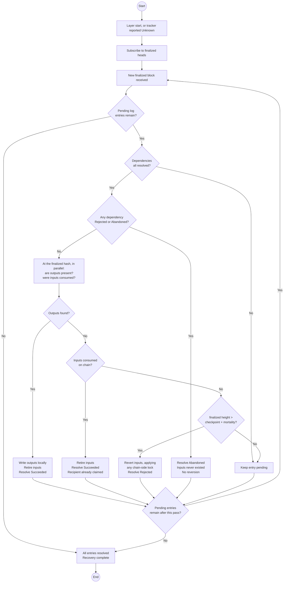

# Coinage Layer — Specification

## 1. Summary

The Coinage Layer is the host's self-contained coinage subsystem. It owns every coin and recycler entry the user controls, partitions them across one or more purses, observes chain state reactively, schedules recycling, and runs the cryptographic and operational machinery for transfers, unloads, and offload. It has no knowledge of RFC‑17 product concepts (receivables, cheques, refunds, invoices); those live in the layer above.

This document is normative for the layer's behavior. Two conformant implementations operating on the same root entropy against the same chain state must produce the same on-chain effects, the same set of local records, and the same observable events.

Coinage state is **not** a projection of chain state. A durable, crash-safe local log is a first-class part of this specification, not an implementation detail — see §7.

## 2. Scope

### 2.1 In scope

Purses; coins and recycler entries (records, state machines, ages); reactive on-chain observation; selection; recycling (payment-folded plus periodic backstop); free / paid unload tokens with automatic fallback; fee-mode auto-selection; transfer to pre-arranged recipient accounts; portable coin export / import (the seam to the upper layer); external offload to a non-coinage account; rebalance between purses; payment classification for direct transfers; operation lifecycle (durable handles, status streams, cancel-before-submission); the durable operation log and crash recovery of in-flight operations; wallet recovery from root entropy.

### 2.2 Out of scope

Receivables; cheques; refunds; invoices; product permissions; consent UI; cheque wire transport; multi-device synchronization; coinage pallet runtime evolution; the product-facing API surface.

### 2.3 Relationship to the upper layer

Exactly one upper layer consumes this layer's API. It is trusted (it lives inside the host) and is the only valid caller. The upper layer adds receivables, cheques, refunds, and the RFC‑6 / RFC‑17 product-facing surface, composing them out of the primitives this layer exposes.

### 2.4 Relationship to other documents

This document is the single source of truth for the layer. Where it conflicts with another document, this one wins.

- **RFC‑0017.** Defines the product surface above the seam. Its Appendix A derivation scheme is **superseded** by Appendix B here, for the security reason stated there. Its purse-identifier language is refined by §4.3.
- **RFC‑0022.** Defers coinage by name, twice — in the built-in-features table and again for ring‑VRF keys. This layer fills that declared gap; it does not override RFC‑0022. Appendix B adopts RFC‑0022's keyed-hash hard-derivation fold rather than defining a parallel one.
- **`coinage-management.md` and `coinage-management-contract.md`.** Superseded. They describe the pre-split unified design and contradict this document on the derivation appendix, the main-purse identifier, the purse-delete precondition, and readiness-state naming. They should be deleted or marked superseded.
- **The pallet.** `paritytech/individuality` `pallets/coinage/src/{lib.rs, extension.rs}` and the runtime configuration in `runtimes/next-people-paseo/src/people.rs` are authoritative for chain behaviour. Where this document records a pallet fact, the pallet wins and this document is wrong.

## 3. Concepts

### 3.1 Purse

A purse is a named, firewalled coinage balance with an isolated derivation namespace. Every coin and every recycler entry belongs to exactly one purse. Balance, selection, recycling, and operations are scoped to a single purse unless explicitly cross-purse (rebalance, deletion).

Exactly one purse with a reserved identifier — the **main purse**, identifier `0` — exists by construction once the layer is initialized. Any number of additional purses may be created.

### 3.2 Coin

A coin is a chain-level NFT representing a fixed denomination of dotUSD. It is identified on chain by an sr25519 account derived from the layer's root entropy, the coin's purse, and its derivation index. A coin carries:

- a denomination `exponent` (denomination = `2^exponent` cents);
- an integer `age` incremented by the chain on every transfer or split, capped at a chain-enforced maximum above which the coin is unusable.

A coin is consumed by transfer (to a pre-arranged recipient account), by split (into smaller coins), by recycling (into a fresh recycler entry), or by export (the coin and its secret are handed to the upper layer).

### 3.3 Recycler entry

A recycler entry is a Bandersnatch keypair the layer placed into a chain recycler ring — a privacy anonymity pool. The layer realizes the entry's value by **unloading** it: a Ring VRF proof of ring membership produces a fresh age-0 coin (or external-asset output) without revealing which entry was unloaded. An entry holds no spendable value on its own; value is realized at unload time. An entry must wait for its ring to fill before its anonymity claim is meaningful.

### 3.4 Operation

An operation is a long-running asynchronous task. The operation kinds this layer supports are: `TopUp`, `Transfer`, `Export`, `Import`, `ExternalOffload`, `Rebalance`, `MaintenanceSweep`, `DeletePurse`, `Recover`. Each operation has a durable opaque handle, a persisted record, a status stream emitted at every state transition, and a set of locked coins / recycler entries that no other operation may touch until the owning operation reaches a terminal state.

One logical operation decomposes into **one or more on-chain transactions**, which may form a dependency chain (§7.5). Partial success is a normal outcome, not an error condition.

Every call to a long-running primitive starts a fresh operation. The layer does not deduplicate by argument equality; callers needing idempotency MUST track handles themselves.

### 3.5 Coin export / import (the layer seam)

The upper layer needs coin secrets to construct cheques but must not have access to the layer's derivation tree. Two primitives bracket this:

- **Export.** Selects coins in a purse summing to a requested amount, performs any necessary split / unload-into-coins extrinsics, then returns the resulting `(coin_account, coin_secret)` pairs and treats the exported coins as no longer owned by the layer.
- **Import.** Accepts an externally supplied list of `(coin_account, coin_secret)` pairs and routes each one into a purse's namespace by submitting a transfer signed with the supplied secret.

A `coin_secret` is the raw sr25519 secret-key material controlling the corresponding coin account. Two implementations exchanging exported secrets must agree on the same encoding (the recommended encoding is the raw 64-byte secret-key form).

These are the only primitives through which coin secrets cross the API. Everything in the upper layer's cheque / receivable machinery composes on top of this seam.

### 3.6 Amounts and denominations

Amounts are **whole cents**. The wire representation is `u32`; the largest coin is `2^14` cents, so `u32` covers roughly $42.9M of aggregate balance, which is ample. Implementations MUST accumulate in a wider type (`u64` recommended) so that summing a purse cannot overflow, and MUST narrow to the wire type through a fallible conversion rather than a truncating cast.

The denomination exponent is **signed** (`i8`), mirroring the pallet's `CoinValue`. Today the chain's `MinimumExponent` is `0`, so every legal denomination is a whole number of cents. A negative exponent has no representation in a cent-granular amount, so an implementation MUST reject a negative exponent on construction and MUST refuse to operate against a runtime whose `MinimumExponent` is negative (§6.7), rather than silently truncating a balance.

### 3.7 Ring location

A recycler ring is addressed by a **ring location**: the pair `(ring_index, revision)`. Both halves are load-bearing. The pallet's unload calls take index *and* revision, and a Ring VRF membership proof built against one revision does not verify against another. Wherever this document says an entry "sits in a ring", it means a ring location; grouping entries for a shared unload extrinsic keys on the full location, never on the index alone.

## 4. Identity

### 4.1 Per-purse isolation

Each purse has its own coin-index space and its own recycler-entry-index space. Index `i` in purse A and index `i` in purse B address different on-chain accounts because their derivation paths differ. A coin or entry record carries `(purse_id, index)` as its identity; purse membership is implied by derivation.

### 4.2 Derivation

All keys are deterministically derived from the root entropy supplied at initialization. The layer never generates entropy itself. Given identical entropy, two instances derive identical accounts.

The derivation scheme is Appendix B. Three invariants are normative:

- Given the same root entropy, the same purse identifier, and the same index, the layer produces the same coin (or recycler-entry) account.
- Two distinct purses have non-overlapping derivation namespaces.
- **Every junction is hard.** No segment of any coinage derivation path may be a soft junction. See Appendix B for why this is a security requirement rather than a preference.

### 4.3 No-reuse invariant

Within a purse, a coin derivation index, once allocated, is never reused. The same rule applies to recycler-entry derivation indices. **A purse identifier, once allocated, is never reused either** — including after the purse is deleted.

These invariants are unconditional: they hold after the coin is spent and the on-chain account is empty, and after the recycler entry is unloaded and removed from the ring. Implementations may realize them by retaining record stubs, by a high-water mark, or by chain scanning — any mechanism that guarantees no identifier is allocated twice.

Rationale: a coin's account ID may have appeared in a transfer memo passed out-of-band; a recycler entry's Bandersnatch public key sits in a public ring member list; a purse identifier names a whole derivation namespace. Reuse would correlate new activity with old. The purse case is not hypothetical — a shipped implementation allocated `max(existing) + 1`, so deleting the highest-numbered purse and creating a new one silently reinhabited the deleted purse's namespace.

**How identifiers are assigned is host-local and not normative.** RFC‑0017 describes purse identifiers as "randomly assigned by the user agent"; that delegates the choice to the host rather than requiring randomness. Sequential assignment from a monotonic counter satisfies this specification and is deterministic and testable.

## 5. State

### 5.1 Coin lifecycle

Each coin record carries a lifecycle state:

- **Pending** — created locally as a future output of an in-flight operation; chain account not yet observed.
- **Available** — chain confirms the account holds a coin with a known age.
- **LockedFor(op)** — held by in-flight operation `op`.
- **Spent** — terminal. Chain confirms the account is empty (or the coin has been exported). Record retained for the no-reuse invariant; subject to garbage collection by any mechanism that still guarantees no reuse.

Independently of that state, a coin record carries a **chain-side lock expiry**, `chain_locked_until: Option<Timestamp>`, observed from `Coinage::LockedCoins` (§5.6). The two are orthogonal: a coin can be locally `Available` and still refused by the runtime.

A coin is **selectable** iff:

```
state = Available  ∧  (chain_locked_until is None  ∨  now ≥ chain_locked_until)
```

Transitions:

| From | To | When |
|-|-|-|
| (none) | `Pending` | Created locally as an output of an operation |
| `Pending` | `Available` | First chain observation reports the account holds a coin |
| `Available` | `LockedFor(op)` | Operation `op` locks the coin during `Preparing` |
| `LockedFor(op)` | `Available` | `op` aborts or is cancelled before submitting any extrinsic |
| `LockedFor(op)` | `Spent` | `op` reaches definite success (§7.6) and the account is observed empty (or, for export, immediately after the export emits the secret) |
| `LockedFor(op)` | `Available` | `op`'s transaction is definitely resolved as not having consumed the coin — the account is still observed populated. If the resolution was a failed dispatch, `chain_locked_until` is set from the observed `LockedCoins` entry |

### 5.2 Recycler entry — on-chain readiness and the anonymity floor

An entry's anonymity at unload time comes from its ring: a Ring VRF proof hides the prover among the ring's members, so the larger the ring, the stronger the anonymity. The chain accepts unloads from rings of any size; this layer applies its own **anonymity floor** — a minimum ring member-count below which it flags the entry as offering reduced anonymity. The floor is a single value scoped to the layer instance; it is not configurable per purse or per operation. The floor is a tunable parameter (Appendix A.2).

Each entry has an on-chain readiness state derived from chain observation:

- **Missing** — no recycler location on chain for the entry's member key. The load extrinsic has not finalized, or the entry has been consumed.
- **Waiting** — chain reports a ring location, but the ring is in onboarding or chain-side readiness conditions are unmet.
- **Ready** — ring member-count meets or exceeds the anonymity floor.
- **Degraded(n)** — ring member-count is `n`, below the floor.

A non-`Missing` entry carries the full ring location (§3.7), not just the index.

`Ready` and `Degraded` are both usable for selection. The choice of whether to use `Degraded` entries is controlled by the caller per primitive (§8).

### 5.3 Recycler entry — readiness jitter

When the layer creates a new recycler entry (top-up or recycling), it records the creation timestamp as `allocated_at` and draws a per-entry random delay `d` uniformly from `[0, D]`. The entry's `ready_at` is `allocated_at + d`; the entry is not selectable until `now ≥ ready_at`, regardless of on-chain readiness.

Without jitter, an observer with timing data could match a load to its subsequent unload. The bound `D` is tunable (Appendix A.3). The mechanism is SHOULD, not MUST: implementations may set `D = 0` if a specific deployment knowingly accepts the timing correlation.

### 5.4 Recycler entry — local lifecycle

Independent of on-chain readiness, each entry has a local lifecycle state:

- **Available** — free for selection.
- **LockedFor(op)** — held by in-flight operation `op`.
- **Consumed** — terminal. The owning operation reached definite success and the entry was unloaded. Record retained for the no-reuse invariant; subject to garbage collection on the same terms as `Spent` coins.

An entry is **selectable** iff:

```
local_state = Available  ∧  on_chain_state ∈ {Ready, Degraded}  ∧  ready_at ≤ now
      ∧  (alias_locked_until is None  ∨  now ≥ alias_locked_until)
```

`alias_locked_until` is the chain-side alias lock of §5.6, the entry-side analogue of a coin's `chain_locked_until`, read from `Coinage::RecyclerAliasStates`. That entry distinguishes two states the layer must not conflate: `Locked` is temporary and the entry returns, `Unloaded` is terminal and it never will.

A caller may further restrict selection to exclude `Degraded` entries via a per-primitive flag (§8). The selectability condition above is the maximum set; flags only narrow it.

### 5.5 Operation lifecycle

Every operation traverses:

| State | Meaning |
|-|-|
| `Preparing` | Selecting, deriving, signing, building extrinsics, or re-planning between phases. No extrinsic currently in flight. |
| `Submitted` | An extrinsic has been broadcast. |
| `InBlock` | An extrinsic has been included in a non-finalized block. **Optimistic, not definite** (§7.6). |
| `Finalized` | An extrinsic has been finalized. |
| `Waiting(until)` | The operation cannot progress until the indicated wall-clock time (e.g. waiting for a recycler entry's `ready_at` or for ring readiness). The layer wakes the operation at or shortly after `until` and returns to `Preparing`. |
| `Recovering` | The layer lost track of a submitted transaction and is resolving its fate against finalized chain state (§7.7). |
| `Done(receipt)` | Terminal. At least one submitted extrinsic definitely succeeded. The receipt (§9) enumerates per-transaction outcomes; partial-failure interpretation is the caller's. |
| `Failed(reason)` | Terminal. Either no extrinsic was submitted (pre-submission failure), every submitted extrinsic was definitely resolved as not having taken effect, or the operation was cancelled. |

A long-running operation (e.g. `ExternalOffload`) may cycle through phases: `Preparing` → `Submitted` → `InBlock` → `Finalized` → `Preparing` → `Waiting` → `Preparing` → `Submitted` → … and so on until it reaches `Done` or `Failed`. Each phase transition is durably persisted (§7.4); the operation resumes from the same phase across restart.

Operations that submit no extrinsics (e.g. `Recover`) emit `Preparing` followed directly by a terminal item.

### 5.6 Chain-side locks after a failed dispatch

The `AsCoinage` transaction extension builds its origin in `prepare`, which runs **outside** the call's storage layer. A dispatch that then fails does not uniformly undo that work. `post_dispatch_details` compensates asymmetrically, and the asymmetry is load-bearing:

| Origin | On `ExtrinsicFailed` |
|-|-|
| `AsCoin` | The coin is **restored** to `CoinsByOwner`, and a `LockedCoins` entry refuses it as an origin until `now + 2^retries × CoinFailureLockPeriod` |
| `AsUnloadTokenFromOutput` | The first alias is **restored**, as `AliasState::Locked` with the same exponential backoff |
| `AsUnloadTokenPeople` / `LitePeople` / `Paid` | The unload token is **gone**. Nothing restores it |
| `InfallibleUnpaidSigned` | Cannot occur — the pallet returns `InvalidTransaction::Custom(InternalError)` from `post_dispatch`, so the extrinsic is not included at all |

Three normative consequences:

1. **A failed dispatch MUST NOT retire the operation's records.** The coin or alias still exists on chain; marking it `Spent` / `Consumed` would delete a record the chain still honours.
2. **Nor may it release them as immediately reusable.** `LockedCoins` and `RecyclerAliasStates` are checked in the extension's `validate`, so a record reselected inside its lock produces an extrinsic the runtime refuses — *after* a fresh unload token has already been spent building it. The backoff doubles each time, so a naive retry loop converges on burning one token per attempt. The layer MUST observe the lock and MUST exclude the record from selection until it expires.
3. **The unload token is not recoverable.** A retry of a failed unload costs a second token. Retry policy must account for the per-period allowance rather than treating retries as free.

`Coinage::LockedCoins` is therefore part of the observation set (§6.1), not an optional read.

## 6. Operational model

### 6.1 Reactive on-chain observation

The layer maintains continuous subscriptions to every chain storage entry backing its local records:

- coin storage for each known coin account;
- **coin lock storage (`Coinage::LockedCoins`) for each known coin account** (§5.6);
- ring-member storage for each recycler entry's member key;
- recycler alias state for each entry the layer has attempted to unload;
- recycler revision and member-count for the rings entries belong to;
- consumed-unload-token storage relevant to the user's allowance.

Subscription events update local records in place. The layer does not pull-poll; callers read its cached view, which the subscription keeps fresh.

The layer is therefore long-lived. Subscription updates must be reconciled with operation-driven changes — but **observation alone can never determine local state**, for two independent reasons:

1. Not all local state has an on-chain representation. A coin handed to a peer over an off-chain channel is "in use" from the layer's point of view from the moment it is sent, while remaining fully vacant on chain until the recipient submits the claiming transaction.
2. An empty coin account is ambiguous. It means "spent" or "the extrinsic has not landed yet", and only the owning operation's durable log can distinguish them.

Consequently an observation that a tracked coin account is **empty** MUST NOT by itself retire the record. Emptiness is evidence, consumed by the resolution procedure of §7.7, never a transition on its own.

### 6.2 Balance

Per purse, the layer exposes three values, emitted by the balance subscription on every change:

- **Spendable** — sum of values of all selectable coins (§5.1) plus all currently selectable recycler entries (§5.4).
- **Spendable strict** — same, but counting only `Ready` recycler entries. Always `≤ spendable`. The difference is the value held in `Degraded` entries.
- **Pending** — sum of values of everything else the purse still owns: coins in `Pending` or `LockedFor`, coins whose `chain_locked_until` has not elapsed, and recycler entries that are not selectable (`Waiting`, `Missing`, `LockedFor`, alias-locked, or with `ready_at > now`).

A chain-locked coin is `pending`, not `spendable`: its value is intact and will return without user action, which is exactly the distinction `pending` exists to express.

### 6.3 Selection

This section describes the selection used for operations that produce coinage value at a destination *inside* coinage — transfer, export, rebalance. External offload uses a different, planner-driven strategy described in §8.6.

When the layer must produce a specified `amount` from a purse for one of these operations, it tries the following strategies in priority order, returning the first that succeeds.

Selection orders coins by `(exponent desc, age desc, derivation_index asc)` and recycler entries by `(exponent desc, ring_index asc, derivation_index asc)` before applying each strategy's heuristic. This ordering is fully deterministic — two conformant implementations with the same purse contents produce the same selection.

1. **Exact match.** Find a subset of selectable coins (in the order above) summing exactly to `amount`. Zero extrinsics.
2. **Split.** Find the smallest single selectable coin strictly greater than `amount`; split it into `amount` + change denominations using one extrinsic. If no single coin suffices, build a multi-coin cover with whole coins (the deterministic order naturally produces largest-first) and split the last coin that crosses the target; if that is also impossible, fall through. No unload token consumed.
3. **Unload into coins.** Use selectable recycler entries (§5.4), optionally with whole coins for partial coverage, to mint coins of the target denominations. Entries are grouped by `(denomination, ring location)`; each group becomes one atomic `unload-into-coins` extrinsic carrying its own unload token. The output value of each group equals its input value (the group's own change absorbs the remainder). Prefer a single smallest sufficient entry; otherwise take entries in the deterministic order above to cover the deficit.

**Selection is policy-free.** It consumes no tunable parameters. The anonymity floor is applied when a ring is *observed*, so an entry's readiness state already encodes it by the time selection runs; likewise a chain-side lock has already been folded into selectability. The only limits selection must respect are the chain's (Appendix A.0).

Selection runs against the live local view. Selection holds locks for the lifetime of the resulting operation; two concurrent selections never disagree about availability.

**Failure classification is a total three-way split**, ordered by what the caller should do next:

| Condition | Error | Caller's move |
|-|-|-|
| Not enough value even counting records that are merely waiting | `InsufficientFunds` | Fund the purse |
| Enough value, but some of it is not selectable yet — unready rings, jitter, or an unelapsed chain-side lock | `NoReadyEntries` | Retry later |
| Everything that will ever be selectable already is, and it covers the amount, but no plan can be built | `UnsatisfiableOutputs` | Change the request |

`UnsatisfiableOutputs` is reachable in ordinary use and is not an internal error. Two causes: coinage divides but never merges, so two 8-cent coins cannot satisfy a single 16-cent output; and per-extrinsic caps mean a named denomination must be minted whole by one unload group, and no group may be large enough. Reporting `InsufficientFunds` here would be actively misleading — the funds are present.

If the caller has disallowed `Degraded` entries for a particular operation, the effective selectability condition narrows accordingly. If selection would have succeeded with `Degraded` entries but cannot succeed without them, return `NoReadyEntries`.

### 6.4 Autonomous lifecycle maintenance

The chain places a hard time limit on **both** states of a logical coin's value:

- A **coin** ages out at `MaximumAge` transfers/splits and becomes unusable.
- A **recycler entry** dies when its ring is cleaned up after `RecyclerExpirationTime` from the ring's `immutable_since`. Backing value of any entry that has not been unloaded by then is destroyed by the pallet (added to `TotalValueOfDestroyedCoins`).

The layer MUST run two autonomous sweeps that together form a closed loop: `coin → entry` (coin-age recycling) and `entry → coin` (ring-expiration rescue). A coin that is never spent cycles between forms indefinitely; no value is lost so long as both sweeps run regularly. Skipping either sweep causes silent loss of funds for users who don't actively spend.

**Coin-age recycling sweep (coin → entry).** A scheduler runs at a tunable interval (Appendix A.4). Per purse, the sweep scans selectable coins whose `age ≥ recycle_at_age` (Appendix A.1), oldest first, and submits one `load_recycler_with_coin` extrinsic per coin. Each definite success consumes the coin (terminal `Spent`) and produces a new `Available` recycler entry whose `ready_at` is set per §5.3. Pre-submission failure releases the lock so a future sweep can retry.

Payment-folded refresh complements this: selection (§6.3) prefers older coins, and unload-into-coins emits age-0 coins. Active wallets refresh themselves implicitly.

**Ring-expiration rescue sweep (entry → coin).** A scheduler runs at a tunable interval (Appendix A.12). Per purse, the sweep scans recycler entries whose ring is approaching expiration — i.e. `now ≥ ring.immutable_since + RecyclerExpirationTime − rescue_margin` (Appendix A.13). The sweep groups eligible entries by `(denomination, ring location)` and submits one `unload_recycler_into_coins` extrinsic per group, each carrying its own unload token (§6.5). Each definite success consumes the entry (terminal `Consumed`) and produces a new age-0 `Available` coin in the same purse.

The ring-expiration sweep is critical: without it, entries created by the coin-age sweep (or by top-up) can expire silently if the host is unused long enough for the ring lifecycle to complete. This is the only way for value to permanently disappear from a wallet whose root entropy and chain identity are otherwise intact.

**Triggers.** For both sweeps, the periodic schedule is the contractual minimum. Implementations MAY add opportunistic triggers (e.g. on host wake / foreground; on a subscription update that brings a coin past `recycle_at_age` or an entry past the rescue margin). Both sweeps are also invoked synchronously by `run_maintenance_sweep` (§8.7).

**Scheduling is a host obligation.** The layer has no clock outside a live session, so it cannot guarantee either sweep fires on schedule by itself. A host that embeds this layer MUST provide a background tick. A foreground-only trigger narrows the loss window but does not close it, because the failure mode is precisely "the user did not open the app".

### 6.5 Unload tokens

Every unload of a recycler entry consumes exactly one unload token. Two classes exist:

- **Free** — derived from the user's people / lite-people ring membership; per-period allowance.
- **Paid** — derived from a period-specific paid-token ring that anyone may join by paying a fee (an on-chain extrinsic).

When the layer needs `N` tokens for a multi-group unload, it resolves them in this order:

1. For each token slot needed, probe `ConsumedFreeUnloadTokens` (cached from chain) for the current period and any prior period within the lookback grace window (Appendix A.6). Pick the first counter in the search range (Appendix A.5) whose alias is not consumed.
2. If free slots run out, fall back to paid tokens. If no paid-token ring membership exists for the current period, the layer first joins the current paid ring (a pre-step extrinsic), then derives the alias.

If neither free nor paid tokens can be obtained (no people/lite-people ring membership and the fee account cannot fund joining the paid ring), the operation fails with `NoUnloadToken`.

A token consumed by a transaction whose dispatch then failed is **not** returned (§5.6). Retry accounting MUST treat each attempt as consuming a token.

The caller does not select the class. Per-token cost is reported in the operation's status stream.

### 6.6 Fee account and fee mode

The layer derives a single **fee account** (sr25519) from the root entropy at initialization. This account pays the on-chain fee for every unload operation across every purse — it is not per-purse, not exposed in the API, and not configurable. How the fee account is funded is outside the layer's concern; the user / upper layer is expected to keep it topped up out of band.

Unloads support two fee modes:

- **Prepaid** — fee paid in native currency / asset from the fee account, alongside the unload extrinsic.
- **From-output** — fee deducted from the unloaded value.

The layer picks the mode automatically per unload: prepaid if the fee account holds sufficient external funds at submission time, from-output otherwise. The caller does not specify.

The two modes are different **origins**, not two ways of paying for one origin. Prepaid presents an unload token (§6.5) and carries `max_fee = 0`. From-output presents no token at all: the extension takes the fee out of the unloaded value, pre-validating the first entry's alias in the token's place, and `max_fee` is the ceiling it may take. An unfunded fee account therefore spends no free allowance — which also means the fee has to be priced before the origin is known, so an implementation prices the prepaid shape's own bytes and re-assembles if the answer was from-output.

### 6.7 Runtime compatibility check

Chain-enforced limits (Appendix A.0) are read from runtime metadata once at connection time and validated before the layer accepts any operation. An unsupported runtime — a negative `MinimumExponent`, a maximum exponent above what the amount type can represent, an inverted exponent range, a zero split or consolidation cap — MUST be refused at connection rather than discovered at the first rejected extrinsic.

Two constants are **not discoverable** from the deployed runtime's metadata and MUST be carried as per-network configuration (Appendix A.0). Where a constant *is* discoverable, a mismatch between the configured and the observed value MUST be treated as a hard failure, not reconciled silently.

## 7. Operations and durability

### 7.1 Handles

Every operation primitive returns an opaque, durable `OperationHandle`. A handle is sufficient to subscribe to the operation's status stream, read its current status, or cancel it (§7.3). Handles are layer-issued; callers do not supply correlation keys. Two operations with disjoint lock sets may run concurrently; lock conflicts are impossible by construction.

### 7.2 Status streams

Each operation emits the state machine of §5.5. The first item is the current status at subscription time. The terminal item (`Done` or `Failed`) is emitted exactly once and the stream then closes. Dropping the subscription is always safe; the operation continues regardless of whether anyone is subscribed.

### 7.3 Cancellation

A caller may cancel an operation whenever no extrinsic is currently in flight — i.e. while the operation is in `Preparing` or `Waiting`. The layer aborts, releases all locks, and emits `Failed(Cancelled)`.

While an extrinsic is in flight (`Submitted` / `InBlock` / `Recovering`), the operation cannot be cancelled at the API. The caller must await the transaction's resolution. A multi-phase operation may become cancellable again once it returns to `Preparing` or `Waiting`.

### 7.4 The durable operation log

The layer maintains a **write-ahead log**. Each log entry corresponds one-to-one with a single on-chain transaction, not with a logical operation. An operation with three transactions has three entries.

Each entry records, before the transaction is broadcast:

| Field | Purpose |
|-|-|
| `operation` | Owning operation handle |
| `sequence` | Position within the operation |
| `depends_on` | Entries whose outputs this entry consumes (§7.5) |
| `inputs` | Coin and recycler-entry records the transaction consumes |
| `outputs` | Coin accounts and recycler-entry member keys the transaction is expected to create |
| `extrinsic_hash` | Hash of the assembled extrinsic |
| `checkpoint_block_number` | Era anchor height |
| `checkpoint_block_hash` | Era anchor hash |
| `mortality` | Era period, in blocks (Appendix A.14) |
| `state` | `Pending`, `Succeeded`, `Rejected`, or `Abandoned` |

The general per-transaction pattern is:

1. Mutate local state — mint the expected output records as `Pending`, mark inputs `LockedFor`.
2. Write the log entry.
3. Broadcast and track (§7.6).
4. On definite success, apply the outcome: retire inputs, promote outputs.
5. On definite failure, revert step 1's mutations subject to §5.6.

**The entry MUST be durable before the broadcast.** The whole design assumes a crash can occur between any two lines of code, including inside step 1. Anything not recoverable from the log plus finalized chain state does not exist.

**Extrinsics MUST be mortal**, and the era anchor MUST be the block recorded as `checkpoint_block_hash` / `checkpoint_block_number`. Mortality is what makes an unresolved entry eventually decidable. With an immortal extrinsic there is no time after which inclusion is impossible, so the layer could never safely return the entry's inputs to the pool — an immortal transaction can still land after the inputs have been respent. Mortality is therefore a correctness requirement, not a fee optimization.

### 7.5 Transaction ordering within an operation

Within one operation, transactions may form a dependency chain: an unload group mints coins that a later transfer then spends. `depends_on` records this.

Two rules follow.

**Submission order.** A transaction MUST NOT be broadcast until every entry it depends on has reached definite success (§7.6). Optimistic in-block inclusion of a predecessor is not sufficient, because a reorg that invalidates the predecessor would leave the dependent transaction spending inputs that never existed.

**Resolution order.** Recovery MUST resolve entries in dependency order. An entry may only be resolved once all entries it depends on are resolved. This is not merely tidy — resolving out of order gives wrong answers:

> Entry `W1` unloads a recycler entry, minting coin account `A`. Entry `W2` transfers `A` to a recipient. Recovery finds `A` empty. That is consistent with two incompatible histories: `W1` never landed, or `W1` landed and `W2` consumed `A`. `W2`'s "were my inputs consumed?" check cannot be interpreted without `W1`'s verdict.

When a predecessor resolves to `Rejected` or `Abandoned`, every entry that depends on it resolves to **`Abandoned`**: its inputs never came into existence, so there is nothing to revert on its behalf, and it can never take effect. The operation's original inputs are returned to the pool by the *predecessor's* reversion, exactly once. An `Abandoned` entry whose extrinsic was in fact broadcast is impossible by the submission-order rule above.

### 7.6 Optimistic tracking and definite outcomes

The layer tracks two grades of outcome, and MUST NOT confuse them.

**Optimistic.** A transaction seen in a non-finalized block, with its dispatch outcome read from that block's events. This is the fast path. It drives UI, unlocks dependent *planning*, and moves the status stream to `InBlock`. It is not durable truth: the block may be reverted and the transaction invalidated on the new canonical chain.

**Definite.** One of:

- *Definite success* — the transaction's effects are observed at a **finalized** block.
- *Definite failure* — the transaction is provably unable to take effect: it was rejected before broadcast, or the finalized chain height has passed `checkpoint_block_number + mortality` without inclusion.

Only a definite outcome may retire records, release locks, write a receipt entry, or terminate an operation.

Best-effort tracking runs in real time and SHOULD continue while the host is backgrounded. Any uncertainty — a socket reconnect, an interrupted status subscription, a status stream ending without a verdict, a reported inclusion that cannot be re-read — moves the entry to recovery (§7.7) rather than being interpreted. The three-way classification a tracker must produce is:

| Tracker outcome | Meaning | Next |
|-|-|-|
| Definitely not included | Rejected pre-broadcast, or the node definitively refused it (`invalid`, `dropped`) | Resolve as `Rejected`; inputs revert |
| Included, with a dispatch verdict | Reached a block; events read | Definite if that block is finalized, otherwise optimistic and awaiting finalization |
| Unknown | Anything else, including `retracted`, `usurped`, timeouts, and lost subscriptions | Hand to recovery |

The inclusion arm carries whether the reporting block was finalized, because a
node that reports `finalized` directly has already settled the transaction and
recovery has nothing to add. Only an inclusion at a non-finalized block needs
the slow path.

Treating "unknown" as either of the other two is the single most dangerous error available to this layer.

### 7.7 Operation recovery

Recovery is the slow, guaranteed path. It resolves every `Pending` log entry against **finalized** chain state and needs neither the transaction's hash nor its events, so it works after a crash in which the layer never observed either.

Recovery runs:

- on layer start, before any new operation is accepted;
- whenever best-effort tracking reports `Unknown`.

The procedure, per finalized block, over the pending entries in dependency order (§7.5):

1. **Are all of this entry's `depends_on` resolved?** If not, skip it this pass.
2. **Is any dependency `Rejected` or `Abandoned`?** Resolve this entry `Abandoned`. No reversion.
3. **Are the entry's `outputs` present at the finalized hash?** If yes → definite success. Write outputs locally, retire inputs, resolve `Succeeded`.
4. **Were the entry's `inputs` consumed on chain?** If yes → the effect happened even though we cannot see our own outputs; a recipient has already claimed them. Retire inputs, resolve `Succeeded`.
5. **Has the finalized height passed `checkpoint_block_number + mortality`?** If yes → the transaction can never be included. Revert inputs to available, resolve `Rejected`.
6. Otherwise keep the entry pending and re-evaluate at the next finalized block.

When an entry resolves via a **failed dispatch** rather than non-inclusion, §5.6 governs the reversion: inputs return to their pool but carry the chain-side lock the pallet wrote, and any unload token the transaction consumed is gone.

Recovery is complete for an operation when it has no pending entries; the operation then terminates per §5.5 on the aggregate of its entries' outcomes.



### 7.8 Restart behaviour and record retention

**In-flight operations.** On restart the layer:

1. Reads back every open operation record, every log entry, and every locked record.
2. Re-establishes chain subscriptions for the affected accounts (§6.1).
3. Fails any operation that has no log entries with `Failed(InterruptedPreSubmission)` and releases its locks. Pre-submission scratch state — in-flight selection, partial signing — is not durable, so a restart in `Preparing` is equivalent to a cancel.
4. Runs recovery (§7.7) over all remaining pending entries before accepting new operations.

**Subscriptions.** All subscription streams (balance, operation status, events) are torn down on restart. Callers MUST re-subscribe after restart; subscriptions are not auto-resumed.

**Terminal-operation records.** Once an operation reaches a terminal status and the terminal status item has been emitted on its status stream, the layer MAY immediately drop the operation record and its log entries from durable storage. Subsequent re-subscription via the now-stale handle returns `OperationNotFound`. Callers that need to retain the receipt MUST capture it from the terminal status item; the layer does not maintain history.

### 7.9 Event ordering against persistence

Events MUST be drained and published **before** the store is persisted.

A terminal operation drops its record as soon as its status is emitted, so the receipt exists only in the emitted event until a subscriber has it. Persisting first and publishing second loses the receipt and the record together if the process dies in between — the operation would simply never have happened as far as any later reader is concerned. Publishing first is safe in the other direction: a crash leaves the operation still open in the persisted store, and recovery resolves it on the next start. The worst case degrades to a duplicate event, which subscribers can absorb and a lost receipt cannot.

## 8. Primitives

All long-running primitives return:

```text
struct OperationStart {
    handle: OperationHandle,
    status: Stream<OperationStatus>,
}
```

Errors emitted synchronously describe failure to start an operation. Errors emitted via the status stream (as `Failed(Error)`) describe terminal failure of a started operation. The full error enum is in §10.

### 8.1 Purse lifecycle

```text
fn create_purse(name: String) -> Result<PurseId, Error>
fn query_purse(purse: PurseId) -> Result<PurseInfo, Error>
fn rename_purse(purse: PurseId, name: String) -> Result<(), Error>
fn delete_purse(target: PurseId, drain_into: PurseId)
    -> Result<OperationStart, Error>
fn rebalance_purse(from: PurseId, to: PurseId, amount: Amount, allow_degraded: bool)
    -> Result<OperationStart, Error>

struct PurseInfo {
    id:               PurseId,
    name:             String,
    spendable:        Amount,
    spendable_strict: Amount,
    pending:          Amount,
}
```

`create_purse` assigns a fresh never-before-used `PurseId` (§4.3), persists the purse, returns synchronously. No chain interaction.

`query_purse` returns a synchronous snapshot.

`rename_purse` updates the purse's name. No chain interaction.

`delete_purse` drains the target into `drain_into` via on-chain transfer, then closes the purse record. The main purse cannot be deleted. A purse cannot be deleted while it has in-flight operations. (The upper layer additionally forbids deletion while receivables are open; that rule lives above the seam because this layer cannot see receivables.)

`rebalance_purse` transfers `amount` from one purse to another by selection in the source purse's namespace, with destination coin accounts allocated in the target purse's namespace. `allow_degraded` controls whether `Degraded` recycler entries may be selected.

Errors: `PurseNotFound`, `CannotDeleteMainPurse`, `PurseHasInFlightOperations`, `InsufficientFunds`, `NoReadyEntries`, `UnsatisfiableOutputs`, `ChainRejected`, `Cancelled`.

### 8.2 Top-up

```text
trait FundingOrigin {
    fn external_account(&self) -> ExternalAccountId;
    fn sign_payload(&self, payload: &[u8]) -> Signature;
}

fn top_up(into: PurseId, amount: Amount, origin: &dyn FundingOrigin)
    -> Result<OperationStart, Error>
```

Decomposes `amount` into recycler-entry denominations, allocates fresh entry indices in `into`, and submits one external-asset load extrinsic per denomination, signed by `origin`. Each load is an independent log entry with no dependencies, so successful loads do not roll back failed ones; per-entry outcomes are reported in the status stream and the receipt.

Errors: `PurseNotFound`, `InsufficientExternalFunds`, `ChainRejected`.

### 8.3 Transfer

```text
fn transfer(
    from:              PurseId,
    amount:            Amount,
    recipient_outputs: Vec<RecipientOutput>,
    allow_degraded:    bool,
    memo_callback:     Option<MemoCallback>,
) -> Result<OperationStart, Error>

struct RecipientOutput {
    exponent: DenominationExponent,
    account:  CoinAccountId,
}

type MemoCallback = fn(memo_entries: Vec<MemoEntry>);

struct MemoEntry {
    sender_coin_account: CoinAccountId,
    recipient_account:   CoinAccountId,
    derivation_index:    CoinIndex,
}
```

Transfers `amount` from `from` to the supplied recipient-controlled accounts. The constraint on `recipient_outputs` is:

```
Σ 2^output.exponent over recipient_outputs == amount
```

Multiple outputs with the same `exponent` are allowed (e.g. two `exponent = 3` outputs to two distinct accounts).

Selection from `from` uses the three-tier strategy (§6.3) routing the output coins to the supplied accounts. Both `split` and `unload_recycler_into_coins` name a destination account per produced coin, so a transfer mints the payee's coins *directly* into the accounts the payee named: it never needs the two-step "mint to myself, then transfer" that a dependent log entry would describe. A transfer's transactions are therefore independent of one another, one atomic effect each, and a failure of one does not orphan the others. Dependent entries per §7.5 arise where a later transaction really does spend an earlier one's output, as in external offload (§8.6).

`sender_coin_account` is the on-chain origin the coin came from: the spending coin's account for a coin-origin transfer, or the recycler entry's contextual alias for a coin minted by an unload. Both are 32-byte identifiers the transaction already carries in public.

If `memo_callback` is supplied, the layer invokes it with one `MemoEntry` per transferred coin once the corresponding transaction reaches optimistic in-block inclusion (§7.6), before finalization. This is deliberate — the recipient should be able to act promptly — but it means a memo may be delivered for a transfer that a subsequent reorg invalidates. The layer does not encode or transmit memos; the caller owns the wire format and is responsible for tolerating that case.

Errors: `PurseNotFound`, `InsufficientFunds`, `NoReadyEntries`, `UnsatisfiableOutputs`, `OutputsDoNotSumToAmount`, `ChainRejected`, `Cancelled`.

### 8.4 Export coins

```text
fn export_coins(from: PurseId, amount: Amount, allow_degraded: bool)
    -> Result<ExportStart, Error>

struct ExportStart {
    handle: OperationHandle,
    status: Stream<OperationStatus>,
    coins:  Stream<ExportedCoin>,    // emits once per coin, then closes
}

struct ExportedCoin {
    account:  CoinAccountId,
    secret:   CoinSecret,
    exponent: DenominationExponent,
}
```

Materializes `amount` worth of coins in `from`'s namespace by selection and any required split / unload-into-coins extrinsics, then emits one `ExportedCoin` per resulting coin. Each exported coin transitions to `Spent` in this layer's view: the on-chain account still holds the coin but it is now controlled by the externally held secret.

A coin is emitted only after the transaction that materialized it has reached **definite success** (§7.6). Emitting on optimistic inclusion would hand out a secret for a coin a reorg could remove.

`export_coins` is the **only** primitive through which coin secrets cross the API. The caller is responsible for the confidentiality of the emitted secrets.

Errors: `PurseNotFound`, `InsufficientFunds`, `NoReadyEntries`, `UnsatisfiableOutputs`, `ChainRejected`, `Cancelled`.

### 8.5 Import coins

```text
fn import_coins(into: PurseId, coins: Vec<(CoinAccountId, CoinSecret)>)
    -> Result<OperationStart, Error>
```

For each supplied pair, the layer (a) reads the coin's denomination from chain, (b) allocates a fresh coin derivation index in `into`, (c) submits a transfer extrinsic from `account` (signed with the supplied secret) to the freshly derived recipient account in `into`'s namespace. The layer does not retain supplied secrets after submission. New coin records appear in `into` and become `Available` once the chain confirms.

Per-coin outcomes (`Done` / `BadCoinSecret` / `SnipedCoin` / `ChainRejected`) are reported in the status stream; partial success is possible. A pair whose `account` is already known to this layer is rejected with `BadCoinSecret`.

Errors: `PurseNotFound`, `BadCoinSecret`, `SnipedCoin`, `ChainRejected`, `Cancelled`.

### 8.6 External offload

```text
fn external_offload(
    from:           PurseId,
    amount:         Amount,
    destination:    ExternalAccountId,
    allow_degraded: bool = false,
) -> Result<OperationStart, Error>
```

Moves `amount` from `from` into a non-coinage account on chain. `allow_degraded` defaults to `false`: an external offload reveals the unloaded value to chain observers, so the anonymity set should be at full strength unless the caller explicitly opts in to `Degraded` entries.

External offload is a **multi-phase, possibly long-running** operation. The layer drives it through the loop below until a terminal state is reached. Each phase transition is durably persisted (§7.4); cancellation is permitted in `Preparing` and `Waiting` (§7.3).

1. **Plan** (status: `Preparing`). Read the current view of `from`. Choose the next phase:
   - If selectable entries (per `allow_degraded`) cover `amount` → **Offboard**.
   - Else if selectable + not-yet-ready entries together cover `amount` → **Wait** until the latest such entry's `ready_at`.
   - Else compute the deficit. If selectable coins cover the deficit → **Recycle**.
   - Else if non-spent coins (including coins locked by this or another operation, recycling, pending-transfer, or chain-locked) together cover the deficit → **Wait** for a short retry interval (Appendix A.11).
   - Else fail with `InsufficientFunds`.
2. **Recycle**. Pick the coins to cover the deficit in the deterministic order of §6.3. Submit one `load_recycler_with_coin` extrinsic per coin. Each definite success produces a new `Available` recycler entry locked to this operation. Return to **Plan**.
3. **Wait** (status: `Waiting(until)`). Suspend until the indicated time. On wake (or operation resume after restart), return to **Plan**.
4. **Offboard**. Submit one `unload_recycler_into_external_asset_and_vouchers` extrinsic per `(denomination, ring location)` group, each carrying its own unload token (§6.5). The total transferred to `destination` is `amount`. Any surplus from the selected entries is **always atomically reloaded** into fresh recycler entries within the same extrinsic — surplus value MUST NOT land as a free coin, because that would re-link the entry-side anonymity set to a fresh sr25519 account. Once all groups have definitely succeeded, reach `Done(receipt)`.

Entries produced in **Recycle** are inputs to **Offboard**, so the corresponding log entries carry a `depends_on` relation and the ordering rules of §7.5 apply.

The operation locks every coin and recycler entry it touches throughout its lifetime, including entries produced during **Recycle**. Locks are released on terminal status per §7.8.

Fee mode is auto-selected per §6.6.

Errors (via terminal `Failed`): `InsufficientFunds`, `NoUnloadToken`, `ChainRejected`, `Cancelled`.
Errors (synchronous): `PurseNotFound`.

### 8.7 Maintenance sweep

```text
fn run_maintenance_sweep(purses: Option<Vec<PurseId>>)
    -> Result<OperationStart, Error>
```

Runs both the coin-age recycling sweep and the ring-expiration rescue sweep once across the listed purses (or all purses if `None`). For each purse the layer:

1. Submits one `load_recycler_with_coin` extrinsic per eligible aging coin (oldest first).
2. Submits one `unload_recycler_into_coins` extrinsic per `(denomination, ring location)` group of entries past the rescue margin.

Per-transaction outcomes are reported via the operation's receipt. The layer also runs both sweeps autonomously per §6.4; this primitive exists so the upper layer can force a run on demand (e.g. on app foreground).

Errors: `PurseNotFound`.

### 8.8 Payment classification

```text
fn classify_incoming_payment(entries: Vec<MemoEntry>)
    -> Result<PaymentClassification, Error>

enum PaymentClassification {
    Matched,    // every entry's recipient_account corresponds to a coin in some purse known to this layer
    Received,   // some entries' coins are present, others are not
    Unmatched,  // no entries match
}
```

Synchronous classification against the live local view. The layer treats an empty entry list as `Unmatched`. The classification is informational only; no operation is started, no record is modified.

### 8.9 Subscriptions

```text
fn subscribe_purse_balance(purse: PurseId) -> Stream<PurseBalance>
fn subscribe_operation_status(handle: OperationHandle) -> Stream<OperationStatus>
fn subscribe_events() -> Stream<LayerEvent>

struct PurseBalance {
    spendable:        Amount,
    spendable_strict: Amount,
    pending:          Amount,
}
```

The two value streams — balance and operation status — emit the current value at subscribe time, then a new item on every change. An event is a change rather than a value, so the event stream has nothing to emit at subscribe time and carries no backlog: it begins with the next event the layer publishes.

A balance is a projection of every record in a purse, and some of its inputs are time-dependent — an entry inside its jitter delay, a coin the chain locked after a failed dispatch. A balance stream therefore MUST NOT be driven by state changes alone; the layer re-evaluates it against the clock and emits when the value has moved, whether or not any record changed.

Closing the stream releases the subscription. Multiple concurrent subscriptions are independent, and dropping one never affects the layer's behaviour.

### 8.10 Wallet recovery from root entropy

Distinct from operation recovery (§7.7): that resolves in-flight transactions after a crash; this reconstructs an entire wallet from seed when durable state is lost.

```text
fn recover(non_main_purse_ids: Vec<PurseId>)
    -> Result<OperationStart, Error>

fn extend_scan(
    purse:             PurseId,
    from_coin_index:   CoinIndex,
    from_entry_index:  RecyclerEntryIndex,
) -> Result<OperationStart, Error>
```

Long-running operations of kind `Recover`. Reconstruct records for the listed purses, plus the main purse (always restored). Scan chain storage using a gap-limit strategy (Appendix C). After the operation reaches `Done`, reactive observation continues from the discovered records.

The operation emits no on-chain extrinsics, so its status stream goes `Preparing` → terminal. Per-record discovery is observable via the event stream (`CoinAvailable`, `EntryAllocated`).

The layer cannot enumerate non-main purse identifiers from the chain; the caller must supply them from its own backup.

Wallet recovery cannot restore the operation log. Any transaction in flight at the moment durable state was lost is unrecoverable, and its inputs are resolved by whatever the chain scan finds.

Errors (via `Failed` status item): `RecoveryFailed`.

## 9. Receipts

When an operation terminates, the layer attaches a receipt summarizing the outcome of every transaction the operation logged:

```text
struct OperationReceipt {
    extrinsics: Vec<ExtrinsicRecord>,
}

struct ExtrinsicRecord {
    extrinsic_hash: Option<ExtrinsicHash>,   // None if never broadcast
    outcome:        ExtrinsicOutcome,
}

enum ExtrinsicOutcome {
    Succeeded {
        block_hash:     BlockHash,            // the finalized block
        affected_coins: Vec<CoinAccountId>,   // consumed and created together
    },
    Rejected {
        reason: String,
    },
    Abandoned {
        reason: String,                       // a dependency did not succeed
    },
}
```

`block_hash` is always a **finalized** block: an outcome is only written once definite (§7.6).

For a multi-transaction operation the receipt may mix all three outcomes. `Done` means *at least one* transaction definitely succeeded; the caller introspects per-transaction outcomes here. An operation whose every entry is `Rejected` or `Abandoned` terminates `Failed`.

The receipt is emitted as part of the terminal status item. Per §7.8 the layer may drop the operation record — and the receipt — immediately after emission, and per §7.9 emission precedes persistence.

## 10. Errors

```text
enum Error {
    // Pre-submission
    PurseNotFound(PurseId),
    OperationNotFound(OperationHandle),
    CannotDeleteMainPurse,
    PurseHasInFlightOperations,
    OutputsDoNotSumToAmount,
    InsufficientFunds        { requested: Amount, available: Amount },
    InsufficientExternalFunds,
    NoReadyEntries           { requested: Amount, available_when_ready: Amount },
    UnsatisfiableOutputs     { requested: Amount, available: Amount },
    NoUnloadToken,           // neither free nor paid tokens available
    BadCoinSecret,

    // Post-submission / chain
    SnipedCoin,
    ChainRejected { extrinsic_hash: ExtrinsicHash, reason: String },

    // Lifecycle
    Cancelled,
    InterruptedPreSubmission,

    // Internal
    StorageError(String),
    SubscriptionError(String),
    RecoveryFailed(String),
    Internal(String),
}
```

`InsufficientFunds`, `NoReadyEntries` and `UnsatisfiableOutputs` form the total three-way selection-failure split of §6.3 and MUST be distinguishable by the caller. The upper layer needs a mapping for `UnsatisfiableOutputs`; RFC‑0017's `CoinPaymentError` has no suitable variant today, and `BalanceLow` would be wrong.

## 11. Events

```text
enum LayerEvent {
    Resynced,                          // post-restart reconciliation complete

    PurseCreated  { purse: PurseId, name: String },
    PurseRenamed  { purse: PurseId, name: String },
    PurseDeleted  { purse: PurseId, drained_into: PurseId, amount: Amount },

    UnloadTokenSpent { purse: PurseId, paid: bool, fee: FeeMode },

    CoinAvailable   { purse: PurseId, exponent: DenominationExponent },
    CoinSpent       { purse: PurseId, exponent: DenominationExponent },
    CoinAged        { purse: PurseId, exponent: DenominationExponent, age: u16 },
    CoinChainLocked { purse: PurseId, exponent: DenominationExponent,
                      until: Timestamp },

    EntryAllocated         { purse: PurseId, exponent: DenominationExponent },
    EntryReadinessChanged  { purse: PurseId, exponent: DenominationExponent,
                             new_state: RecyclerEntryOnChainState },
    EntryConsumed          { purse: PurseId, exponent: DenominationExponent },

    OperationStarted   { handle: OperationHandle, kind: OperationKind, purse: PurseId },
    OperationProgress  { handle: OperationHandle, status: OperationStatus },
    OperationCompleted { handle: OperationHandle, terminal: TerminalStatus },

    MaintenanceSweepStarted   { purses: Vec<PurseId> },
    MaintenanceSweepCompleted {
        coins_recycled:   u32,    // coin → entry
        entries_rescued:  u32,    // entry → coin
        failed:           u32,
    },
}
```

Records are identified by `(purse, exponent)`, not by derivation index — derivation indices are not part of the API. `Resynced` is emitted exactly once after the layer completes post-restart reconciliation, which includes operation recovery (§7.7); subscribers treat earlier events as reconstruction and later events as live state changes.

## 12. Trust boundaries

### 12.1 No raw cryptography across the API

The layer holds and uses, but never returns to the caller, any signing key derived from root entropy except as the explicit return value of `export_coins`. The API otherwise exposes only structured values: balances, denominations, ages, readiness states, opaque handles, receipts, errors, events. `export_coins` is the single named exception.

### 12.2 Information surface

To the caller, the layer exposes per-purse identity, name, and balance triples; per-operation handles, status streams, and receipts; coin and recycler-entry aggregates via balance and events. Records are not individually addressable from the API.

To the chain, the layer is an ordinary coinage protocol participant.

### 12.3 Durable-state confidentiality

The layer's durable store holds operation records, the operation log (with extrinsic hashes, input and output account identifiers, and era anchors), local-only timestamps, derivation-index counters, and the root entropy (or a handle to it). Implementations MUST treat the store as confidential and SHOULD encrypt it at rest. The exact scheme is implementation-defined.

Note that the operation log is more sensitive than the record store alone: it links inputs to outputs across a transaction, which is exactly the correlation the recycler anonymity set exists to break. It MUST NOT be exported, logged, or included in diagnostics.

## 13. Bootstrap

The layer is initialized with root entropy supplied by the caller. The main purse exists by construction once entropy is present. No non-main purses exist on first initialization; the caller is expected to track non-main purse identifiers and supply them to `recover` if local durable state is ever lost.

Wallet recovery from root entropy alone is mandatory: given entropy and a list of purse identifiers to restore, the layer reconstructs durable records by chain scanning (Appendix C). It loses local-only state the chain cannot witness — per-entry jitter timestamps reset (entries become immediately eligible once chain readiness is satisfied), and the operation log is gone.

## 14. Open questions

- **`UserAgentPermission::CoinPayment` does not exist.** There is no protocol-level way to grant or deny coinage access, so consent for purse operations cannot be expressed. This blocks an honest implementation of even `create_purse` at the layer above.
- **Cheque encryption is unspecified.** `CoinPaymentCheque.encrypted_secrets` is declared opaque, but a cheque crosses hosts, so both sides must agree on the KEM, the AEAD, and the coin-secret encoding. It needs one specified scheme and a version byte. Above the seam, but it constrains what `export_coins` must emit.
- **Two chain constants are not discoverable** (Appendix A.0), and they are exactly the two that guard the two fund-loss paths. Asks for the pallet authors: add `#[pallet::constant]` to `MaximumAge`; confirm when the `RecyclerExpirationTime` attribute reaches the deployed runtime.
- **Background scheduling.** §6.4 requires a host-driven tick the platform surface does not yet define (truapi#308).
- **RFC‑0021 deprecation.** `PaymentTopUpSource::Coins` lets a product handle raw coin secrets in the clear, bypassing the cheque ceremony. It should be removed once cheques land, but it has a live consumer, so the order is: cheques land → that consumer migrates → RFC‑0021 deprecated.
- **Coinage runtime evolution.** Pallet storage / constant / fee changes are not this layer's concern; metadata-aware negotiation is not constrained here.
- **Recovery UX.** Surfacing recovery progress to the user is a layer-above concern.

---

## Appendix A: Parameters

### A.0 Chain constants (not tunable)

These are facts about the runtime, not choices of the layer. Exceeding one makes an extrinsic invalid. They are read from metadata at connection time and validated (§6.7). Values shown are `next-people-paseo`.

| Constant | Value | Discoverable | Notes |
|-|-|-|-|
| `MinimumExponent` | `0` | yes | Type is `i8`; a negative value is unsupported (§3.6) |
| `MaximumExponent` | `14` | yes | Largest coin is 16,384 cents |
| `MaximumAge` | `16` | **no** | Declared without `#[pallet::constant]` |
| `MaxSplitOutputs` | `32` | yes | Outputs per split / unload-into-coins extrinsic |
| `MaxConsolidation` | `64` | yes | Entries consolidated per unload-into-coins extrinsic |
| `RecyclerExpirationTime` | 90 days | **no** | Marked `#[pallet::constant]` in source but absent from the deployed runtime's metadata |
| `UnloadTokenTimePeriodPeopleLitePeople` | 1 day | yes | |
| `MaxFreeUnloadTokensPerTimePeriod` | `1000` | yes | Upper bound on A.5, not its value |
| `UnderlyingAssetUnit` | `10^4` | yes | Base units per cent |
| `CoinFailureLockPeriod` | 60 s | yes | Base of the exponential backoff in §5.6 |

The two non-discoverable constants MUST be carried as per-network configuration. They are precisely the values guarding the two fund-loss paths — coins aging out, and entries expiring in a ring — so a runtime that changes either without the layer being told causes silent loss.

### A.1 `recycle_at_age`
**Value:** `MaximumAge − 2`, i.e. `14`.
**Why:** Margin against the chain age cap absorbs one or two retry windows under congestion or downtime.

### A.2 `minimum_anonymous_ring_size`
**Value:** `10`.
**Why:** Chain enforces no minimum. A conservative floor.

### A.3 `recycler_entry_jitter_upper_bound`
**Value:** `6 h`, drawn uniformly from `[0, bound]`.
**Why:** Decorrelates load from subsequent unload.

### A.4 `recycling_sweep_interval`
**Value:** `24 h`.
**Why:** Catches anything past the threshold within a day.

### A.5 `free_token_counter_search_range`
**Value:** `[0, 10)`.
**Why:** A conservative policy choice, *bounded by* `MaxFreeUnloadTokensPerTimePeriod` (which is `1000`, not `10`). Searching the full chain allowance would cost 1000 storage probes per token slot for no practical benefit.

### A.6 `period_lookback_grace`
**Value:** `1 h`.
**Why:** Absorbs transactions prepared near a period boundary.

### A.7 `recovery_batch_size`
**Value:** `500`.
**Why:** Balances per-batch RPC cost against gap-detection responsiveness.

### A.8 `recovery_gap_limit`
**Value:** `4 consecutive empty batches`.
**Why:** With `batch_size = 500`, tolerates gaps up to 2000 indices.

### A.9–A.10 — withdrawn

`max_split_outputs` and `max_recycler_entries_per_group` were listed here as tunables. They are chain constants and now live in A.0 as `MaxSplitOutputs` and `MaxConsolidation`. Note the value correction: `MaxConsolidation` is `64`, not `8`.

### A.11 `external_offload_retry_interval`
**Value:** `30 s`.
**Why:** Short wake-up used by `external_offload` when the deficit could be covered by coins currently in transient states (locked / recycling / pending-transfer / chain-locked). Long enough to give those transients a chance to settle; short enough to keep the operation responsive.

### A.12 `ring_expiration_sweep_interval`
**Value:** `24 h`.
**Why:** Periodic schedule for the ring-expiration rescue sweep (§6.4). Same cadence as the coin-age sweep — there is no reason to run them at different frequencies and a single nightly schedule simplifies operations.

### A.13 `rescue_margin`
**Value:** `25 % of RecyclerExpirationTime`, or at minimum `7 days`, whichever is larger. Resolves to 22.5 days.
**Why:** Slack between the rescue-sweep trigger time and the chain's actual ring expiration. Must be large enough to absorb (a) gaps between sweeps when the host is rarely active, (b) congestion delays for the unload extrinsic, (c) the per-entry jitter and ring-fill time of the rescued coin's eventual re-recycling. Too small → rescue races the chain cleanup. Too large → premature rescue, more unload tokens consumed than necessary.

### A.14 `extrinsic_mortality`
**Value:** `256` blocks (≈ 25 min at 6 s block time).
**Why:** Every coinage extrinsic is mortal (§7.4), and this period is the sole determinant of how long recovery must keep an unresolved entry's inputs locked before it may declare the transaction dead. Too short and a transient disconnect or a backgrounded app loses transactions that would otherwise have landed. Too long and a user whose transaction vanished waits that long before the value is spendable again. 256 blocks survives a brief backgrounding while bounding the worst-case lockup to well under an hour.

**Constraints:** the era period MUST be a power of two in `[4, 65536]`, per Substrate's era encoding. The recorded `checkpoint_block_hash` MUST be the era anchor actually used to build the extrinsic; a mismatch makes the expiry test in §7.7 unsound.

## Appendix B: Derivation scheme

Hard junctions throughout. The key-type split separates the sr25519 sub-tree used for coin keys from the Bandersnatch sub-tree used for recycler-entry keys, so each sub-tree can be enumerated independently during wallet recovery.

Paths:

```text
// Coin at item I in purse P (sr25519):
//coinage//coin//<P>//<PAGE>//<I>

// Recycler entry at item I in purse P (Bandersnatch):
//coinage//<P>//<PAGE>//<I>
```

- **Every segment is a hard junction.** This is a security requirement, not a style choice. RFC‑0022's Motivation establishes that sr25519 soft derivation is invertible from the child side: a child secret, the parent public key and the path together recover the parent secret, and salting a segment with a secret component does not restore the firewall. RFC‑0017's entire model is built on transmitting coin secrets — that is what a cheque *is* — so under a soft-junction scheme, cashing one cheque would expose the purse root and with it every other coin in the purse, past and future. This supersedes RFC‑0017 Appendix A, which specified `//coinage//<PURSE>//<PAGE><DERIV_SEC>/<ITEM>` with a secret path component and a soft item junction. Nothing implements it, so there is no migration cost.
- `<P>` is the integer purse identifier. The main purse is `0`. The purse junction is always present.
- `<PAGE>` is `0` for this version. Future versions may partition a purse's index space across pages; the junction is present now so adding pages later does not move existing accounts.
- `<I>` is the item index within `(purse, page)`.

The recycler-entry tree is folded into RFC‑0022's ring‑VRF key tree using that RFC's keyed-hash hard-derivation primitive — `derive_ringvrf_hard(parent, code) = hash(parent, code)` — rather than a parallel construction. RFC‑0022 shapes that tree as `//{domain}//{index}` with the domain always a product's dotNS identifier, which coinage cannot supply; coinage takes **`coinage` as a reserved domain**, unambiguous because every product domain is a dotNS name, and extends the path with the purse and page structure above.

This is a clean break from the shipped `//pps//coin//<i>` and `//pps//ring-vrf//<i>` layout: the root segment changes from `pps` to `coinage`, purse and page junctions are added, and existing main-purse coins are not on the new path. Existing testnet coins become unreachable, which is accepted. (RFC‑0022 records the legacy layout as `//pps//coin/{index}` with a single slash, implying a soft junction; both mobile implementations in fact use hard junctions. Worth correcting there.)

Coin and recycler-entry index counters are maintained independently per purse. Wallet recovery scans the coin sub-tree (sr25519, querying `Coinage::CoinsByOwner`) and the recycler-entry sub-tree (Bandersnatch, querying recycler-location storage) independently, each with its own gap-limit scan (Appendix C).

## Appendix C: Wallet recovery scan

Parameters: `batch_size`, `gap_limit` (Appendix A.7, A.8). This is the seed-rescan of §8.10, not the operation recovery of §7.7.

```text
recover(non_main_purse_ids):
    for purse in {MAIN_PURSE} ∪ non_main_purse_ids:
        recover_coins(purse)
        recover_entries(purse)

recover_coins(purse):
    cursor = 0
    empty_batches = 0
    while empty_batches < gap_limit:
        idxs    = [cursor, cursor + batch_size)
        accts   = derive_coin_accounts(purse, idxs)
        results = query_coin_storage(accts)     // bulk RPC
        locks   = query_coin_locks(accts)       // Coinage::LockedCoins
        for (i, r) in zip(idxs, results):
            if r is Some((exponent, age)):
                persist Coin { purse, derivation_index: i,
                               exponent, age: Some(age), state: Available,
                               chain_locked_until: locks[i] }
        empty_batches = (empty_batches + 1) if all None else 0
        cursor += batch_size

recover_entries(purse):
    // analogous over recycler-location storage; each found entry
    // is persisted with on_chain_state derived from chain reply,
    // local_state = Available, allocated_at = now, ready_at = .distantPast,
    // and its full ring location (index and revision).
```

`extend_scan` runs the same algorithm starting at supplied non-zero cursors, for use when a gap is suspected past the previous stopping point.
