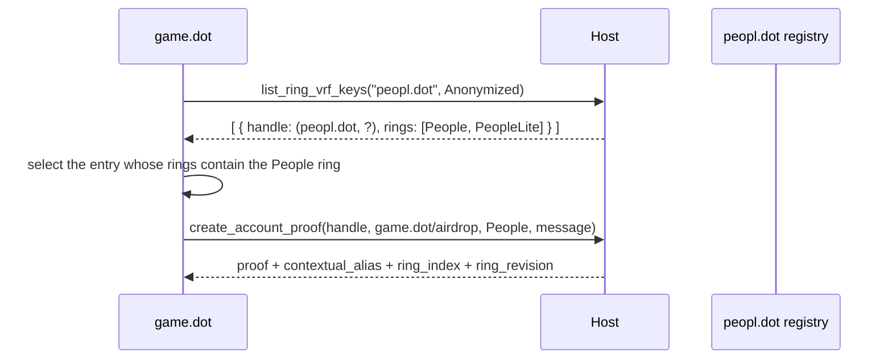

# RFC-0024: Proof of Personhood as a Product — Explicit Ring VRF Key Management

|                 |                                                                                                                     |
| --------------- | ------------------------------------------------------------------------------------------------------------------- |
| **RFC Number**  | 24                                                                                                                  |
| **Start Date**  | 2026-07-29                                                                                                          |
| **Description** | Make ring VRF member keys explicit, product-owned, and usable across products, so personhood can ship as a product  |
| **Authors**     | Valentin Sergeev                                                                                                    |

## Summary

RFC-0004 makes the Host pick a ring VRF member key on the caller's behalf, with a hard-coded fallback to "the PoP ring". This RFC replaces that with an explicit, product-owned key registry: a product registers keys it owns against the rings it intends them for, other products discover those registrations by an anonymized handle, and the handle is passed to `create_account_proof` / `get_account_alias`. With an `onLoad` executable modality for global lifetime and the Accounts Protocol companions, full and light personhood become a standalone product whose key index no consumer — including the Host — has to know.

Because a ring VRF proof is a bearer token for its context's alias, a proof is only issued when the caller owns either the key or the context. Cross-product alias use moves to transaction signing instead: `create_transaction`'s signer generalizes to include personhood-alias origins, so the Host produces the proof while satisfying the signer and never hands one out. The RFC also resolves RFC-0022's deferral of well-known alias accounts: every context is product-owned and built with TrUAPI's product-scoped context function, so there is no second context scheme.

## Motivation

**Personhood is welded into the Host.** RFC-0004 §"Host member-key selection" requires every Host to define the PoP ring collection internally, choose a member key corresponding to the requested `RingLocation`, fall back to the PoP key when correspondence is undeterminable, and tiebreak stably. `truapi-server` implements exactly that with the ring identities compiled in (`rust/crates/truapi-server/src/runtime/signing_host/ring_vrf.rs`: `FULL_PERSON_COLLECTION`, `LITE_PERSON_COLLECTION`, `enum PersonKey { Full, Lite }`). So every change to how a person key is derived, registered, renewed, or recovered is a Host release.

A personhood product must instead own the full and light keys — under RFC-0022, the `peopl.dot` domain of the ring-VRF tree — while telling the Host and Account Holder enough to keep serving the app's own personhood-dependent features, and lending its keys and aliases to other products. The binding constraint across all of it: **no consumer may know which key is used**, not the app and not a calling product.

**The obstacle** is that the member keys serve three overlapping classes of work, and only one is not extractable:

| Class                        | Examples                                           | Extractable?                       |
| ---------------------------- | -------------------------------------------------- | ---------------------------------- |
| App-internal features        | coinage unload proofs, PGAS / Bulletin / SSS slots | No — the app itself needs the key  |
| Product-extractable features | game, mobrule, identity                            | Yes                                |
| Cross-product shared         | set identity account, set score alias              | Yes, but needs cross-product reach |

The app-internal class forces a mechanism, and this RFC picks a **registration call**: the product declares which key is intended for which ring, and the Host uses that registration wherever it used a compiled-in key. The rejected alternative is in [Alternatives](#alternatives).

**Remote Hosts cannot reach ring VRF keys without the phone**, which is usually backgrounded. Two directions address it: the layered background-availability model designed for consent-free SSO requests (referenced, not respecified — see [Prior Art](#prior-art-and-references)), and an AutoSigning extension transferring the product's ring VRF domain entropy so the Host can derive registered member secrets locally.

## Stakeholders

- **Personhood product developers** — the first consumer; owns the registry entries for the full and light personhood rings.
- **Product developers building on personhood** — score / identity / mobrule / game; consume foreign handles, foreign contexts, and alias origins.
- **Host developers** — implement the registry, drop the compiled-in member-key selection, generalize the transaction signer, add the `onLoad` modality.
- **Account Holder developers (Mobile App)** — become the authoritative registry, implement the new message pairs, extend the AutoSigning payload, answer registrations from the background.
- **Chain / individuality developers** — on-chain contexts (`score`, `resources`, `mob-rule`) must be derived with TrUAPI's product-scoped context function rather than a parallel namespace.

## Explanation

### Terminology

- **Ring VRF domain** — per RFC-0022, ring VRF keys live in their own tree rooted at `hash(root_entropy, "ring-vrf")`, with hard-only paths `//{productId}//{index}`. A product's *domain entropy* is the node at `//{productId}`. This tree is disjoint from the sr25519 product-account tree at `//product//{productId}/{index}`.
- **DerivationIndex** — per RFC-0022, `Either<u32, [u8; 32]>`; each domain has its own index space.
- **Key handle** — the public name of a registered key: `ProductAccountId { dot_ns_identifier: <owner>, derivation_index: <index> }`. It names a slot in the owner's ring VRF domain, not an sr25519 account.
- **Registry** — the set of `(handle, declared rings)` entries. The Account Holder is authoritative; the Host holds a synchronized copy.

### Key management calls

Two additions to the `Account` trait.

```rust
type RingVrfPublicKey = [u8; 32];

/// A registry entry as returned to a caller.
struct RegisteredRingVrfKey {
    /// Stable public name of the key.
    handle: ProductAccountId,
    /// Rings the owning product declared this key for.
    rings: Vec<RingLocation>,
    /// `Some` when the caller owns the key, or has been granted public-key disclosure.
    public_key: Option<RingVrfPublicKey>,
}

/// How much of a registry entry the caller is asking for.
enum RingVrfKeyDisclosure {
    /// Handle and declared rings only.
    Anonymized,
    /// Additionally the member public key.
    PublicKey,
}

/// Register a ring VRF key the calling product owns, declaring the ring it is
/// intended for. Registering the same `index` for an additional `ring` extends
/// the existing entry rather than creating a second one.
fn register_ring_vrf_key(
    index: DerivationIndex,
    ring: RingLocation,
) -> Result<RingVrfPublicKey, RegisterRingVrfKeyErr>;

/// List the registry entries owned by `owner` — the calling product or another one.
fn list_ring_vrf_keys(
    owner: ProductId,
    disclosure: RingVrfKeyDisclosure,
) -> Result<Vec<RegisteredRingVrfKey>, ListRingVrfKeysErr>;
```

- **A product may register only its own keys.** Ownership is the calling product id, never a parameter, so registration needs no capability gate and no prompt.
- **A key may be registered for many rings**, and a product may hold several keys for one ring. Nothing assumes 1:1.
- **Registration declares intent, not membership.** It means "this is the key I will use for that ring", not "the user is a person"; membership is still discovered only by attempting a proof, which returns `NotMember` (RFC-0004). This keeps the registry from being a personhood oracle.
- **The public key is owner-visible by default, permissioned cross-product**, because a member public key is linkable across every ring it appears in.

RFC-0022 already pins `//peopl.dot//index_bytes(0)` as the full personhood key and `index_bytes(1)` as the light one. Under this RFC those constants are the personhood product's own implementation detail, expressed to everyone else as two registry entries.

### Proofs and aliases take an explicit key handle

RFC-0004's Host member-key selection contract is **deleted**: the Host no longer defines a PoP collection, infers correspondence, or has a fallback.

```rust
fn create_account_proof(
    key_handle: ProductAccountId,
    context: ProductProofContext,
    ring: RingLocation,
    message: Vec<u8>,
) -> Result<HostAccountCreateProofResponse, HostAccountCreateProofError>;

fn get_account_alias(
    key_handle: ProductAccountId,
    context: ProductProofContext,
    ring: RingLocation,
) -> Result<HostAccountGetAliasResponse, HostAccountGetAliasError>;
```

`ring` stays a parameter even though the handle carries declared rings: a key may be registered for several, and the caller must say which the proof is against. The Host MUST verify `ring` appears in the handle's declared rings and return `KeyNotInRing` otherwise. RFC-0004's guarantee that `(key_handle, context, ring)` yields the same alias on every conforming Host now holds trivially, since key selection is no longer Host policy.

### Errors

```rust
enum RegisterRingVrfKeyErr {
    /// No user is signed in (RFC-0009).
    NotConnected,
    RingNotFound,
    Rejected,
    Unknown { reason: String },
}

enum ListRingVrfKeysErr {
    NotConnected,
    /// `owner` is not the calling product and the caller has no grant for it.
    Rejected,
    Unknown { reason: String },
}

// Extensions to the RFC-0004 error sets. `HostAccountGetAliasError` gains
// `KeyNotRegistered` and `KeyNotInRing`; only proofs carry the last variant.
enum HostAccountCreateProofError {
    RingNotFound,
    NotMember,
    /// `key_handle` has no registry entry.
    KeyNotRegistered,
    /// `key_handle` is registered, but not for the requested `ring`.
    KeyNotInRing,
    /// Neither `key_handle` nor `context` belongs to the calling product.
    ForeignKeyInForeignContext,
    Rejected,
    Unknown { reason: String },
}

// Extensions to `HostCreateTransactionError` (RFC-0020).
enum HostCreateTransactionError {
    // ... existing variants unchanged ...
    /// An alias signer names a context the caller has no grant for.
    AliasNotPermitted,
    /// The call contains a `set_alias` whose target is not the alias account
    /// of the signing context.
    AliasTargetMismatch,
}
```

### Cross-product discovery

A game product producing a proof with the full personhood key, under its **own** airdrop context — abstracted by the product SDK, not the Host:



**No product may assume a key index of another product.** The index is the owner's implementation detail; consumers select by declared `RingLocation` and treat the handle as opaque. Hardcoding `(peopl.dot, 0)` breaks the moment the owner rotates or adds a key. This is the one rule a consuming product has to remember.

### Every context is owned by exactly one product

RFC-0004's `ProductProofContext { product_id, suffix }` and its derivation are unchanged:

```rust
fn product_context_bytes(ctx: ProductProofContext) -> [u8; 32] {
    blake2b256(utf8("product/") ++ utf8(ctx.product_id) ++ utf8("/") ++ ctx.suffix)
}
```

There is **no separate well-known-context namespace and no second context scheme.** Every context — including those existing as on-chain constants — is a `ProductProofContext` whose on-chain constant is the output of `product_context_bytes`, so RFC-0004's `product_account_id_for_proof_context(product_id, suffix)` applies unchanged and no context string needs encoding into a derivation suffix.

A context therefore has exactly one owner: the `product_id` mixed into its derivation. A context used by many products is not thereby owned by many — consumers name the owner's context, and only the owner can define one. Each context's alias account follows from the context alone, 1:1, through RFC-0004's `product_account_id_for_proof_context`.

**This supersedes RFC-0022 §"Well-known alias accounts"**, which describes `score`, `resources`, and `mob-rule` as owned by no product, outside the product-based construction, and defers their handling. Under this RFC they are ordinary product-owned contexts; **the score context is owned by the personhood product**, and DIMs coercible to the score system are its consumers. Access to a foreign context is governed by the permission model below; there is no sharing declaration on a context.

### A proof only ever binds to a context the caller owns

Keys and contexts are owned independently, and one of the four combinations is dangerous:

| `key_handle` owner | `context` owner | Example                                                    | Allowed |
| ------------------ | --------------- | ---------------------------------------------------------- | ------- |
| caller             | caller          | the personhood product proving under its own context        | yes     |
| **foreign**        | caller          | a game proving with the people key in its airdrop context   | yes     |
| caller             | **foreign**     | own key under a foreign context; fails `NotMember` anyway    | yes     |
| **foreign**        | **foreign**     | a game proving with the people key in the score context      | **no**  |

> A Host MUST reject `create_account_proof` when neither `key_handle` nor `context` belongs to the calling product, with `ForeignKeyInForeignContext`.

The reason is that **a proof is a bearer token for its context's alias.** `message` is opaque — for an extrinsic it is a hash of the inherited implication, and accepting a caller-supplied preimage instead would still be blind signing — so nothing at proof time can tell what the proof will authorize. A caller holding a proof under the score context can therefore bind that alias to an account of its own, signing the `set_alias` with its own product account and needing nothing further from anyone; nor is there a downstream chokepoint, since it can submit the extrinsic without going through the Host at all.

Denying the foreign/foreign combination removes the token, leaving a simple invariant: **whoever holds a proof owns the context it binds to**, so which account an alias points at is always the context owner's own business.

### Alias signing

That denial would also block the legitimate case — a product acting under another product's alias, such as claiming score rewards — if proofs were the only route. They are not. `create_transaction` already promises to *"upon approval, fill all necessary transaction extensions to satisfy signer"*, making it the natural place for an alias origin: the Host constructs the proof while satisfying the signer, so it never hands one out and sees the whole call while doing so.

RFC-0020 parametrized the transaction payload by signer type; the `ProductAccountId` signer generalizes to:

```rust
enum TxSigner {
    /// Sign as an ordinary product account. Today's behaviour.
    ProductAccount {
        account: ProductAccountId,
    },
    /// Sign as a personhood alias whose account is already set on chain,
    /// under an `AsPersonalAliasWithAccount`-style origin.
    PersonalAliasWithAccount {
        key_handle: ProductAccountId,
        context: ProductProofContext,
        ring: RingLocation,
    },
    /// Sign as a personhood alias proven by ring VRF, under an
    /// `AsPersonalAlias`-style origin. This is what `set_alias` uses.
    PersonalAliasWithProof {
        key_handle: ProductAccountId,
        context: ProductProofContext,
        ring: RingLocation,
    },
}
```

Both alias variants carry the same three fields the proof itself needs, for the same reasons as `create_account_proof`: the `key_handle` names which registered key to prove with, and `ring` disambiguates when that handle is registered for several. Neither is secret — a caller discovers the handle through `list_ring_vrf_keys` and treats it as opaque — so there is nothing gained by having the Host infer them. `context` needs no companion alias-account field, because a context and its alias account are 1:1 under RFC-0004's `product_account_id_for_proof_context`.

Semantics are unchanged: the caller supplies a call, the Host fills whatever the signer requires. The proof simply becomes one of those things, produced by the Host rather than the caller — which makes the enforcement that was impossible at proof time available:

> When the signer is `PersonalAliasWithProof` or `PersonalAliasWithAccount`, a Host MUST decode `call_data` and reject a `set_alias` whose target account is not the alias account of `context`, with `AliasTargetMismatch`.

The 1:1 mapping is what makes this an exact check rather than a containment test: for a given context there is exactly one legitimate target, so the Host recomputes it and compares. `set_alias` is the only call reachable under an alias origin that can rebind an alias, so it is the only one that needs the check. And since the Host must already understand the call well enough to build the origin's extensions, the extra cost is reading one argument.

`ProductAccount(...)` keeps accepting a foreign `ProductAccountId` under a grant — cross-product product-account signing has uses unrelated to ring VRF, so this RFC neither restricts nor bounds it — and `get_account` likewise still accepts a foreign id, which a caller needs anyway to put the alias account into the `set_alias` call. What the alias variants add is the *origin*, not access to a key: `PersonalAliasWithAccount` produces a transaction the chain sees as the personal alias acting, which a plain signature from the same account does not. The protection here is correspondingly narrow — not "no foreign signing", but that an alias's *binding* cannot be redirected.

The alias flow is then:

1. **Read the alias.** `get_account_alias(pop_handle, score_context, people_ring)`. The consuming product checks the ring revision on each use and renews when it has moved; nothing else watches for it.
2. **Bind or rebind if needed.** `create_transaction(set_alias(...), signer: PersonalAliasWithProof { pop_handle, score_context, people_ring })`. After a suspension this is a fresh `set_alias`; on a ring-revision change the accompanying action can ride an `AsPersonalAliasWithAccountRevised` origin alongside the update.
3. **Act.** `create_transaction(action, signer: PersonalAliasWithAccount { pop_handle, score_context, people_ring })`.

No cross-product proof is handed out at any step, and **in the happy path the user sees none of the three** — the requirement that shapes the permission model below.

### The app's own personhood-dependent features

On a successful registration the Host matches the declared `RingLocation` against its well-known table (People, People-Lite) by structural equality, records the handle as the corresponding person key, and uses it wherever it used `PersonKey::Full` / `PersonKey::Lite` — coinage unload proofs on the Host, ring-VRF slot assignment for Bulletin / SSS allowance and PGAS claims on the Account Holder (RFC-0010). Both learn the mapping from the registry rather than a compiled-in product id or index, and the compiled-in ring table shrinks to a well-known-ring matcher used for feature routing, not key selection.

**Contention.** If two products register for the same well-known ring, the Host MUST NOT pick silently. It resolves to the product the user designated as their personhood provider — a Host setting defaulting to the first registrar and user-changeable — so a second product cannot silently displace the first.

### Product shape

The personhood product is not headless: it needs a **pocket card**, because personhood has user-facing state worth surfacing (recovery, suspension status, which products hold grants), and a **global lifetime**, to answer registration and cross-product requests regardless of what the user is looking at.

The existing manifest model fits — one executable manifest per modality, all sharing one globally-lived background script, with the enabled modalities determining the reachable TrUAPI surface. Today `worker` carries `includes: { chat, pocket }`. One addition:

```ts
interface WorkerIncludes {
  chat: boolean;
  pocket: boolean;
  /** Runs on host load with a global lifetime and contributes no UI surface. */
  onLoad: boolean;
}
```

The personhood product declares `{ pocket: true, onLoad: true }`. No capability flag gates the key-management calls: registration only touches the caller's own domain, and consuming a foreign key is governed by the permission model.

`onLoad` is independently useful for products that contribute no UI at all. Those run in the background and never show themselves, so the Host MUST disclose the fact at install time and list them in a user-reachable "runs in the background" inventory — a headless globally-lived executable is otherwise indistinguishable from a Host feature.

### Permission model

The requirement is asymmetric: routine discovery should be cheap, and the powerful grants deliberate but not per-call.

| Call                                     | Own key / own context | Foreign                                                     |
| ---------------------------------------- | --------------------- | ----------------------------------------------------------- |
| `register_ring_vrf_key`                  | permissionless        | n/a — a product registers only its own keys                 |
| `list_ring_vrf_keys` (either disclosure) | permissionless        | requires a grant                                            |
| `get_account_alias`, `get_account`       | permissionless        | requires a grant                                            |
| `create_account_proof`                   | permissionless        | grant for the foreign key; **refused** if the context is also foreign |
| `create_transaction` · `ProductAccount`  | permissionless        | requires a grant — unchanged by this RFC                    |
| `create_transaction` · alias signers     | permissionless        | requires a grant for the context                            |

The model is **user-approval driven**, per RFC-0002: an unapproved foreign access produces a one-time prompt with the persist-once lifecycle. The only way to avoid the prompt is for the *owner* to have allowed the caller in advance — **a product declares, in its manifest, the list of product ids it permits to access its data without a prompt.** Nothing else grants silent access.

That declaration belongs to the product manifest, specified separately ([RFC: Product Manifest Format](https://github.com/paritytech/truapi/pull/206)), with two requirements from here: the allowlist must be **structurally extensible**, so a richer scheme (per-method grants, attestation thresholds) can replace a flat product-id list without a wire break; and it should be expressible **per method or category**, so "read my key handles" and "sign under my alias" need not be one grant. Until it lands, Hosts fall back to a one-time prompt per (caller, owner, call) triple, persisted per RFC-0002.

### Accounts Protocol

Ring VRF secrets derive from the user's root entropy, so every operation here ultimately belongs to the Account Holder.

```rust
struct RegisterRingVrfKeyRequest {
    calling_product_id: ProductId,
    index: DerivationIndex,
    ring: RingLocation,
}
struct RegisterRingVrfKeyResponse {
    responding_to: SsoSessionRequestId,
    payload: Result<RingVrfPublicKey, RingVrfError>,
}

struct ListRingVrfKeysRequest {
    calling_product_id: ProductId,
    owner: ProductId,
    disclosure: RingVrfKeyDisclosure,
}
struct ListRingVrfKeysResponse {
    responding_to: SsoSessionRequestId,
    payload: Result<Vec<RegisteredRingVrfKey>, RingVrfError>,
}
```

A Host holding a current registry snapshot answers `list` locally. `RingVrfProofRequest` and `RingVrfAliasRequest` gain `key_handle: ProductAccountId` alongside the `calling_product_id` they already carry, and `RingVrfError` gains `KeyNotRegistered` and `KeyNotInRing`.

**Registration always reaches the Account Holder, but never blocks on it.** The phone is the authoritative registry — it needs the complete set to serve slot assignment and PGAS claims, and to show the user what their keys are used for. A Host holding the product's domain entropy answers immediately and mirrors the registration fire-and-forget; registration is idempotent, so re-notifying the phone about an entry it already has costs nothing. Without the entropy the Host issues the request and waits.

> **A Host MUST NOT derive a member secret for a `(product, index)` pair absent from its registry.**

This needs saying because domain entropy makes derivation *unconditional*: given the entropy of `//peopl.dot`, a Host can compute the member secret at index 7, or 4711, or any other, since derivation is pure arithmetic and nothing about holding the entropy distinguishes a meaningful index from a meaningless one. The registry supplies that distinction. Serve an unregistered index and the phone has no record the key exists — it cannot include it in slot assignment, list it in the inventory, or answer "what is this key used for". So the entropy lets a Host **derive** a key the registry already lists; only registration, which always reaches the phone, brings one into **existence**.

#### Answering while the phone is backgrounded

Registration is consent-free from the user's point of view and not latency-critical, so it is served by the layered background-availability model already designed for consent-free SSO requests — handshake prefetch, foreground, a bounded hot window, a push-woken headless cold path, and a mandatory non-blocking degrade. That model is specified in its own document (see [Prior Art](#prior-art-and-references)) and is not restated here.

Two consequences belong to this RFC: prefetch should carry the registry snapshot, so a consumer of an already-registered key never pays a round trip; and every headless execution context has a system-enforced budget (~30 s, ~24 MB), which a `RingVrfPublicKey` derivation fits comfortably but a ring VRF **proof** may not — the second motivation for the extension below.

#### AutoSigning extension

RFC-0022 collapses RFC-0010's `AutoSigning` payload to the product-root secret key alone. It is extended to also transfer the ring VRF domain entropy:

```rust
AutoSigning {
    /// Secret key of `//product//{productId}`.
    product_root_private_key: Sr25519SecretKey,
    /// Entropy of the `//{productId}` node of the ring-VRF tree (RFC-0022).
    /// Lets the Host derive the member secret of any *registered* key locally.
    ring_vrf_domain_entropy: RingVrfEntropy,
}
```

No registry snapshot travels with the grant: the Host accumulates registrations as it serves them and receives the rest through prefetch. With this granted, a remote Host serves `create_account_proof`, `get_account_alias`, and alias signing — including a foreign product's — without touching the phone. **The grant comes from the key owner, not the caller**: a proof against `peopl.dot`'s key is served locally only because `peopl.dot` granted AutoSigning.

### Migration and compatibility

Nothing here ships with production consumers. `create_account_proof` (wire `request_id` 26) and `get_account_alias` (wire 24) have no external callers, so the leading `key_handle` is added in place rather than behind a new protocol version; their request types gain a field with wire ids unchanged. The two new methods take fresh append-only ids. `get_account` (wire 22) keeps its signature — a previously-rejected input becoming conditionally accepted is purely additive.

`ProductAccountTxPayload.signer` changes type from `ProductAccountId` to `TxSigner`, breaking at the SCALE layer for `create_transaction` (wire 30). This continues RFC-0020's second change — parametrizing the payload by signer type — rather than reversing its first: the `context` RFC-0020 removed was `TxPayloadContext` (metadata, token symbol, best block), where `TxSigner`'s `ProductProofContext` carries which alias signs. `LegacyAccountTxPayload` is untouched, a legacy account having no product subtree and therefore no alias.

In the Accounts Protocol: two new message pairs, a field on each ring VRF request, one field on `AutoSigning`, and a signing companion mirroring `TxSigner` so the Account Holder can satisfy an alias origin without AutoSigning — all breaking at the SCALE layer, landing together with RFC-0022. `WorkerIncludes.onLoad` is additive.

The compiled-in ring identities and `PersonKey { Full, Lite }` are removed once the personhood product registers, and are **not** retained as a fallback: a silent fallback to a compiled-in key would resurrect the coupling this RFC removes and mask registry-sync bugs as working proofs.

## Drawbacks

- **Removing the fallback makes personhood installable, and therefore missing.** A user without the product installed has no people key at all, so coinage unload and PGAS allowance stop working until they install it. Intended, but a real regression in default capability.
- **The Host must decode `set_alias` to enforce the alias-target rule.** Real coupling to the individuality pallet: a call-encoding change breaks the check, and a check that silently stops matching fails open. It widens an existing dependency rather than creating one — the Host already decodes enough to build the origin's extensions — but it must fail closed on an unrecognized call shape under an alias signer.
- **Bundling ring VRF entropy into AutoSigning widens one grant.** "Sign transactions without prompting me" and "produce personhood proofs offline" become one decision, and the second is arguably the stronger. Accepted deliberately: two grants would mean two authorization surfaces for what the user experiences as one relationship.
- **The registry is new distributed state**, agreed between the registering product, the caching Host, and the owning Account Holder; a stale Host returns `KeyNotRegistered` for a key that exists. Idempotent registration and a single authority keep it diagnosable, but it replaces a compile-time constant.
- **Registration leaks intent.** An anonymized listing still says "`peopl.dot` has a key it intends for the People ring" — not proof of membership, but a consumer learns the user has attempted full personhood before any proof is requested. The one privacy cost accepted for cheap discovery.
- **The silent happy path depends on the manifest RFC**: until the allowlist exists, each cross-product call in the alias flow produces a one-time prompt.
- **The key handle overloads `ProductAccountId`**, which now names both an sr25519 product account and a ring VRF slot in a different tree at the same `(product, index)`.

## Alternatives

- **Per-flow host callbacks instead of a registration call** — a Host call per internal flow with a product-supplied handler. Rejected: a new bidirectional contract for every internal feature the Host ever adds, coupled release cycles, and it hands the product flows (slot-table bookkeeping, claim budgets) RFC-0010 put on the Account Holder.
- **Enforcing the alias target at proof time**, with the Host constructing the whole `set_alias` payload behind a dedicated call. Rejected: `create_transaction` already receives the call and already owes the signer its extensions, so no new method and no second call-construction path is needed.
- **Inspecting the proof `message`**, with or without a caller-supplied preimage. Unimplementable: it is a hash of the inherited implication, and trusting a caller's preimage is still blind signing.
- **Attestation thresholds / trusted verifiers** instead of a product-id allowlist. Deferred rather than dismissed: the flat list is simpler, and the manifest RFC must keep the schema extensible.
- **A `ProofContext` enum with a `PoP(WellKnownContextSuffix)` variant.** Rejected: it forks context derivation and alias-account mapping in two — the situation RFC-0022 left open and this RFC closes.

## Prior Art and References

- [RFC-0004 — Redesign `create_account_proof`](0004-ringlocation-redesign.md) — `RingLocation`, `ProductProofContext`, the context derivation, and the member-key selection contract this RFC deletes. Its "Out of scope: explicit member-key management … left to a future RFC" is this RFC.
- **RFC-0022 — Account key derivations** ([PR #296](https://github.com/paritytech/truapi/pull/296)) — the ring-VRF tree, `Either<u32, [u8; 32]>` indices, the reserved `peopl.dot` identity, and the `AutoSigning` payload this RFC extends. Its deferral of well-known alias accounts is resolved here.
- **RFC-0023 — sr25519 VRF signing for product accounts** ([PR #301](https://github.com/paritytech/truapi/pull/301)) — the complementary non-member path, where this RFC's ring VRF path serves members.
- [RFC-0020 — `create_transaction` and its AP mirror](0020-create-transaction.md) — the signer-parametrized payload this RFC generalizes, and the pattern of specifying a call together with its AP companion.
- [RFC-0010 — W3S Allowance Management](0010-allowance.md) — AutoSigning and the PGAS / Bulletin / SSS flows that consume the person key.
- [RFC-0002 — Permission Model](0002-permission-model.md) — the prompt-once lifecycle every cross-product grant reuses · [RFC-0009](0009-unauthenticated-product-access.md) — `NotConnected` semantics · [RFC: Product Manifest Format](https://github.com/paritytech/truapi/pull/206) — where the allowlist is specified.
- *SSO background availability — common model* — the layered availability ladder referenced above. **TODO: link the HackMD document.**
- `rust/crates/truapi-server/src/runtime/signing_host/ring_vrf.rs` — the compiled-in selection this RFC removes.
- [Polkadot People Registry / Ring VRF](https://forum.polkadot.network/t/the-people-registry/12749) · [individuality#878](https://github.com/paritytech/individuality/pull/878) — alias-account assignment for derived product addresses.

## Unresolved Questions

No open questions remain on the design above. Three items are deliberately deferred to follow-up work:

- **Revocation** — already deferred by RFC-0010 and made more urgent by the entropy transfer, including retraction of a registry entry by its owner.
- **Key rotation and recovery** — the registry makes rotation expressible (register a new index, retire the old), but the effect on in-flight aliases is unspecified.
- **Provider competition** — once personhood is a product, more than one can exist; the provider-designation setting is only the minimal hook.
