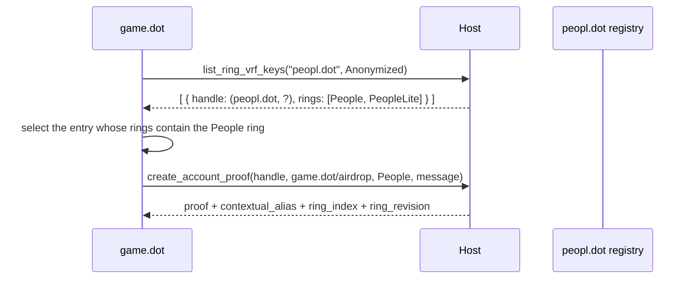

# RFC-0024: Proof of Personhood as a Product — Explicit Ring VRF Key Management

|                 |                                                                                                                     |
| --------------- | ------------------------------------------------------------------------------------------------------------------- |
| **RFC Number**  | 24                                                                                                                  |
| **Start Date**  | 2026-07-29                                                                                                          |
| **Description** | Make ring VRF member keys explicit, product-owned, and usable across products, so personhood can ship as a product  |
| **Authors**     | Valentin Sergeev                                                                                                    |

## Summary

RFC-0004 makes the Host pick a ring VRF member key on the caller's behalf, with a hard-coded fallback to "the PoP ring". This RFC replaces that with an explicit, product-owned key registry: a product registers keys it owns against the rings it intends them for, other products discover those registrations by an anonymized handle, and the handle is passed to `create_account_proof` / `get_account_alias`. With an `onLoad` executable modality for global lifetime, and the Accounts Protocol companions, full and light personhood become a standalone product that no consumer — including the Host itself — has to know the key index of.

Because a ring VRF proof is a bearer token for its context's alias, a proof is only ever issued when the caller owns either the key or the context. Cross-product alias use moves to transaction signing instead: `create_transaction`'s signer generalizes to include personhood-alias origins, so the Host produces the proof while satisfying the signer and never hands one out.

It also resolves RFC-0022's deferral of well-known alias accounts (`score`, `resources`, `mob-rule`): every context is product-owned and constructed with TrUAPI's product-scoped context function, so there is no second context scheme.

## Motivation

### Personhood is welded into the Host

RFC-0004 §"Host member-key selection" requires every Host to define the PoP ring collection internally, choose a member key corresponding to the requested `RingLocation`, fall back to the PoP key when correspondence is undeterminable, and tiebreak stably. `truapi-server` implements exactly that with the ring identities compiled in (`rust/crates/truapi-server/src/runtime/signing_host/ring_vrf.rs`: `FULL_PERSON_COLLECTION`, `LITE_PERSON_COLLECTION`, `enum PersonKey { Full, Lite }`).

So personhood cannot be shipped, versioned, or replaced independently of the Host: every change to how a person key is derived, registered, renewed, or recovered is a Host release.

### What a personhood product must be able to do

1. **Own** the full and light personhood ring VRF keys — under RFC-0022 the `peopl.dot` domain of the ring-VRF tree.
2. **Tell the Host and the Account Holder enough** to keep serving the app's own personhood-dependent features — coinage unload proofs, and the ring-VRF slot assignment behind PGAS / Bulletin / Statement Store allowance (RFC-0010).
3. **Lend its keys** to other products, so they can create proofs and read aliases.
4. **Lend its aliases** — without lending the proofs behind them. Every use of an alias is a signature under an alias origin; the alias must additionally be *set* on chain and *renewed* — after a suspension a fresh `set_alias` is required from scratch, while a ring-revision change still requires a proof but can ride an `AsPersonalAliasWithAccountRevised` origin alongside the alias update.

The binding constraint across all four: **no consumer may know which key is used** — not the app, and not a calling product.

### The obstacle

The member keys serve three overlapping classes of work, and only one is not extractable:

| Class                        | Examples                                           | Extractable?                       |
| ---------------------------- | -------------------------------------------------- | ---------------------------------- |
| App-internal features        | coinage unload proofs, PGAS / Bulletin / SSS slots | No — the app itself needs the key  |
| Product-extractable features | game, mobrule, identity                            | Yes                                |
| Cross-product shared         | set identity account, set score alias              | Yes, but needs cross-product reach |

The app-internal class is what forces a mechanism. This RFC picks a **registration call**: the product declares which of its keys is intended for which ring, and the Host uses that registration wherever it used a compiled-in key. The rejected alternative is in [Alternatives](#alternatives).

### Remote Hosts cannot use ring VRF keys without the phone

A remote (Desktop) Host cannot use a ring VRF key without a round trip to the Account Holder, and the phone is usually backgrounded. Two independent directions address this: the layered background-availability model designed for consent-free SSO requests (referenced, not specified here — see [Prior Art](#prior-art-and-references)), and an **AutoSigning extension** that transfers the product's ring VRF domain entropy so the Host can derive registered member secrets locally.

## Stakeholders

- **Personhood product developers** — the first consumer; owns the registry entries for the full and light personhood rings.
- **Product developers building on personhood** — score / identity / mobrule / game; consume foreign handles, foreign contexts, and alias accounts.
- **Host developers** — implement the registry, drop the compiled-in member-key selection, add the `onLoad` modality.
- **Account Holder developers (Mobile App)** — become the authoritative registry, implement the new message pairs, extend the AutoSigning payload, answer registrations from the background.
- **Chain / individuality developers** — on-chain contexts (`score`, `resources`, `mob-rule`) must be derived with TrUAPI's product-scoped context function rather than a parallel namespace.

## Explanation

### Terminology

- **Ring VRF domain** — per RFC-0022, ring VRF keys live in their own tree rooted at `hash(root_entropy, "ring-vrf")`, with hard-only paths `//{productId}//{index}`. A product's *domain entropy* is the node at `//{productId}`; its member secrets are the children of that node. This tree is disjoint from the sr25519 product-account tree at `//product//{productId}/{index}`.
- **DerivationIndex** — per RFC-0022, `Either<u32, [u8; 32]>`; each domain has its own index space.
- **Key handle** — the public name of a registered key: `ProductAccountId { dot_ns_identifier: <owner>, derivation_index: <index> }`. It names a derivation slot in the owner's ring VRF domain, not an sr25519 account.
- **Registry** — the set of `(handle, declared rings)` entries. The Account Holder is authoritative; the Host holds a synchronized copy.

### Key management calls

Two additions to the `Account` trait.

```rust
type RingVrfPublicKey = [u8; 32];

/// A registry entry as returned to a caller.
struct RegisteredRingVrfKey {
    /// Stable public name of the key.
    handle: ProductAccountId,
    /// Rings the owning product declared this key for.
    rings: Vec<RingLocation>,
    /// `Some` when the caller owns the key, or has been granted public-key disclosure.
    public_key: Option<RingVrfPublicKey>,
}

/// How much of a registry entry the caller is asking for.
enum RingVrfKeyDisclosure {
    /// Handle and declared rings only.
    Anonymized,
    /// Additionally the member public key.
    PublicKey,
}

/// Register a ring VRF key the calling product owns, declaring the ring it is
/// intended for. Registering the same `index` for an additional `ring` extends
/// the existing entry rather than creating a second one.
fn register_ring_vrf_key(
    index: DerivationIndex,
    ring: RingLocation,
) -> Result<RingVrfPublicKey, RegisterRingVrfKeyErr>;

/// List the registry entries owned by `owner` — the calling product or another one.
fn list_ring_vrf_keys(
    owner: ProductId,
    disclosure: RingVrfKeyDisclosure,
) -> Result<Vec<RegisteredRingVrfKey>, ListRingVrfKeysErr>;
```

- **A product may register only its own keys.** Ownership is the calling product id, never a parameter. Registration therefore needs no capability gate and no prompt: a product creating an entry in its own domain cannot affect anyone else.
- **A key may be registered for many rings**, and a product may hold several keys for one ring. Neither the API nor consumers assume 1:1.
- **Registration declares intent, not membership.** It means "this is the key I will use for that ring", not "the user is a person". Membership is still discovered only by attempting a proof, which returns `NotMember` (RFC-0004). This keeps the registry from being a personhood oracle.
- **The public key is owner-visible by default, permissioned cross-product.** The anonymized shape is what makes routine discovery cheap; a member public key is linkable across every ring it appears in, so it is disclosed only under a grant.

RFC-0022 already pins `//peopl.dot//index_bytes(0)` as the full personhood key and `index_bytes(1)` as the light one. Under this RFC those constants are the personhood product's own implementation detail, expressed to everyone else as two registry entries.

### Proofs and aliases take an explicit key handle

RFC-0004's Host member-key selection contract is **deleted**: the Host no longer defines a PoP collection, infers correspondence, or has a fallback.

```rust
fn create_account_proof(
    key_handle: ProductAccountId,
    context: ProductProofContext,
    ring: RingLocation,
    message: Vec<u8>,
) -> Result<HostAccountCreateProofResponse, HostAccountCreateProofError>;

fn get_account_alias(
    key_handle: ProductAccountId,
    context: ProductProofContext,
    ring: RingLocation,
) -> Result<HostAccountGetAliasResponse, HostAccountGetAliasError>;
```

`ring` stays a parameter even though the handle carries declared rings: a key may be registered for several, and the caller must say which one the proof is against. The Host MUST verify `ring` appears in the handle's declared rings and return `KeyNotInRing` otherwise, so a stale caller cannot obtain a proof against a ring the owner did not intend.

RFC-0004's guarantee that `(key_handle, context, ring)` yields the same alias on every conforming Host holds trivially now that key selection is not Host policy.

### Errors

```rust
enum RegisterRingVrfKeyErr {
    /// No user is signed in (RFC-0009).
    NotConnected,
    RingNotFound,
    Rejected,
    Unknown { reason: String },
}

enum ListRingVrfKeysErr {
    NotConnected,
    /// `owner` is not the calling product and the caller has no grant for it.
    Rejected,
    Unknown { reason: String },
}

// Extensions to the RFC-0004 error sets. `HostAccountGetAliasError` gains
// `KeyNotRegistered` and `KeyNotInRing`; only proofs carry the last variant.
enum HostAccountCreateProofError {
    RingNotFound,
    NotMember,
    /// `key_handle` has no registry entry.
    KeyNotRegistered,
    /// `key_handle` is registered, but not for the requested `ring`.
    KeyNotInRing,
    /// Neither `key_handle` nor `context` belongs to the calling product.
    ForeignKeyInForeignContext,
    Rejected,
    Unknown { reason: String },
}

// Extensions to `HostCreateTransactionError` (RFC-0020).
enum HostCreateTransactionError {
    // ... existing variants unchanged ...
    /// An alias signer names a context the caller has no grant for.
    AliasNotPermitted,
    /// The call contains a `set_alias` whose target account is outside the
    /// subtree of the signing context's owner.
    AliasTargetNotOwned,
}
```

### Cross-product discovery

The flow for a game product to produce a proof with the full personhood key, under its **own** airdrop context — abstracted by the product SDK, not by the Host:



The context is the caller's own, which is what makes this the permitted shape; see [proof scope](#a-proof-only-ever-binds-to-a-context-the-caller-owns).

**No product may assume a key index of another product.** The index is the owner's implementation detail; consumers select by declared `RingLocation` and treat the handle as opaque. Hardcoding `(peopl.dot, 0)` breaks the moment the owner rotates or adds a key. This is the one rule a consuming product has to remember.

### Every context is owned by exactly one product

RFC-0004's `ProductProofContext { product_id, suffix }` and its derivation are unchanged:

```rust
fn product_context_bytes(ctx: ProductProofContext) -> [u8; 32] {
    blake2b256(utf8("product/") ++ utf8(ctx.product_id) ++ utf8("/") ++ ctx.suffix)
}
```

There is **no separate well-known-context namespace and no second context scheme.** Every context — including the ones that exist as on-chain constants — is a `ProductProofContext`, and its on-chain constant is the output of `product_context_bytes`. Chain-side definitions must be derived with this function; RFC-0004's `product_account_id_for_proof_context(product_id, suffix)` then applies unchanged, so no special encoding of a context string into a derivation suffix is needed.

A context therefore has exactly one owner — the `product_id` mixed into its derivation. A context used by many products is not thereby owned by many; consumers name the owner's context, and only the owner can define one. **This supersedes RFC-0022 §"Well-known alias accounts"**, which describes `score`, `resources`, and `mob-rule` as owned by no product and outside the product-based construction, and defers their handling. They are assigned owners instead: **the score context is owned by the personhood product**, and DIMs coercible to the score system are its consumers.

Access to another product's context is governed by the ordinary permission model below — there is no separate sharing declaration on a context.

### A proof only ever binds to a context the caller owns

Keys and contexts are independently owned, so three combinations are meaningful, and one of them is dangerous.

| `key_handle` owner | `context` owner | Example                                                        | Allowed |
| ------------------ | --------------- | -------------------------------------------------------------- | ------- |
| caller             | caller          | the personhood product proving under its own context              | yes     |
| **foreign**        | caller          | a game product proving with the people key in its airdrop context | yes     |
| caller             | **foreign**     | a caller's own key under someone else's context — not a member of the personhood ring, so it fails `NotMember` anyway | yes |
| **foreign**        | **foreign**     | a game product proving with the people key in the score context   | **no**  |

> A Host MUST reject `create_account_proof` when neither `key_handle` nor `context` belongs to the calling product, with `ForeignKeyInForeignContext`.

The reason is that **a proof is a bearer token for its context's alias.** `message` is opaque — for an extrinsic it is a hash of the inherited implication, and supplying a preimage instead would still be blind signing — so no inspection at proof time can tell what the proof will authorize. A caller holding a proof under the score context can therefore bind that alias to an account of its own, signing the `set_alias` with its own product account, needing nothing further from anyone. There is no downstream chokepoint either: the caller can submit the extrinsic without going through the Host at all.

Denying the foreign/foreign combination removes the token. The resulting invariant is simple: **whoever holds a proof owns the context it binds to**, so the choice of which account an alias points at is always the context owner's own business.

### Alias signing

Denying that combination would also deny the legitimate case — a product acting under another product's alias, such as claiming score rewards — if proofs were the only route. They are not. `create_transaction` already promises to *"upon approval, fill all necessary transaction extensions to satisfy signer"*, so it is the natural place for an alias origin: the Host constructs the proof as part of satisfying the signer, which means it never hands one out, and it sees the whole call while doing so.

RFC-0020 parametrized the transaction payload by signer type; the `ProductAccountId` signer generalizes to:

```rust
enum TxSigner {
    /// Sign as an ordinary product account. Today's behaviour.
    ProductAccount(ProductAccountId),
    /// Sign as a personhood alias whose account is already set on chain,
    /// under an `AsPersonalAliasWithAccount`-style origin.
    PersonalAliasWithAccount(ProductAccountId, ProductProofContext),
    /// Sign as a personhood alias proven by ring VRF, under an
    /// `AsPersonalAlias`-style origin. This is what `set_alias` uses.
    PersonalAliasWithProof(ProductProofContext),
}
```

This does not change `create_transaction`'s semantics — the caller still supplies a call and the Host still fills whatever the signer requires. The proof simply becomes one of those things, produced by the Host rather than by the caller.

The enforcement that was impossible at proof time is now available:

> When the signer is `PersonalAliasWithProof` or `PersonalAliasWithAccount`, a Host MUST decode `call_data` and reject a `set_alias` whose target account is outside the subtree of `context.product_id`, with `AliasTargetNotOwned`.

The Host must already understand the call well enough to build the origin's extensions, so the additional cost is reading one argument of one call.

`ProductAccount(...)` keeps accepting a foreign `ProductAccountId` under a grant. Cross-product product-account signing has uses unrelated to ring VRF, so this RFC neither restricts nor bounds it; it is governed by the general permission model and by the separate work on account-access permissions. `get_account` likewise still accepts a foreign id, which a caller needs anyway to put the alias account into a `set_alias` call.

What the two alias variants add is the *origin*, not merely access to a key: `PersonalAliasWithAccount` produces a transaction the chain sees as the personal alias acting, which a plain signature from the same account does not. And the protection this section is about is narrower than "no foreign signing" — it is that the *binding* of an alias cannot be redirected, which depends only on the proof never being lent and on the `set_alias` target being checked.

The alias flow collapses accordingly:

1. **Read the alias.** `get_account_alias(pop_handle, score_context, people_ring)`. The consuming product checks the ring revision on each use and renews when it has moved; nothing else watches for it.
2. **Bind or rebind if needed.** `create_transaction(set_alias(...), signer: PersonalAliasWithProof(score_context))`. After a suspension this is a fresh `set_alias`; on a ring-revision change the accompanying action can ride an `AsPersonalAliasWithAccountRevised` origin alongside the update.
3. **Act.** `create_transaction(action, signer: PersonalAliasWithAccount(alias_account, score_context))`.

No cross-product proof is handed out at any step, and **in the happy path the user sees none of the three** — the requirement that shapes the permission model below.

### The app's own personhood-dependent features

On a successful registration the Host matches the declared `RingLocation` against its well-known table (People, People-Lite) by structural equality, records the handle as the corresponding person key, and uses it wherever it used `PersonKey::Full` / `PersonKey::Lite` — coinage unload proofs on the Host, ring-VRF slot assignment for Bulletin / SSS allowance and PGAS claims on the Account Holder (RFC-0010). Both components learn the mapping from the registry rather than from a compiled-in product id or index. The compiled-in ring table shrinks to a well-known-ring matcher used for feature routing, not key selection.

**Contention.** If two products register for the same well-known ring, the Host MUST NOT pick silently. It resolves to the product the user designated as their personhood provider — a Host setting that defaults to the first registrar and is user-changeable — so a second product cannot silently displace the first.

### Product shape

The personhood product is not headless: it needs a **pocket card**, because personhood has user-facing state worth surfacing (recovery, suspension status, which products hold grants). It also needs a **global lifetime**, to answer registration and cross-product requests regardless of what the user is looking at.

The existing manifest model fits: one executable manifest per modality, all sharing one globally-lived background script, with the enabled modalities determining the reachable TrUAPI surface. Today `worker` carries `includes: { chat, pocket }` — the UI surfaces it contributes. One addition:

```ts
interface WorkerIncludes {
  chat: boolean;
  pocket: boolean;
  /** Runs on host load with a global lifetime and contributes no UI surface. */
  onLoad: boolean;
}
```

The personhood product declares `{ pocket: true, onLoad: true }`. No capability flag gates the key-management calls: registration only ever touches the caller's own domain, and consuming a foreign key is governed by the permission model.

`onLoad` is independently useful for products that genuinely contribute no UI. A product whose manifest declares `onLoad` and nothing else runs in the background and never shows itself; for those, the Host MUST disclose the fact at install time and list them in a user-reachable "runs in the background" inventory, since a headless globally-lived executable is otherwise indistinguishable from a Host feature.

### Permission model

The requirement is asymmetric: routine discovery should be cheap, and the powerful grants deliberate but not per-call.

| Call                                          | Own key / own context | Foreign                                                     |
| --------------------------------------------- | --------------------- | ----------------------------------------------------------- |
| `register_ring_vrf_key`                       | permissionless        | n/a — a product registers only its own keys                 |
| `list_ring_vrf_keys(Anonymized)`              | permissionless        | requires a grant                                            |
| `list_ring_vrf_keys(PublicKey)`               | permissionless        | requires a grant                                            |
| `get_account_alias`                           | permissionless        | requires a grant                                            |
| `create_account_proof`                        | permissionless        | grant for the foreign key; **refused** if the context is also foreign |
| `get_account`                                 | permissionless        | requires a grant                                            |
| `create_transaction` · `ProductAccount`       | permissionless        | requires a grant — unchanged by this RFC                    |
| `create_transaction` · alias signers          | permissionless        | requires a grant for the context                            |

The model is **user-approval driven**, per RFC-0002: a foreign access the user has not approved produces a one-time prompt with the persist-once lifecycle. The only way to avoid the prompt is for the *owner* to have allowed the caller in advance: **a product declares, in its manifest, the list of product ids it permits to access its data without a prompt.** Nothing else grants silent access.

That declaration belongs to the product manifest, which is specified separately (see [RFC: Product Manifest Format](https://github.com/paritytech/truapi/pull/206)). Two requirements on it from here:

- The allowlist must be **structurally extensible**, so a richer scheme (per-method grants, attestation thresholds) can replace a flat product-id list later without a wire break.
- It should be expressible **per method or method category**, so "read my key handles" and "sign from my alias account" need not be one grant.

Until that RFC lands, Hosts fall back to a one-time prompt per (caller, owner, call) triple, persisted per RFC-0002 — correct, but with consent surfaces the target UX does not want.

### Accounts Protocol

Ring VRF secrets derive from the user's root entropy, so every operation here ultimately belongs to the Account Holder.

```rust
struct RegisterRingVrfKeyRequest {
    calling_product_id: ProductId,
    index: DerivationIndex,
    ring: RingLocation,
}
struct RegisterRingVrfKeyResponse {
    responding_to: SsoSessionRequestId,
    payload: Result<RingVrfPublicKey, RingVrfError>,
}

struct ListRingVrfKeysRequest {
    calling_product_id: ProductId,
    owner: ProductId,
    disclosure: RingVrfKeyDisclosure,
}
struct ListRingVrfKeysResponse {
    responding_to: SsoSessionRequestId,
    payload: Result<Vec<RegisteredRingVrfKey>, RingVrfError>,
}
```

A Host holding a current registry snapshot answers `list` locally and does not issue that request. `RingVrfProofRequest` and `RingVrfAliasRequest` gain `key_handle: ProductAccountId` alongside the `calling_product_id` they already carry, and `RingVrfError` gains `KeyNotRegistered` and `KeyNotInRing`.

**Registration always reaches the Account Holder, but never blocks on it.** The phone is the authoritative registry — it needs the complete set to serve slot assignment and PGAS claims, and to show the user what their keys are used for. A Host that holds the product's domain entropy answers the product immediately and mirrors the registration to the phone fire-and-forget; registration is idempotent, so re-notifying the phone about an entry it already has costs nothing. Without that entropy the Host issues the request and waits.

> **A Host MUST NOT derive a member secret for a `(product, index)` pair absent from its registry.**

The reason this needs saying: domain entropy makes derivation *unconditional*. Given the entropy of `//peopl.dot`, a Host can compute the member secret at index 7, or 4711, or any other index, because derivation is pure arithmetic — nothing about holding the entropy distinguishes an index that means something from one that does not. The registry is what supplies that distinction. If a Host served a proof for an unregistered index, the phone would have no record that such a key exists: it could not include it in slot assignment, could not list it in the user's inventory, and could not answer "what is this key used for". So the entropy grants the Host the ability to **derive** a member secret the registry already lists; only registration — which always reaches the phone — brings a new key into **existence**.

#### Answering while the phone is backgrounded

Registration is consent-free from the user's point of view and not latency-critical, so it is served by the layered background-availability model already designed for consent-free SSO requests: handshake prefetch, foreground, a bounded hot window, a push-woken headless cold path, and a mandatory non-blocking degrade. That model is specified in its own document (linked under [Prior Art](#prior-art-and-references)) and is not restated here.

Two consequences matter for this RFC. Prefetch should carry the registry snapshot, so a consumer of an already-registered key never pays a round trip. And every headless execution context has a system-enforced budget (~30 s, ~24 MB): deriving a `RingVrfPublicKey` fits comfortably, while producing a ring VRF **proof** may not — the second motivation for the extension below.

#### AutoSigning extension

RFC-0022 collapses RFC-0010's `AutoSigning` payload to the product-root secret key alone. It is extended to also transfer the product's ring VRF domain entropy:

```rust
AutoSigning {
    /// Secret key of `//product//{productId}`.
    product_root_private_key: Sr25519SecretKey,
    /// Entropy of the `//{productId}` node of the ring-VRF tree (RFC-0022).
    /// Lets the Host derive the member secret of any *registered* key locally.
    ring_vrf_domain_entropy: RingVrfEntropy,
}
```

No registry snapshot travels with the grant: the Host accumulates registrations as it serves them and receives the rest through prefetch.

With this granted, a remote Host serves `create_account_proof` and `get_account_alias` — including a foreign product's — without touching the phone. **The grant comes from the key owner, not the caller**: product A's proof against `peopl.dot`'s key is served locally only because `peopl.dot` granted AutoSigning; A cannot grant it.

### Migration and compatibility

Nothing here ships with production consumers. RFC-0004's `create_account_proof` (wire `request_id` 26) and `get_account_alias` (wire 24) have no external callers, so the leading `key_handle` is added in place rather than behind a new protocol version; `HostAccountCreateProofRequest` and `HostAccountGetAliasRequest` gain a field with their wire ids unchanged. The two new methods take fresh append-only ids. `get_account` (wire 22) keeps its signature — a previously-rejected input becomes conditionally accepted, which is purely additive.

`ProductAccountTxPayload.signer` changes type from `ProductAccountId` to `TxSigner`, which is breaking at the SCALE layer for `create_transaction` (wire 30). It is a continuation of RFC-0020's second change — parametrizing the payload by signer type — rather than a reversal of its first: the `context` RFC-0020 removed was `TxPayloadContext` (metadata, token symbol, best block), and `TxSigner`'s `ProductProofContext` is a different type carrying which alias signs. `LegacyAccountTxPayload` is untouched, since a legacy account has no product subtree and therefore no alias.

In the Accounts Protocol, two new message pairs, a field on each ring VRF request, and one field on `AutoSigning`: all breaking at the SCALE layer, landing together with RFC-0022. The AP signing companion mirrors `TxSigner` so the Account Holder can satisfy an alias origin when AutoSigning is not granted. `WorkerIncludes.onLoad` is additive.

The compiled-in ring identities and `PersonKey { Full, Lite }` are removed once the personhood product registers, and are **not** retained as a fallback: a silent fallback to a compiled-in key would resurrect the coupling this RFC removes and would mask registry-sync bugs as working proofs.

## Drawbacks

- **Removing the fallback makes personhood installable, and therefore missing.** A user without the personhood product installed has no people key at all: coinage unload and PGAS allowance stop working until they install it. Intended, but a real regression in default capability.
- **The Host must decode `set_alias` to enforce the alias-target rule.** That is real coupling to the individuality pallet: a call-encoding change breaks the check, and a check that silently stops matching fails open. The Host must already decode enough to build the origin's extensions, so this widens an existing dependency rather than creating one — but it is the price of having any enforcement point at all, and it should fail closed on an unrecognized call shape under an alias signer.
- **Bundling ring VRF entropy into AutoSigning widens one grant.** "Sign transactions without prompting me" and "produce personhood proofs offline" become one user decision, and the second is arguably the stronger. Accepted deliberately: two grants would mean two authorization surfaces for what a user experiences as one relationship with a product.
- **The registry is new distributed state.** Three parties must agree on it — the registering product, the caching Host, the owning Account Holder. A stale Host returns `KeyNotRegistered` for a key that exists. Registration being idempotent and the phone the only authority keeps this diagnosable, but it replaces a compile-time constant.
- **Registration leaks intent.** An anonymized listing still says "`peopl.dot` has a key it intends for the People ring". It does not prove membership, but a consumer learns the user has at least attempted full personhood before any proof is requested. This is the one privacy cost the design accepts for cheap discovery.
- **The silent happy path depends on the manifest RFC.** Until the allowlist exists, each cross-product call in the alias flow produces a one-time prompt.
- **The key handle overloads `ProductAccountId`.** The same type now names an sr25519 product account and a ring VRF derivation slot in a different tree at the same `(product, index)`. Accepted for the trivial alias-account mapping it buys.

## Testing, Security, and Privacy

**Testing.**

- *Registry authority.* A Host holding domain entropy must refuse to derive an unregistered index. The single most important negative test here — it is what keeps the phone's inventory truthful.
- *Determinism.* For a fixed `(key_handle, context, ring)`, `get_account_alias` and the `contextual_alias` inside `create_account_proof` must agree across Hosts and across the proxied and AutoSigning-local paths; a locally-derived proof and a phone-produced one must be indistinguishable to a verifier.
- *Ring binding.* A handle registered for ring X, called with ring Y, must return `KeyNotInRing`.
- *Proof scope.* `create_account_proof` with both a foreign `key_handle` and a foreign `context` must return `ForeignKeyInForeignContext`, and the other three combinations must not be affected. Assert the absence of a proof, not just the error code.
- *Alias target.* `create_transaction` with an alias signer and a `set_alias` naming an account outside the context owner's subtree must return `AliasTargetNotOwned` — including when the target is the caller's own account, which is the case that motivated the rule. An unrecognized call shape under an alias signer must fail closed.
- *Fire-and-forget mirroring.* A registration served locally under AutoSigning must reach the phone, and re-notifying an entry the phone already holds must be a no-op rather than a duplicate entry.
- *Background availability.* Registration answered on the foreground, hot-window, and cold paths, plus the degrade, with the answer path fitting the smallest headless budget.
- *Provider contention.* Two products registering for the same well-known ring must not silently change the designated provider.
- *Context construction.* The on-chain score constant must equal `product_context_bytes` for the personhood product's score context — the test that keeps the two schemes from diverging again.

**Security.** Products never receive member secrets; `RingVrfPublicKey` is the only key material crossing the TrUAPI boundary, and only under the owner's disclosure decision. Products also never receive a proof they could use blindly against a context they do not own, which is what makes the *binding* of an alias structurally protected rather than only permission-gated: the proof stays inside the Host, and the `set_alias` target is checked where it is produced. Cross-product product-account signing remains permission-gated and is out of scope here. AutoSigning with ring VRF entropy makes the Host a custodian of the material behind personhood proofs — RFC-0010's custody obligations at a higher blast radius, which Account Holders MUST present distinctly in the authorization UI.

**Privacy.** Anonymized listing is the default cross-product shape specifically so discovery does not distribute public keys: a member public key is linkable across every ring it appears in. Contexts remain product-scoped, so RFC-0004's unlinkability guarantee is unchanged — a foreign context is reachable only under a grant the user or the owner made deliberately. Well-known contexts are enumerable by construction, which is not a regression: an alias is computable only with the member secret.

## Alternatives

- **Per-flow host callbacks instead of a registration call.** The Host would expose a higher-level call per internal flow ("allocate PGAS allowance") and the product would supply a handler, so only the relevant private key is touched. Rejected: it grows a new bidirectional contract for every internal feature the Host ever adds, couples the personhood product's release cycle to the Host's, and makes the product responsible for flows (slot-table bookkeeping, claim budgets) RFC-0010 deliberately put on the Account Holder. Registration adds one call and leaves every existing flow where it is.
- **A per-context `Shared` / `Private` scope**, with the Host rejecting an undeclared foreign context and restricting foreign account access to alias indices of shared contexts. Rejected: it introduces a second authorization mechanism next to the permission model, on a different axis (the context rather than the caller), and "a product may *name* this context" turned out to be an unclear thing to grant. Cross-product access is a permission question, answered in one place — and the scope would not have stopped the alias hijack anyway, since that needs no foreign account.
- **Enforcing the alias target at proof time**, by having the Host construct the whole `set_alias` payload behind a dedicated call so it knows what it is signing. Rejected in favour of generalizing the signer: `create_transaction` already receives the call and already owes the signer its extensions, so it needs no new method and no second call-construction path.
- **Inspecting the proof `message`**, with or without a caller-supplied preimage. Rejected as unimplementable: the message is a hash of the inherited implication, and trusting a preimage the caller supplies is still blind signing.
- **Constraining the alias target on chain**, so `set_alias` accepts only an account the runtime can derive from the proof's context. Attractive — it would remove the class of attack rather than one instance — but the mapping from a context to its alias account is a client-side HD derivation the runtime cannot verify; it only sees account ids. It also removes the deliberately convenient case of pointing an alias at a real product account.
- **The owner performing every binding itself**, never lending anything, with consumers calling a product-level operation on the personhood product. Rejected as needing a product-to-product invocation primitive TrUAPI does not have; the alias signer achieves the same protection through a call that already exists.
- **A dedicated "key manager" modality**, or a `capabilities.keyManager` flag gating registration. Rejected: registration only ever writes to the caller's own ring VRF domain, so there is nothing to gate.
- **Attestation thresholds / trusted verifiers** for silent access, instead of a product-id allowlist. Rejected for now in favour of the simpler flat list; the manifest RFC must keep the schema extensible so this remains available.
- **A distinct `RingVrfKeyId { product_id, index }`** instead of reusing `ProductAccountId` for handles. Rejected: a near-duplicate type, and it makes the alias-account mapping less obvious.
- **A `ProofContext` enum with a `PoP(WellKnownContextSuffix)` variant**, giving well-known contexts a `pop:`-prefixed namespace outside the product scheme. Rejected: it forks context derivation and alias-account mapping in two, which is the situation RFC-0022 left open and this RFC closes.

## Prior Art and References

- [RFC-0004 — Redesign `create_account_proof`](0004-ringlocation-redesign.md) — `RingLocation`, `ProductProofContext`, the context derivation, and the member-key selection contract this RFC deletes. Its "Out of scope: explicit member-key management … left to a future RFC" is this RFC.
- **RFC-0022 — Account key derivations** ([PR #296](https://github.com/paritytech/truapi/pull/296)) — the ring-VRF tree and its `//{productId}//{index}` paths, `Either<u32, [u8; 32]>` derivation indices, the reserved `peopl.dot` product identity, and the `AutoSigning` payload this RFC extends. Its deferral of well-known alias accounts is resolved here.
- **RFC-0023 — sr25519 VRF signing for product accounts** ([PR #301](https://github.com/paritytech/truapi/pull/301)) — the complementary non-member path: `sign_vrf` from a product account for participants not yet in the people set, where this RFC's ring VRF path serves members.
- [RFC-0002 — Permission Model for Host API](0002-permission-model.md) — the prompt-once / persist-indefinitely lifecycle every cross-product grant here reuses.
- [RFC: Product Manifest Format](https://github.com/paritytech/truapi/pull/206) — where the product-id allowlist is specified.
- [RFC-0009 — Unauthenticated Product Access](0009-unauthenticated-product-access.md) — `NotConnected` semantics.
- [RFC-0010 — W3S Allowance Management](0010-allowance.md) — AutoSigning and the PGAS / Bulletin / SSS flows that consume the person key.
- [RFC-0020 — `create_transaction` and its Accounts Protocol mirror](0020-create-transaction.md) — the pattern of specifying a TrUAPI call together with its AP companion, followed here.
- *SSO background availability — common model* — the layered availability ladder referenced above. **TODO: link the HackMD document.**
- `rust/crates/truapi-server/src/runtime/signing_host/ring_vrf.rs` — the compiled-in selection this RFC removes.
- [Polkadot People Registry / Ring VRF](https://forum.polkadot.network/t/the-people-registry/12749) · [individuality#878](https://github.com/paritytech/individuality/pull/878) — alias-account assignment for derived product addresses.

## Unresolved Questions

1. **How does a Host resolve the key and ring for an alias signer?** `TxSigner`'s alias variants name a context but not a `key_handle` or a `RingLocation`, since the caller must not choose them. Resolving them from the context's owner and the designated personhood provider is the intent, but the exact rule — and what happens when the owner has several registered keys for the relevant ring — is unspecified.
2. **Is `set_alias` the only call an alias signer needs checked?** The target rule covers the known hijack. Whether other calls reachable under an alias origin can rebind or transfer the alias, and therefore need the same treatment, needs a pass over the pallet's extrinsics rather than an assumption.
3. **Who owns the `resources` and `mob-rule` contexts?** The score context is assigned to the personhood product. RFC-0022 lists two more well-known contexts, and every context needs exactly one owner.
4. **Does the personhood product's pocket card change what `onLoad` needs to disclose?** The disclosure and background-inventory rules were written for products with no UI at all; a product with a pocket card is visible, so the rules may apply only to `onLoad`-only manifests.

Deferred to follow-up work: **revocation**, already deferred by RFC-0010 and made more urgent by the entropy transfer, including retraction of a registry entry by its owner; **key rotation and recovery**, which the registry makes expressible but whose effect on in-flight aliases is unspecified; and **provider competition**, for which the designation setting is only the minimal hook.
