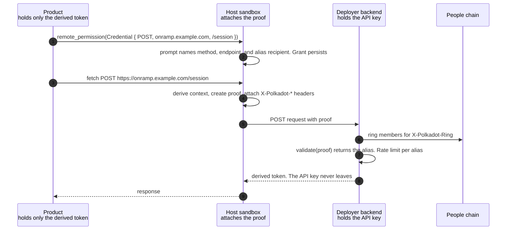

# RFC-0025: Credential-endpoint remote permission

|                 |                                                                                                                   |
| --------------- | ------------------------------------------------------------------------------------------------------------------- |
| **RFC Number**  | 25                                                                                                                |
| **Start Date**  | 2026-08-03                                                                                                        |
| **Authors**     | Tiago Tavares                                                                                                     |
| **Description** | Add a `RemotePermission::Credential` variant granting one method and path, with a personhood proof the host attaches |

## Summary

Add one variant to `RemotePermission` ([RFC-0002](0002-permission-model.md)), `Credential`, granting outbound access to a single `(domain, path, method)` rather than a whole domain. The host attaches a ring VRF proof of people-set membership ([RFC-0004](0004-ringlocation-redesign.md)) to every covered request.

The goal is to let a product use a service that requires a secret. The secret stays on a backend the deployer runs, unreadable by host and product. The product receives a derived token. The proof binds each request to one person, one product, and one endpoint, so the backend can gate what it issues without accounts.

Products keep issuing their own requests. The host sandbox already mediates every one, which is how `Remote` is enforced. A backend behind a `Credential` grant MUST verify the proof. Personhood is not optional.

## Motivation

A funding product wants a meld.io API key for fiat onramp. A game wants TURN credentials. Neither can hold one, because a product runs on the user device and anything it holds is readable there. [Meld](https://docs.meld.io/docs/meld-api/getting-started) says so directly: "Always call Meld from your backend. Direct calls from a browser or mobile app expose your API key." So the deployer runs a backend holding the credential, and the product calls it for a derived token. `Remote` already permits that call, but it is domain-wide, so a user approving "access to onramp.example.com" cannot tell one payment session from every endpoint the deployer runs. And its proofs are product-supplied: the product picks the `ProductProofContext`, so it can present a fresh alias per visit, and nothing ties a proof to the product that sent it.

Requirements:

1. **The credential never reaches the product.** Only a derived token does.
2. **The user can tell what they approved.** One operation, not a set.
3. **Personhood disclosure names its recipient** at approval time, not afterwards.
4. **A backend can rate limit one person.** The alias is stable and not product-variable.
5. **A backend can refuse other products.** A proof from another product or endpoint fails verification.
6. **Nothing depends on the host platform.** Desktop and web have no App Attest or Play Integrity equivalent.
7. **Decisions already made survive.** Permissions persist indefinitely ([RFC-0002](0002-permission-model.md)).

## Detailed Design



### The variant

Added to `RemotePermission`:

```rust
/// Outbound access to one method and path on one domain, carrying a
/// personhood proof the host attaches (RFC 0025).
Credential {
    /// Domain the grant covers. Covered requests must be `https`.
    domain: String,
    /// Exact path the grant covers. No wildcards.
    path: String,
    /// HTTP method the grant covers.
    method: String,
}
```

Appended last: `RemotePermission` is SCALE-encoded into `CoreStorageKey::PermissionAuthorization`, so amending `Remote` would re-key every stored decision, which [RFC-0002](0002-permission-model.md) requires to persist indefinitely. `Credential` narrows `Remote` rather than replacing it. One triple per grant, and a second triple is a second prompt. Hosts canonicalise `domain` to lower case and `method` to upper case before keying a stored decision. `path` is keyed verbatim.

### Authorization

1. **No session.** Denied under [RFC-0009](0009-unauthenticated-product-access.md). The host does not auto-prompt login.
2. **Covered requests would not be `https`.** Denied. The proof would otherwise travel in plaintext.
3. **The user is not a people-set member.** Denied. `create_account_proof` returns `NotMember` for the same reason.
4. **Otherwise.** A prompt naming the method, domain, path, and that this endpoint receives a personhood alias.

### Proof attachment

Each covered request is proved separately. The host attaches:

```text
X-Polkadot-Proof      Ring VRF proof, made over the message below.
X-Polkadot-Ring       Ring revision the proof was made against.
X-Polkadot-Timestamp  Unix seconds.
X-Polkadot-Nonce      Random per request.
```

The message passed to `create_account_proof` is

```text
blake2b256(
  "truapi/credential-request/v1"
  ++ len(method) ++ method
  ++ len(domain) ++ domain
  ++ len(path)   ++ path
  ++ len(query)  ++ query
  ++ timestamp_be64
  ++ nonce
  ++ blake2b256(body)
)
```

with each length a big-endian `u32` byte count. The prefixes prevent boundary ambiguity. The label separates this digest from other uses of the key. Query and body are covered so a proof cannot authorise different content. The alias is not sent, because a verifier obtains it from the proof. `X-Polkadot-Ring` names the ring snapshot to verify against.

The host derives the `ProductProofContext` itself: `product_id` is the calling product identifier, and `suffix` derives from the granted triple. Nothing comes from the request payload. The context is hashed into the proof as `product/<product_id>/<suffix>` per [RFC-0004](0004-ringlocation-redesign.md), and verification takes the expected context as input, so one proof binds person, product, and endpoint.

The host MUST strip caller-supplied `X-Polkadot-*` headers before attaching its own.

The grant is the consent. It authorises these proofs without the per-call confirmation that `create_account_proof` otherwise requires unless `AutoSigning` ([RFC-0010](0010-allowance.md)) covers the account. A dialog per HTTP request would be unusable.

### Consuming-backend contract

A backend behind a `Credential` grant MUST:

> Verify the ring VRF proof against the People chain, under the context it computes itself from the product it serves and the endpoint being called, and against the digest of the request as received. Derive the per-person key it rate limits from the alias that verification returns, never from any other field of the request.

Context and message are verification inputs, so those bindings are enforced rather than checked. A timestamp window, and a nonce set within it, bound how long a captured proof stays useful.

## Implementation notes

`verifiablejs`, a WASM binding of `paritytech/verifiable` published for Node and bundlers, exposes `validate(ring_exponent, proof, members, context, message)` returning the alias. `web3-citizenship-web` already uses it against People. The integration cost is `members`: the ring is rebuilt from People chain storage, so cache it keyed on the ring revision. Recommended: pin the context derivation with test vectors. Exchange one proved request for a session token, since a bandersnatch proof is large and slow. Conformance-test that one user yields one alias per endpoint across sessions and unrelated aliases across endpoints.

## Drawbacks

- **Non-members are refused.** [RFC-0023](0023-account-sign-vrf.md) serves that population. This design has no equivalent.
- **Backends need a chain connection**, not just a verifier, to obtain and refresh the ring.
- **More prompts for chatty products.** `Remote` remains for one broad grant.
- **No bound on use after the grant.** [RFC-0002](0002-permission-model.md) defines no revocation. A grant persists until cleared in host settings.
- **The alias is per product.** The scoping that pins one product means a shared backend sees a different alias per product, as [RFC-0004](0004-ringlocation-redesign.md) intends.
- **Product-binding is host-attested.** A modified host can mint a proof under any context. Person-binding is cryptographic: the owner is still one member with one alias per context, so per-person limits stand.

## Alternatives

- **Amending `Remote` rather than adding a variant.** One way to ask instead of two, but `RemotePermission` is SCALE-encoded into the persisted permission key, so it would invalidate every stored grant.
- **A `secrets.request` method proxying the call through the host.** An earlier draft. It moves outbound HTTP into the protocol, which [RFC-0002](0002-permission-model.md) assigned to the sandbox, then needs SSRF rules, size bounds, redirect handling, and header stripping to contain what that creates. On the web host, itself a browser page, CORS still applies, so the same call behaves differently per platform.
- **Leave the product to attach its own proof.** It can today, and a backend that pins the context can force the binding. What it cannot do is tell the user, at grant time, that this endpoint receives their alias.
- **Declaring the endpoint in a dotNS text record.** The deployer publishes the backend address and the host resolves it, so rotating it needs no product redeploy and a shared service is declared once rather than copied into every caller. This was the centre of an earlier draft. Set aside because a frontend carrying its own API address is ordinary, and a lookup on the path of every grant adds a failure mode for an ergonomic gain.
- **A trusted execution environment operated by network nodes.** The credential is encrypted to an attested enclave rather than held by a deployer, removing the need for deployer infrastructure entirely. Parachains built for confidential compute, such as Integritee and Phala, exist for this. Out of scope because it replaces the backend rather than the grant, and attestation moves trust to a hardware vendor rather than removing it. Worth revisiting if requiring every deployer to run a service blocks adoption.
- **A Device Uniqueness Backend as a trusted relayer.** Covered requests go to a uniqueness backend, which attests the calling device and forwards them to the deployer, who trusts the relayer instead of verifying proofs. Set aside because it inserts a third party that sees every request, it gates on device uniqueness rather than personhood, so one person with several devices counts as several callers, and it makes one central service a dependency of every credentialed call.
- **Reputation or governance approval instead of personhood.** A backend could admit callers with an accrued track record, or governance could curate which endpoints products may reach. Both gate on standing that must be earned or granted, so a new user and a new deployer are excluded either way, and neither has a substrate a backend can check without coordination. The People chain gives verification with none.
- **Path prefixes in the grant.** Fewer prompts, but a prompt naming a prefix asks the user to reason about a set, which is what domain grants already do badly.

## Prior Art and References

- **[RFC-0002](0002-permission-model.md)**, permission model: the enum extended here.
- **[RFC-0004](0004-ringlocation-redesign.md)**, `create_account_proof`: the ring proof and the `ProductProofContext` whose derivation the host takes over here.
- **[RFC-0009](0009-unauthenticated-product-access.md)**, the no-session gate.
- **[RFC-0010](0010-allowance.md)**, `AutoSigning`: the confirmation rule this RFC departs from.
- **[RFC-0023](0023-account-sign-vrf.md)**, `sign_vrf`: the path for non-members, which this does not use.
- [Meld API getting started](https://docs.meld.io/docs/meld-api/getting-started), for the backend-only constraint.

