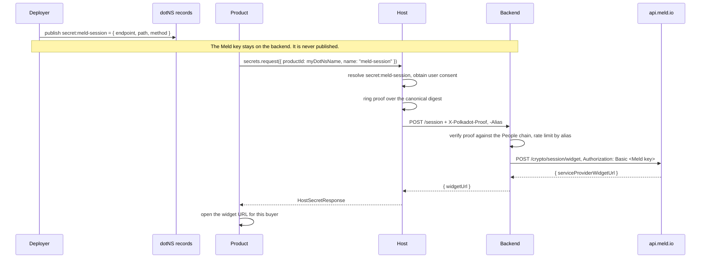

# RFC-0025: Secrets Management in TrUAPI

|                 |                                                                                                    |
| --------------- | -------------------------------------------------------------------------------------------------- |
| **RFC Number**  | 25                                                                                                 |
| **Start Date**  | 2026-08-03                                                                                         |
| **Description** | A single TrUAPI method letting products use secrets they never hold, held by backends they don't run |
| **Authors**     | Tiago Tavares                                                                                      |

## Summary

Add one method to a new `Secrets` trait, `request`, which sends a product's request to a **backend** that holds a credential and returns only the result. A backend is an HTTPS endpoint named in a dotNS text record, and every request carries a proof of personhood.

The credential never reaches the product or the host. The host runs on the user's machine, and one copy taken from one device would spend the deployer's account on behalf of every user. Therefore, a deployer must run the service, and a user who has not proved personhood cannot reach one at all. Other designs were considered, including escrowing the credential with a Parity-run resolver and encrypting it to an enclave attested by network nodes.

## Definitions

- **Backend**. An HTTPS endpoint declared in a dotNS text record. It holds a credential and uses it to perform the one operation that record declares, authorizing each request on the personhood proof attached to it.
- **Secret name**. What a product asks for, scoped to a dotNS name. Resolves to a text record naming the backend and the one operation it will perform. A product may declare as many as it needs, whether for different credentials or for several operations against the same one.
- **Caller proof**. The ring VRF proof and contextual alias attached to every request.
- **Product account**. An sr25519 account the host derives per product from the user's root secret ([RFC-0022](0022-account-derivations.md)).
- **Ring VRF proof**. The anonymous bandersnatch proof of people-set membership from `create_account_proof` ([RFC-0004](0004-ringlocation-redesign.md)). Proves membership without revealing which member.
- **Contextual alias**. The identifier `create_account_proof` derives from the member key and a `ProductProofContext`. The same member key under different contexts yields different, unlinkable aliases ([RFC-0004](0004-ringlocation-redesign.md)).

## Motivation

A funding product wants a meld.io API key for fiat onramp. A game product wants TURN credentials so two players can connect through a relay when their networks refuse a direct path. Neither can hold what they are asking for, because a product runs inside a host on the user's own machine and anything handed to either is readable by the person using it. [Meld's documentation](https://docs.meld.io/docs/meld-api/getting-started) states it plainly: "Always call Meld from your backend. Direct calls from a browser or mobile app expose your API key." A TURN relay secret mints unlimited credentials for a relay somebody pays bandwidth for. Both are long-lived credentials that must stay unknown to the person running the product.

Where a provider offers a credential that is safe in a client, none of this is needed. Meld Checkout takes a `publicKey` in the URL and requires no backend, at the cost of Meld's hosted UI in place of a custom provider and quote flow. That is worth checking before publishing a record.

Requirements for a solution:

1. **Products never receive secret material.** What crosses the TrUAPI boundary is the result of an operation, or a credential that expires on its own.
2. **A product may declare many secrets.** Each product's records are its own namespace, so `meld` under one product is unrelated to `meld` under another, and one deployer may publish several names against the same credential.
3. **A product may reach a backend another product declared.** A shared service should not have to be redeclared by every consumer that wants it.
4. **A backend can tell its callers apart.** A publicly reachable endpoint must not mean anonymous unlimited use of the credential behind it.
5. **Nothing depends on the host's platform.** The desktop and web hosts have no equivalent of Apple App Attest or Google Play Integrity and must not be second-class.
6. **One mechanism.** A product minting relay tickets and a product creating a Meld session should differ in configuration, not in code shape.

## Detailed Design

### Trust boundary

For any host implementing this API:

> A credential that must remain unknown to the user MUST NOT be transmitted to the host or to the product.

Every other decision in this RFC follows from that constraint. The user controls the host, so delivering a secret into it delivers the secret to them regardless of transport.

It does not cover the user's own keys, because losing one of those costs that user alone, while one copy of a deployer's credential taken from one device spends the deployer's account on behalf of every user.

### Declaration and resolution

A backend is named in the product's dotNS text records:

```text
Key:   secret:<name>
Value: {
  "endpoint": "https://onramp.example.com",
  "path":     "/meld/session",
  "method":   "POST"
}
```

The credential never appears in the record. What is published is one operation the deployer is willing to spend it on.

A request names the dotNS name whose records to read and the secret within them, so `secret:<name>` resolves under that name.

```ts
// A TURN relay run by the deployer.
await truapi.secrets.request({ productId: myDotNsName, name: "turn" });

// A Meld session backend run by the deployer.
await truapi.secrets.request({ productId: myDotNsName, name: "meld-session", body });
```

Naming a dotNS name other than your own is allowed, which is how a product reaches a service another deployer publishes. It follows [RFC-0004](0004-ringlocation-redesign.md) and [RFC-0023](0023-account-sign-vrf.md), which take a product identifier rather than assuming the caller's. Records are public and endpoints are publicly reachable, so refusing it would buy obscurity rather than isolation. What actually protects a backend is the caller proof and its own rate limiting, not who is permitted to name it.

Typed convenience such as a `getIceServers()` that parses the TURN response into `RTCIceServer[]` belongs in the product SDK, above this RFC.

### Method

Added to a new `Secrets` trait:

```rust
/// Send a request to a backend and return its response.
///
/// The backend is resolved as `secret:<name>` in the dotNS records of `product`.
/// That record fixes the endpoint, path, and method, so the caller supplies
/// only a body, query, and headers.
#[wire(request_id = 166)]
async fn request(
    &self,
    _cx: &CallContext,
    _request: HostSecretRequest,
) -> Result<HostSecretResponse, CallError<HostSecretError>> {
    Err(CallError::unavailable())
}
```

### Request, response, and error

```rust
struct HostSecretRequest {
    /// dotNS name whose records declare the backend. Often the calling product,
    /// but naming another is how a product reaches a shared service.
    product_id: String,
    /// Secret name, resolved as `secret:<name>` in those records.
    /// The record it finds names the backend.
    name: String,
    /// Appended to the fixed path as a query string.
    query: Vec<SecretQueryParam>,
    /// Headers to forward. The host strips any in the `X-Polkadot-` namespace.
    headers: Vec<SecretHeader>,
    /// Request body, if the declared method takes one.
    body: Option<Vec<u8>>,
}

struct SecretHeader { name: String, value: String }
struct SecretQueryParam { name: String, value: String }

/// The dotNS record, published by the deployer rather than sent over the wire.
struct BackendRecord {
    /// Origin the request is sent to. Shown to the user at consent time.
    endpoint: String,
    /// Fixed path. The product cannot vary it.
    path: String,
    /// Fixed method. The product cannot vary it.
    method: String,
}

struct HostSecretResponse {
    status: u16,
    headers: Vec<SecretHeader>,
    body: Vec<u8>,
}

enum HostSecretError {
    /// No authenticated session (RFC-0009). The host must not auto-prompt login.
    NotConnected,
    /// No record under that name.
    UnknownSecret,
    /// The record resolved but does not parse, names an unsupported field,
    /// or declares an endpoint the host refuses to fetch.
    MalformedRecord,
    /// The user declined consent or the signing confirmation.
    Rejected,
    /// The user is not a people-set member, so no proof can be produced.
    /// Mirrors `NotMember` from RFC-0004.
    NotMember,
    /// The endpoint could not be reached.
    Transport,
    /// The response exceeded the limit set by the host and was discarded.
    ResponseTooLarge,
    /// The request body or header count exceeded the limit set by the host.
    RequestTooLarge,
    Unknown { reason: String },
}
```

The caller proof travels as request headers, so a backend verifies it without parsing an arbitrary payload:

```text
X-Polkadot-Product     dotNS name of the calling product, which may differ
                       from the product whose record was resolved. Host-asserted.
X-Polkadot-Timestamp   Unix seconds, to bound replay.
X-Polkadot-Nonce       Random per request, to bound replay.
X-Polkadot-Proof       Ring VRF proof over the canonical digest.
X-Polkadot-Alias       Contextual alias for this backend.
```

The canonical digest covers the method, the full request URL including query, the timestamp, the nonce, and a hash of the body. Backends MUST reject a request whose timestamp falls outside their accepted window, and MUST reject a repeated nonce within it. A replayed request is a duplicated operation, which for a payment session is a duplicated charge.

### Call semantics

The host resolves `secret:<name>` from `product`'s dotNS records and returns `UnknownSecret` if there is none. It builds the request from the record's `endpoint`, `path`, and `method`, appending the caller's `query`. It obtains user consent, produces the caller proof, and attaches it.

The host MUST reject an endpoint that is not `https`, and MUST reject one resolving to a loopback, link-local, or private address, returning `MalformedRecord` in both cases. It MUST apply that check to the address it connects to rather than to the hostname, so a name that resolves differently on a second lookup cannot slip past it. Without this a product could publish `secret:x` naming `http://127.0.0.1:9944` under its own dotNS name and use the host as a proxy into the user's machine and local network, reaching what the browser's same-origin and local network protections would otherwise deny it.

The host MUST strip any caller-supplied header in the `X-Polkadot-` namespace before attaching its own, so a product cannot forge or displace the proof.

The host MUST bound the response it buffers and MUST return `ResponseTooLarge` rather than exceed that bound. A product may publish a record naming any endpoint and then call it, so the response is untrusted input regardless of who deployed the product, and an unbounded one exhausts the host through a call the user has already consented to. The same applies to the request body and header count, which the product supplies directly, returning `RequestTooLarge`.

The response is returned unmodified except for hop-by-hop headers. Products must not assume the request originated from the user's address, because the host makes it directly and the backend makes any upstream call from its own infrastructure.

### Authorizing the caller

A declared endpoint is publicly reachable, so without something more, anyone can spend the credential behind it by posting to it.

Rate limiting alone does not fix that, because a limit per identity is no limit when identities are free. A product-account signature has the same gap: it proves the caller is consistently the same party, and a fresh keypair costs nothing. Scarcity is the property that matters, so every request carries a ring VRF proof from `create_account_proof` ([RFC-0004](0004-ringlocation-redesign.md)), which shows people-set membership without revealing which member. There is no weaker option to select and no configuration to get it. Producing the proof follows `create_account_proof`'s existing rules, so nothing new here governs when the user is asked to approve.

The canonical digest is the message the proof is made over, so one artifact carries both personhood and request integrity and no separate signature is needed.

The unlinkable identifier comes with it: the call takes a `ProductProofContext { product_id, suffix }`, and the same member key under different contexts yields different, unlinkable contextual aliases. Setting `suffix` from the backend gives one stable alias per person per backend and an unrelated one everywhere else, so no separate nullifier construction is needed. That is what Meld's `externalCustomerId` wants, and it is a hash of a wallet address today for the same reason.

This is deliberately the ring path and not `sign_vrf` ([RFC-0023](0023-account-sign-vrf.md)). That method produces an sr25519 VRF bound to the product account, for participants who are **not yet** people-set members. It is identity-bound rather than anonymous, and a non-member account is free to create, so it delivers neither the anonymity nor the scarcity this design needs. The two are complementary and only the ring path fits here.

A backend verifies against the People chain, so Parity is in neither the request path nor the verification path, and there is no key distribution to agree. The canonical digest is the one thing every verifier must reproduce identically, and it is not yet pinned to that precision. It also works identically on the desktop and web hosts, which is why device attestation is not used here: Apple App Attest and Google Play Integrity exist only on mobile.

The cost is that a non-member cannot reach any backend and gets `NotMember`. That is the deliberate trade: every backend is Sybil-resistant without its operator configuring anything, and the population still verifying is served by nothing here.

### Consuming-backend contract

A backend that verifies these proofs MUST:

> Verify the ring proof against the current ring on the People chain, and verify that it was made over the digest of the request as received. Derive the caller identity it rate limits from the contextual alias that proof carries, never from a caller-supplied field.

`X-Polkadot-Product` is host-asserted and unverifiable, so a backend must never make a trust decision on it. It is a routing and diagnostics hint. In particular a backend cannot restrict itself to the product that declared it, because any product may name that record and the header asserting otherwise is unverifiable. A backend that ignores this contract gains nothing an attacker cannot forge, and the failure is silent, which is why it is stated normatively rather than left to implementers.

### Flow

The deployer publishes the record once. At purchase time the backend attaches the Meld key and returns only the widget URL, so the key never leaves their infrastructure.



### Accounts Protocol companion

None. The caller proof reuses `create_account_proof`, which already has one, so the Host and Account Holder boundary is unchanged.

## Implementation notes

- **The response bound is host policy.** This RFC requires one without fixing a number, since a relay ticket and a provider's JSON differ by orders of magnitude from whatever a future backend returns.
- **Query values are the only caller-controlled part of the URL.** Endpoint, path, and method all come from the record, so encoding the query is the whole of the injection surface.
- **Conformance tests** worth writing against a mock backend: a caller cannot influence the resolved URL path or method, caller-supplied `X-Polkadot-` headers are stripped, a non-member gets `NotMember` rather than an unproven request reaching the backend, and the same user yields the same contextual alias across sessions and different aliases across backends.
- **The relay path is verifiable end to end** against a real TURN server: a ticket derived from the wrong secret produces `401` and no relay candidate.

## Non-goals

For credentials that belong to a **deployer or to Parity** and must stay unknown to the user, where the product needs the result of an operation rather than the credential itself.

**Not** for secrets that belong to the user. Those can be encrypted to the user's own key, and the objection driving this design does not apply to them.

**Not** a general outbound HTTP proxy. The endpoint is fixed by the record, must be public HTTPS, and a product wanting arbitrary network access already has `RemotePermission::Remote`.

**Not** a way to hide anything from the user. Results cross into the host and are therefore readable by whoever runs it. Only the credential stays out of reach.

## Drawbacks

- **Deployers must run something.** There is no path here to shipping a product with a third-party credential and no infrastructure. For small products that may be the difference between shipping and not.
- **A declared endpoint is publicly reachable.** Caller proofs raise the bar without making it private. Backends still need rate limiting, and the abuse cost lands on whoever runs them.
- **Non-members cannot use this at all.** Every request needs people-set membership, so anyone still verifying is shut out of every backend, not just the sensitive ones. [RFC-0023](0023-account-sign-vrf.md) exists precisely because that population needs a different path, and this design has no equivalent for them. Making personhood mandatory buys Sybil resistance everywhere at that price.
- **Product identity is unverifiable, so a backend cannot restrict who invokes it.** Any product may name another's record, and the header carrying product identity is host-asserted. Backends gate on the caller proof and their own rate limits. What impersonation buys is calls against the backend's own endpoint, not possession of a credential.
- **One record per operation.** A deployer needing several calls against the same credential publishes several names. That is the cost of the product not choosing paths.

## Alternatives

### The product calls the endpoint directly

The closest thing to doing nothing. A product can already reach any origin with `RemotePermission::Remote`, so a deployer could publish no record and hardcode their endpoint instead. Two things would be missing. The endpoint would live in the bundle, so rotating it needs a redeploy and every consumer of a shared service needs its own copy. And nothing the product sends could be trusted, because a product can claim whatever identity it likes, which leaves the endpoint open to anyone who finds it. Record-based discovery and an unforgeable caller proof are the whole of what this method adds, and without both it should not exist.

### A network-run trusted execution environment

Not rejected, and the direction to revisit. Instead of the deployer running a backend, the credential would be encrypted to an enclave whose attestation proves which code decrypts it, with the enclave operated by network nodes rather than by Parity or the deployer. That removes both the custody problem and the requirement that every deployer run infrastructure. Polkadot parachains built for confidential compute, such as Integritee and Phala, exist for roughly this purpose. It is out of scope here because it needs a different record carrying ciphertext and an attestation policy, because attestation moves trust to a hardware vendor rather than removing it, and because nothing in this design is blocked waiting for it.

### Put the secret on the device

This fails in both the forms it takes. A generic `get_host_secret(name)` breaches the trust boundary by definition, and it cannot serve the TURN case anyway, because what a relay backend gives out is a ticket it mints rather than a credential it stores. A flat namespace with no owner also lets two products each claim `meld`. Baking the secret into the host distribution fails harder still, since a downloadable host makes any embedded secret public.

### Fetch the secret from the deployer's URL into the host

Worth distinguishing from the accepted design, because it looks similar. An endpoint that hands the plaintext credential to whoever asks is strictly worse than publishing the credential, because it adds a false sense of control. The host calls a backend to have work done, never to collect a key.

### Escrow the secret with a Parity-run resolver

Considered at length and set aside. The deployer would encrypt the secret to a resolver's published key, publish the ciphertext in the record, and the resolver would decrypt and attach it. It spares deployers from running anything, but it makes Parity the custodian of third-party payment credentials with the liability that follows, and concentrates every deployer's secret behind one breach. The network-run enclave above is the better form of the same idea, since it removes the single custodian rather than hardening one.

### Encrypt secrets to every user's key

Authorising a user to decrypt gives that user the plaintext, which is the outcome the Meld case must avoid. The same objection defeats encrypting to a host key, since the host is the user's to control. It also requires enumerating users before they arrive, grows the record linearly, and cannot revoke what has already been decrypted. The scheme is correct for secrets that belong to the user, which is a non-goal here.

## Prior Art and References

- **[RFC-0004](0004-ringlocation-redesign.md)**, `create_account_proof`. The ring-VRF proof and the `ProductProofContext` whose suffix yields unlinkable contextual aliases, which the caller proof is built from. Its `NotMember` error is mirrored here.
- **[RFC-0010](0010-allowance.md)**, allowance and `AutoSigning`, which decides whether a caller proof needs a per-call confirmation.
- **[RFC-0022](0022-account-derivations.md)**, account key derivations. Source of the product account and the ring VRF domain the proof is made from.
- **[RFC-0023](0023-account-sign-vrf.md)**, `sign_vrf`. The complementary sr25519 path for participants who are not yet people-set members, and why it is not the primitive used here.
- **[RFC-0024](https://github.com/paritytech/truapi/pull/324)**, personhood as a product (in review). It adds an explicit `key_handle` to `create_account_proof` and deletes [RFC-0004](0004-ringlocation-redesign.md)'s host-side key selection, so the caller proof here depends on whichever of the two lands. It also requires every proof context to be built with TrUAPI's product-scoped context function, which constrains how this RFC may derive its suffix.
- `POST /v1/turn/issue` in the identity backend. An existing implementation of what a relay backend does here: it holds the relay secret and returns only a short-lived ticket.
- [Meld API getting started](https://docs.meld.io/docs/meld-api/getting-started), for the backend-only constraint and the note that "Meld does not require IP or CORS allowlisting", which rules out origin restriction as a mitigation.

## Unresolved Questions

- **How is the canonical digest constructed, exactly?** Every deployer writes an independent verifier, so field ordering, separators, the hash algorithm, query canonicalization, and the encoding of the proof and alias headers all have to be pinned rather than described. This RFC should not ship without test vectors a verifier can check itself against.
- **What user consent does this call require?** Reusing `RemotePermission::Remote { domains }` for the endpoint origin is the obvious fit, but it was written for a product reaching out directly, and here the host calls on the product's behalf. Open within that: whether consent is per backend or per call, and whether the record's declared endpoint is shown at grant time.
- **How the `ProductProofContext` suffix is derived from the backend.** It must bind in a way the backend operator can reproduce and a product cannot vary to farm fresh aliases. The endpoint origin is the obvious binding, which means changing endpoint resets every identifier. [RFC-0004](0004-ringlocation-redesign.md) leaves the suffix to the caller, and [RFC-0024](https://github.com/paritytech/truapi/pull/324) requires contexts to use the product-scoped construction, so this needs settling against whichever lands.
- **Where the `key_handle` comes from if [RFC-0024](https://github.com/paritytech/truapi/pull/324) lands.** That RFC deletes host-side key selection, so a request would need a handle the product does not have and must not learn. The host supplying it from the registry is the obvious answer and is not specified here.
- **Whether the record needs a schema version.** One field now avoids a migration later, if the record ever grows beyond endpoint, path, and method.
- **Does requiring personhood everywhere cost too much?** It locks non-members out of WebRTC and onramp alike. The alternative is a per-record choice between a product-account signature and a ring proof, which restores configurability at the cost of every backend having to decide, and of a weaker default for anyone who picks wrong.
