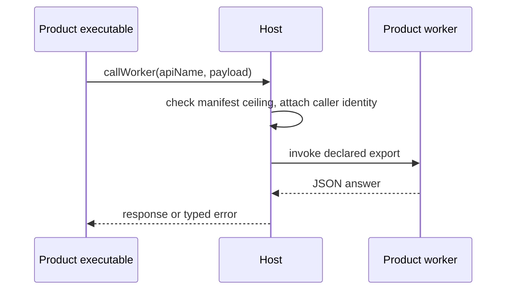

# RFC 0027: Calling a product worker from its app

|                 |                                                                                                      |
| --------------- | ---------------------------------------------------------------------------------------------------- |
| **RFC Number**  | 27                                                                                                   |
| **Start Date**  | 2026-08-20                                                                                           |
| **Description** | A `Worker` method letting a product executable invoke a named export of the same product worker. |
| **Authors**     | Tiago Tavares                                                                                        |

## Summary

Add one method to a new `Worker` trait. `call_worker` takes an export name and a JSON payload, dispatches to the worker of the calling product, and returns the export answer. The request carries no product field. The Host supplies the caller identity, and a worker opts in by declaring in its manifest `includes` which product executables may reach it. The call is request/response, one direction, and carries data only.



## Motivation

A product ships rendered executables (`app`, `widget`, `funding`) and a single background `worker`. They run in separate sandboxes, and no protocol connects them.

**Work that outlives the view has nowhere to live.** A funding executable starts a settlement that runs for minutes. The user closes the sheet halfway through. The worker is the right home for that job. It holds the full Host API surface and its lifetime is independent of any view. But the executable cannot start it, so the job runs in the page, dies with the view, and escapes the deadline and quarantine machinery a Host applies to worker code.

**An executable cannot ask what its own product is doing.** The two share one storage namespace, so worker results are readable once written. What is missing is the request. An executable reopened mid-job cannot distinguish still working from never started.

**Products will otherwise ask for the unsafe version.** The obvious shortcut is to let the page hand the worker a function to run. That must not be built. See [Alternatives](#alternatives). Shipping the bounded version first is the cheapest way to prevent it.

## Detailed Design

### `worker.callWorker`

```rust
/// Invoke a named export of the calling product worker.
///
/// The export must be declared by the worker module in the product verified
/// archive. An undeclared name is `Invalid`. Nothing is loaded on demand.
#[wire(request_id = 174)]
async fn call_worker(
    &self,
    cx: &CallContext,
    request: WorkerCallRequest,
) -> Result<WorkerCallResponse, CallError<WorkerCallError>>;
```

```rust
/// Request to invoke one worker export.
struct WorkerCallRequest {
    /// Export declared by the worker module. Not a path, not a module
    /// specifier. The Host resolves it against the already-loaded module.
    api_name: String,
    /// JSON arguments, bounded by the worker protocol payload ceiling.
    payload: String,
    /// Per-call wall-clock budget. `None` selects the Host default, and
    /// values are clamped to the Host window. Caller-expressible because
    /// the budgets differ: an interactive status check wants to fail fast,
    /// a settlement start wants the full window.
    deadline_ms: Option<u32>,
}

/// The export answer.
struct WorkerCallResponse {
    /// JSON returned by the export, under the same payload ceiling.
    payload: String,
}

/// Error from call_worker.
enum WorkerCallError {
    /// No worker is running for this product. Covers a product with no
    /// worker, a worker the user stopped, a manifest that declares no
    /// ceiling for this executable, a quarantined worker, and a host that
    /// runs no workers at all.
    Unavailable,
    /// No such export, or the payload is malformed or over the ceiling.
    Invalid(GenericError),
    /// The call outlived its deadline and was revoked.
    Timeout,
    /// The worker threw, or died handling the call.
    Crashed,
    /// Worker and Host disagree on the protocol.
    Version,
}
```

**The request carries no product identifier, and that is the security property.** The Host knows which product executable it is rendering. If the caller named the product, page JavaScript could address another product worker. Identity that JavaScript can state is identity JavaScript can forge.

**Data crosses, never code.** `api_name` selects an export the verified archive already declared. The call cannot widen what the worker is able to do, and the answer comes back as bytes.

**`Unavailable` is deliberately undifferentiated.** Distinguishing a missing worker from one the user stopped from one the manifest withholds would turn the method into a probe for a control the user owns.

## Manifest declaration

Reaching a worker is opt-in and declared in the manifest, so what can call a worker is answerable before any code runs. `includes` already names which surfaces a worker serves. This extends the same vocabulary:

```ts
interface WorkerIncludes {
  chat: boolean;
  pocket: boolean;
  /** Product executables permitted to call this worker. Absent means none. */
  app?: boolean;
  widget?: boolean;
  funding?: boolean;
}
```

Per-executable rather than one flag: a product may want its funding sheet to drive a settlement while its widget cannot, and a ceiling can be widened additively but never narrowed. Unknown keys stay ignored, so a record published before this RFC reads as no executable may call me. Unlike `chat`, which widens what the worker itself may do, these flags grant the worker nothing. They only admit a caller.

## Semantics and invariants

- **Same limits, new caller.** Executable calls reuse the worker protocol bounds: capped payloads, per-call deadlines with typed expiry, serialized dispatch, a bounded queue whose overflow is `Unavailable`, and crash backoff into quarantine. A caller in a loop degrades into typed errors, not unbounded work.
- **The Host owns starting.** If the worker is not running and the manifest permits the call, the Host may start it. If the user has stopped it, the answer is `Unavailable` until the user says otherwise.
- **No ambient state.** Two calls share nothing beyond what the worker persists. Callers that need continuity pass an identifier the worker minted.
- **One identity beneath both.** Every product executable, `funding.<product>` included, runs under the base product identity. The subnames are resolution names, never runtime identities. Caller and worker therefore share one storage namespace and one product account. A Host that gives a subname its own namespace breaks this method outright: the worker answers name state the caller cannot read or persist against.

## Typical product flow

```ts
const started = await truapi.worker.callWorker({
  apiName: "startSettlement",
  payload: JSON.stringify({ rail: "BANK", intentId }),
});
if (!started.isOk()) return renderUnavailable();
const { jobId } = JSON.parse(started.value.payload);

// Reopening later: ask rather than wait for the next write.
const status = await truapi.worker.callWorker({
  apiName: "status",
  payload: JSON.stringify({ jobId }),
});
```

The job survives the executable closing because it never lived there. The caller holds an identifier, not a process.

## Non-goals

- **No push.** Request/response only. A caller polls a status export or reads storage.
- **No worker-initiated calls.** The worker writes to product storage instead.
- **No cross-product calls.** An executable reaches its own worker and no other.
- **No lifecycle control.** Starting, stopping and disclosing workers stays a Host concern.

## Drawbacks

- Two executables that could not interact now can, which is new surface to review. No authority moves.
- The worker becomes a soft dependency. A product must still work when the answer is `Unavailable`, because the user can stop the worker at any time.
- Status is polled. A subscription is future work.

## Alternatives

- **Passing code instead of data.** Worker code resolves only from one pinned, verified archive. Page-supplied code has no CID and no signature, and an attacker who can inject into the page would execute with worker authority. Changing worker logic costs a redeploy, which is the intended price.
- **A symmetric message channel.** Invites the worker to depend on an executable being present, which is the coupling the worker exists to avoid. The lifetimes are asymmetric, so the protocol is too.
- **Product storage as the only mechanism.** Durable job state should still live there, but alone it cannot start a stopped worker, gives no typed failure, and turns every request into an unbounded poll.
- **A single `includes` flag.** Cannot express that the funding sheet may call while the widget may not.
- **Do nothing.** The status quo the motivation describes.

## Prior Art and References

- [RFC: Product Manifest Format](product-manifest.md): the two-level manifest, the `worker.<product>` subname, `includes`, and the one-worker-per-product rule this RFC extends.
- [RFC 0024: Proof of Personhood as a Product](0024-personhood-as-product.md): also extends `WorkerIncludes`, with `onLoad`. See [Unresolved Questions](#unresolved-questions).
- [RFC 0002: Permission Model](0002-permission-model.md): owns product-to-product interaction, which is why cross-product calls are a non-goal here.
- [Brevity pocket modality contract](https://github.com/paritytech/brevity-dozer/blob/main/docs/pocket-modality-contract.md): §6 specifies the worker protocol bounds this method reuses, namely the payload ceiling, serialized dispatch, the bounded queue, and crash backoff into quarantine. §7 specifies the identity rules behind [Semantics and invariants](#semantics-and-invariants). Neither is specified in this repo.

## Unresolved Questions

- **Coordination with RFC 0024**, which also extends `WorkerIncludes`, with `onLoad`. That key is a lifecycle request rather than a surface, so `includes` would carry two different kinds of thing. Whether lifecycle belongs there at all is worth settling once rather than in two RFCs separately.
