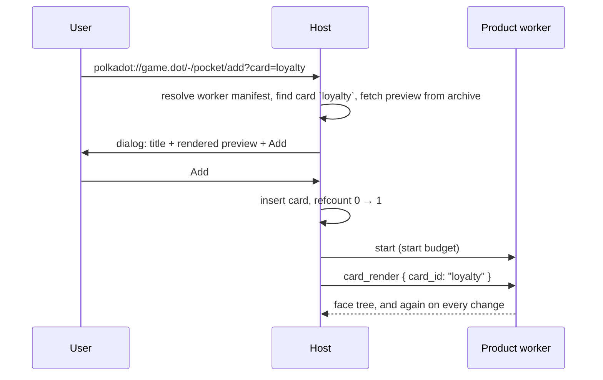

# RFC — Pocket modality

|                 |                                                                                                 |
| --------------- | ----------------------------------------------------------------------------------------------- |
| **Start Date**  | 2026-09-03                                                                                      |
| **Description** | A host-owned collection of product-backed cards: how a card is added, rendered, opened, removed |
| **Authors**     | Valentin Fernandez                                                                              |

## Summary

Pocket is a host surface holding a small set of **cards**, each backed by a product. The host owns the collection and renders every collapsed card natively from a renderer tree the product's worker streams to it. Tapping a card opens the product's Widget executable. A product cannot add a card by itself: a card enters Pocket when the user follows a Pocket-targeted deeplink and approves a host dialog showing the card as it will look. Both the user and the owning product can remove a card. Three privileged cards, Humanity, Balance and Scarcity, are always present and removable by neither.

Chat and Pocket are served by the product's single Worker executable, whose lifetime is a reference count: one reference per active chat, one per visible card, terminated at zero.

The protocol change is one `Pocket` trait with four methods, a Pocket section in the Worker manifest, a deeplink grammar that names a target modality, and moving the renderer node types out of `chat`. Host-initiated calls already exist (`Chat::custom_message_render`), so no code-generation work is needed.

Tracking issue: [#563](https://github.com/paritytech/host-rust-core/issues/563).

## Motivation

The iOS host already shows Humanity, Balance and Scarcity as cards, with the content and interactions of each card hard-coded into the host. Personhood is becoming a product ([RFC 0024](0024-personhood-as-product.md)), which declares `includes: { pocket: true }` and expects a card, and there is no contract behind that flag: nothing says how a product supplies a card's face, learns that the user tapped it, or is kept alive while the card is on screen.

Without a contract each host invents one. The ordering constraint is that the first iteration, three known cards, ships before anyone publishes a card, so the rendering and lifecycle rules must stand on their own and the add flow must layer on top without changing them.

## Approach

### Model

- A **card** is identified by `(product_id, card_id)`. `card_id` is a lowercase label the product declares.
- The **face** is the collapsed presentation. The host renders it natively from a `CustomRendererNode` tree, the same component set chat custom messages use, and keeps the last tree per card so the face is shown offline and at cold start before the worker answers.
- The **expanded card** is the product's `widget` executable in a WebView.
- The **worker** is the product's one Worker executable. It streams faces, receives actions, and is the only execution the `Pocket` trait is available to.
- A **privileged card** is one the host itself places and pins: present on first run without approval, never removable. Iteration 1 ships exactly three, Humanity, Balance and Scarcity, and the host designates the product that backs each (the personhood provider of RFC 0024 for Humanity).

The host is the only writer of the collection. A product observes its own cards and may remove them, and nothing else.

### Rendering and actions

The host opens one `card_render` subscription per card whose face is on screen, passing the `card_id`. Every item is a complete tree that replaces the previous face. The host caches the newest tree durably; a subscription that ends with the worker gone leaves the cached face in place.

Interactive nodes in the tree (`Button.click_action`, `TextField.value_change_action`) fire on the worker's `action_subscribe` stream with the `card_id` they came from, so one handler serves every card of the product.

The renderer types (`CustomRendererNode`, its props, modifiers, tokens) move from `truapi::v01::chat::custom_renderer` to their own `truapi::v01::renderer` module and are re-exported through `truapi::latest`. Chat keeps using them. The wire encoding does not change; only the Rust path does. The approval dialog, the Pocket face, and a product's own web preview then all consume one type, and the product-sdk can ship a React reconciler for it in the style of `product-react-renderer`.

### Expanded card

Tapping a face opens the product's `widget` executable with the card named in the launch URL query, `card=<card_id>`. The WebView talks to the worker through `call_worker` ([RFC 0027](https://github.com/paritytech/host-rust-core/pull/468)); Pocket adds no channel of its own. The Widget runs under the same product identity and storage namespace as the worker, so the card the user opened and the state it shows are one product's. Keeping the native face visible through the open and close animation, and preloading the WebView, are host implementation and not part of the contract.

### Lifecycle

Each product has one Worker executable, shared by Chat and Pocket, as the manifest already requires. The host keeps a reference count on it:

- **+1** for each active chat surface the product serves, held while the surface is open.
- **+1** for each card whose face is on screen, held by the open `card_render` subscription.
- A host that honours RFC 0024's `includes.onLoad` holds **one permanent reference** of its own. That is what "global lifetime" means under this model, so the flag and the count compose.

At zero the host terminates the executable after a short host-chosen grace period. The product cannot add a reference; it can only drop one, by removing a card.

**Start budget.** When the count goes from zero to one the host instantiates the worker and evaluates its entry module under a bounded budget of wall-clock time and memory, host-configured and in the order of seconds. Module evaluation is the start hook: it is where the product registers its `card_render` and `action_subscribe` handlers. A handler still unregistered when the budget ends is unsupported for this run, and the host shows the cached face. Issue #563 calls this budget `onLoad`; the RFC avoids the name because RFC 0024 uses it for a manifest flag with a different meaning.

### Adding a card (full iteration)

Products **publish** card definitions in the Worker manifest ([Product Manifest Format](product-manifest.md)), alongside the existing `includes`:

```ts
type WorkerManifest = CommonExecutableFields & {
  kind: 'worker';
  entrypoint: string;
  includes: { pocket?: boolean; chat?: boolean; input?: boolean };
  /** Cards the product can back. Absent unless `includes.pocket` is true. */
  pocket?: { cards: PocketCardDefinition[] };
};

type PocketCardDefinition = {
  id: string;      // Lowercase label, unique within the product.
  title: string;   // Shown in the approval dialog and in host chrome.
  preview: string; // Path inside the worker archive to a CustomRendererNode tree, JSON in the generated TypeScript shape.
};
```

The preview is a static file in the CID-pinned archive, so the host can show a card before any product code runs, the same property the [funding modality](https://github.com/paritytech/host-rust-core/pull/339) relies on for its rail list. It is the face the user approves; the live face may differ once the worker streams.

**Deeplinks name a modality.** A product URL is `polkadot://<product_id>.<tld>/<path>` and today always opens the App. The first path segment `-` is reserved for host-handled targets and cannot be an App route:

```text
polkadot://<product_id>.<tld>/<path>                     App, unchanged
polkadot://<product_id>.<tld>/-/pocket/add?card=<id>     Offer to add a published card
polkadot://<product_id>.<tld>/-/pocket/open?card=<id>    Expand a card that is present
```

A host without the named modality, or one that does not know the action, opens the App instead. Products reach a deeplink from their own web UI through `system.navigate_to`, which already lets `polkadot:` through without a grant, so an "Add to Pocket" button is one call.



An added card is an ordinary card from then on: same face stream, actions, expansion, removal rules, and worker reference as a privileged one, without the pin. If the card is already present, `add` behaves as `open`. An unknown card, or a product whose manifest lacks `includes.pocket`, produces a host error and no dialog.

### Removing a card

The user removes a card in host UI. The product removes one of its own with `remove_card`. Either way the card is gone: its cached face is discarded, its render subscription ends, its reference is dropped, and getting it back means the deeplink flow again. Removing a card that is not present succeeds. Removing a privileged card fails with `Privileged`, for the product, and is not offered to the user.

### Wire surface

Ids start after the highest allocated on `main` at draft time (194) and are re-checked when implemented.

```rust
/// Pocket cards backed by the calling product.
#[crate::service(required_execution = Worker)]
#[crate::async_trait]
pub trait Pocket: Send + Sync {
    /// The calling product's cards, whole set on subscribe and on every change.
    #[wire(start_id = 198)]
    async fn list_subscribe(&self, cx: &CallContext) -> Subscription<HostPocketListSubscribeItem>;

    /// Remove one of the calling product's cards. Idempotent.
    #[wire(request_id = 202)]
    async fn remove_card(
        &self,
        cx: &CallContext,
        request: HostPocketRemoveCardRequest,
    ) -> Result<HostPocketRemoveCardResponse, CallError<HostPocketRemoveCardError>>;

    /// Actions the user triggered on any of the calling product's faces.
    #[wire(start_id = 204)]
    async fn action_subscribe(&self, cx: &CallContext) -> Subscription<HostPocketActionSubscribeItem>;

    /// Streams the face of one card while it is on screen. Each item replaces the face.
    #[wire(host_initiated, start_id = 208)]
    fn card_render(
        &self,
        cx: &CallContext,
        request: ProductPocketCardRenderRequest,
    ) -> Subscription<CustomRendererNode>;
}
```

```rust
pub struct PocketCard {
    pub card_id: String,
    /// Placed by the host; cannot be removed.
    pub privileged: bool,
}

pub struct HostPocketListSubscribeItem { pub cards: Vec<PocketCard> }

pub struct HostPocketRemoveCardRequest { pub card_id: String }
/// Unit: removal has nothing to report beyond success.
pub struct HostPocketRemoveCardResponse;
pub enum HostPocketRemoveCardError {
    /// The card is privileged.
    Privileged,
    Unknown { reason: String },
}

pub struct HostPocketActionSubscribeItem {
    pub card_id: String,
    /// `Button.click_action` or `TextField.value_change_action` from the face tree.
    pub action_id: String,
    pub payload: Option<Vec<u8>>,
}

pub struct ProductPocketCardRenderRequest { pub card_id: String }
```

Each payload travels in a `V1` versioned envelope like every other method. A `card_render` item encodes byte-for-byte like a chat custom-message render item, so a host that already decodes one decodes the other.

No request names a product: the host knows which worker it is talking to, so a product can neither observe nor remove another product's cards. A host with no Pocket surface answers `remove_card` with `Unavailable`, ends `list_subscribe` and `action_subscribe` at once with an empty Interrupt frame, and never opens `card_render`.

## Trade-offs

- **No product-initiated add.** A product cannot surface a card at the moment it becomes relevant; it has to get the user to a deeplink. Accepted: the collection is the user's, and a dialog per card is the consent.
- **The component set is reused as is.** Faces are built from the renderer nodes chat already has: no image or gradient backgrounds, no barcode or QR node, no aspect-ratio control. Those gaps are shared with chat and belong to a separate RFC so the two changes ship independently; nothing here depends on them.
- **The preview can lie.** The approved static face and the live face are both product-authored and nothing ties them together. The host can bound the drift by rendering both with the same component set, not by checking content.
- **Card definitions cost manifest budget.** Text records are small; a product with many cards pushes the Worker manifest toward the dotNS limit. Only ids, titles, and paths go in the manifest; the trees live in the archive.
- **Expanded cards need a Widget and RFC 0027.** A product with cards but no `widget` executable has faces that do not open. Products that want interaction without a WebView use face actions.
- **The start hook is module evaluation, not a call.** A dedicated host-initiated `start` method carrying the reason for the start was considered and dropped: it would run at the same moment and the first `card_render` request already says why the worker is up.
- **Reference counting is host-observable state the product cannot read.** A worker learns it is being terminated only by being terminated. Products must persist anything worth keeping as they go, which is already the Worker contract.
- **`-` as the reserved segment** is borrowed from GitLab's `/-/` namespace. Any App route starting with `/-/` is unreachable once a host implements this. A query parameter was rejected because Apps tend to ignore unknown parameters, so an unsupported target would silently open the App with no signal that anything was asked for.

## Considerations

- **Which products back Balance and Scarcity.** Humanity has an owner through RFC 0024. Balance and Scarcity are host-rendered today and this RFC assumes the host designates a product for each before iteration 1 ships.
- **Where card definitions live if the manifest budget bites.** The fallback is a single `pocket.json` at the archive root listing the cards, with the manifest carrying only `includes.pocket`.
