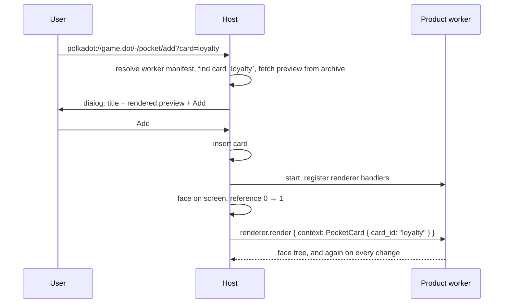

# RFC — Pocket modality

|                 |                                                                                                 |
| --------------- | ----------------------------------------------------------------------------------------------- |
| **Start Date**  | 2026-09-03                                                                                      |
| **Description** | A host-owned collection of product-backed cards: how a card is added, rendered, opened, removed |
| **Authors**     | Valentin Fernandez                                                                              |

## Summary

Pocket is a host surface holding a small set of **cards**, each backed by a product. The host owns the collection and
renders every collapsed card natively from a renderer tree the product's worker streams to it. Tapping a card opens the
product's Widget executable. A product cannot add a card by itself: a card enters Pocket when the user follows a
Pocket-targeted deeplink and approves a host dialog showing the card as it will look. Both the user and the owning
product can remove a card. Three privileged cards, Humanity, Balance and Scarcity, are always present and removable by
neither.

A face is drawn through the [Unified Renderer](https://github.com/paritytech/host-rust-core/pull/633)'s `PocketCard`
context. The collection itself is one `Pocket` trait with two methods, a Pocket section in the Worker manifest, and a
deeplink grammar that names a target modality.

Tracking issue: [#563](https://github.com/paritytech/host-rust-core/issues/563).

## Motivation

The iOS host shows Humanity, Balance and Scarcity as cards whose content and interactions are hard-coded into it.
Personhood is becoming a product ([RFC 0024](0024-personhood-as-product.md)), which declares
`includes: { pocket: true }` and expects a card. No contract stands behind that flag: nothing says which cards a product
may back, how one enters the collection, or who can take it out.

The first iteration ships three host-placed cards before anyone publishes one, so the collection rules hold for a
host-placed card on their own and the add flow layers on top without changing them.

## Approach

### Model

- A **card** is identified by `(product_id, card_id)`. `card_id` is a short label the product declares, screened by the
  same rules as a chat identifier (see Wire surface).
- The **face** is the collapsed presentation, rendered natively from a `RendererNode` tree.
- The **expanded card** is the product's `widget` executable in a WebView.
- The **worker** is the product's one Worker executable. It draws the faces, handles their actions, and is the only
  execution the `Pocket` trait is available to.
- A **privileged card** is one the host itself places and pins: present on first run without approval, never removable.
  Iteration 1 ships exactly three, Humanity, Balance and Scarcity, and the host designates the product that backs each
  (the personhood provider of RFC 0024 for Humanity).

The host is the only writer of the collection. A product observes its own cards and may remove them, and nothing else.

### Rendering and actions

A face is a body drawn through [Renderer](https://github.com/paritytech/host-rust-core/pull/633), on the
`PocketCard { card_id }` context. The host opens a `render` stream while the face is on screen and gets a `RendererNode`
tree per item; presses and edits inside the tree arrive on `action_subscribe` under the same context, so one handler
serves every card of the product.

Pocket adds one rule on top: the host caches the newest tree per card durably, so a face is shown offline and at cold
start before the worker answers, and a privileged card has something to show on first run.

### Expanded card

Tapping a face opens the product's `widget` executable with the card named in the launch URL query, `card=<card_id>`.
Pocket adds no channel of its own. The Widget runs under the same product identity and storage namespace as the worker,
so the card the user opened and the state it shows are one product's. Keeping the native face visible through the open
and close animation, and preloading the WebView, are host implementation and not part of the contract.

### Lifecycle

Pocket holds one worker reference per card whose face is on screen. A product cannot add a reference, only drop one by
removing a card.

### Adding a card (full iteration)

Products **publish** card definitions in the Worker manifest ([Product Manifest Format](product-manifest.md)), alongside
the existing `includes`:

```ts
type WorkerManifest = CommonExecutableFields & {
  kind: "worker";
  entrypoint: string;
  includes: { pocket?: boolean; chat?: boolean; input?: boolean };
  /** Cards the product can back. Absent unless `includes.pocket` is true. */
  pocket?: { cards: PocketCardDefinition[] };
};

type PocketCardDefinition = {
  id: string; // Card label, unique within the product. Screened as a chat identifier is.
  title: string; // Shown in the approval dialog and in host chrome.
  preview: string; // Path inside the worker archive to a RendererNode tree, JSON in the generated TypeScript shape.
};
```

The preview is a static file in the CID-pinned archive, so the host can show a card before any product code runs, the
same property the [funding modality](https://github.com/paritytech/host-rust-core/pull/339) relies on for its rail list.
It is the face the user approves; the live face may differ once the worker streams.

**Deeplinks name a modality.** A product URL is `polkadot://<product_id>.<tld>/<path>` and today always opens the App.
The first path segment `-` is reserved for host-handled targets and cannot be an App route:

```text
polkadot://<product_id>.<tld>/<path>                     App, unchanged
polkadot://<product_id>.<tld>/-/pocket/add?card=<id>     Offer to add a published card
polkadot://<product_id>.<tld>/-/pocket/open?card=<id>    Expand a card that is present
```

A host without the named modality, or one that does not know the action, opens the App instead. Products reach a
deeplink from their own web UI through `system.navigate_to`, which already lets `polkadot:` through without a grant, so
an "Add to Pocket" button is one call.



An added card is an ordinary card from then on: same face stream, actions, expansion, removal rules, and worker
reference as a privileged one, without the pin. If the card is already present, `add` behaves as `open`. An unknown
card, or a product whose manifest lacks `includes.pocket`, produces a host error and no dialog.

### Removing a card

The user removes a card in host UI. The product removes one of its own with `remove_card`. Either way the card is gone:
its cached face is discarded, its `Renderer::render` stream ends, its reference is dropped, and getting it back means
the deeplink flow again. Removing a card that is not present succeeds. Removing a privileged card fails with
`Privileged`, for the product, and is not offered to the user.

### Wire surface

Pocket occupies 206 to 211. The highest id allocated on `main` is 197, because `locale.subscribe` declares
`start_id = 194` and a subscription spans four ids (start, stop, interrupt, receive). The eight ids between are not
truapi's to take: the product SDK's `host-api` package appends its own SDK-only methods directly after the last truapi
id, so `host_local_storage_subscribe`, `host_worker_begin_operation` and `host_worker_end_operation` already occupy 198
to 201, 202 to 203, and 204 to 205. Pocket starts above that block.

This only holds until the next SDK-side addition, because that package numbers by appending and truapi and the SDK grow
into one shared space from the same end. [#357](https://github.com/paritytech/host-rust-core/pull/357) removes the
contention properly by splitting the frame discriminant into a trait byte and a method byte, which retires flat
allocation; Pocket would then hold a trait byte with methods 0 and 1 and the ids below become history. Until it lands,
an id range reserved for SDK extensions is what keeps the two from meeting.

```rust
/// Pocket cards backed by the calling product.
#[crate::service(required_execution = Worker)]
#[crate::async_trait]
pub trait Pocket: Send + Sync {
    /// The calling product's cards, whole set on subscribe and on every change.
    #[wire(start_id = 206)]
    async fn list_subscribe(&self, cx: &CallContext) -> Subscription<HostPocketListSubscribeItem>;

    /// Remove one of the calling product's cards. Idempotent.
    #[wire(request_id = 210)]
    async fn remove_card(
        &self,
        cx: &CallContext,
        request: HostPocketRemoveCardRequest,
    ) -> Result<HostPocketRemoveCardResponse, CallError<HostPocketRemoveCardError>>;
}
```

```rust
pub struct PocketCard {
    pub card_id: String,
    /// Placed by the host; cannot be removed.
    pub privileged: bool,
}

pub struct HostPocketListSubscribeItem { pub cards: Vec<PocketCard> }

pub struct HostPocketRemoveCardRequest { pub card_id: String }
pub enum HostPocketRemoveCardError {
    /// The card is privileged.
    Privileged,
    Unknown { reason: String },
}
```

Each payload travels in a `V1` versioned envelope like every other method. `HostPocketRemoveCardResponse` carries no
payload of its own: removal has nothing to report beyond success, so its envelope is the bare `V1` variant, as every
other unit response is.

**Bounds.** `card_id` is a product-supplied identifier and carries the rules chat already applies to its own, through
`normalize_chat_identifier`: trimmed, NFC-normalized, non-empty, at most `CHAT_FIELD_MAX_BYTES` (256) bytes once
normalized, and rejected if it contains characters that let two distinct ids render identically (joiners, variation
selectors, soft hyphens, non-ASCII spaces). Pocket reuses the constant rather than declaring its own, so the modalities
cannot drift; chat acquired these bounds only after hosts had already diverged
([#453](https://github.com/paritytech/host-rust-core/pull/453)), which is the outcome stating them here avoids. Action
ids and action payloads are the renderer's, and bounded there.

No request names a product: the host knows which worker it is talking to, so a product can neither observe nor remove
another product's cards. A host with no Pocket surface answers `remove_card` with `Unavailable` and ends
`list_subscribe` at once with an empty Interrupt frame.

## Trade-offs

- **No product-initiated add.** A product cannot surface a card at the moment it becomes relevant; it has to get the
  user to a deeplink. Accepted: the collection is the user's, and a dialog per card is the consent.
- **The node vocabulary is the renderer's.** A face cannot ask for a node the renderer does not carry, so gaps such as a
  barcode node or aspect-ratio control are argued there and close for every surface at once.
- **The preview can lie.** The approved static face and the live face are both product-authored and nothing ties them
  together. The host can bound the drift by rendering both from the same node vocabulary, not by checking content.
- **Card definitions cost manifest budget.** Text records are small; a product with many cards pushes the Worker
  manifest toward the dotNS limit. Only ids, titles, and paths go in the manifest; the trees live in the archive.
- **Expanded cards need a Widget.** A product with cards but no `widget` executable has faces that do not open. Products
  that want interaction without a WebView use face actions. `Pocket` is reachable only from the worker, so an expanded
  card that wants to offer "Remove from Pocket" has to reach its own worker to do it.
- **Pocket declares no rendering method of its own.** A `card_render` and `action_subscribe` pair keyed by `card_id` was
  considered and dropped: a face is a body like any other, and a pair per surface costs four wire ids each and gives a
  product one handler per surface to register.
- **`-` as the reserved segment** is borrowed from GitLab's `/-/` namespace. Any App route starting with `/-/` is
  unreachable once a host implements this. A query parameter was rejected because Apps tend to ignore unknown
  parameters, so an unsupported target would silently open the App with no signal that anything was asked for.

## Considerations

- **Which products back Balance and Scarcity.** Humanity has an owner through RFC 0024. Balance and Scarcity are
  host-rendered today and this RFC assumes the host designates a product for each before iteration 1 ships.
- **Where card definitions live if the manifest budget bites.** The fallback is a single `pocket.json` at the archive
  root listing the cards, with the manifest carrying only `includes.pocket`.
- **Material effects on a face.** Predefined surface effects a card picks, animated by device orientation. Not specified
  here: a privileged card is host-placed, so a host can attach one by card identity, and anything a third-party card
  picks belongs in the renderer's `Effect` vocabulary.
