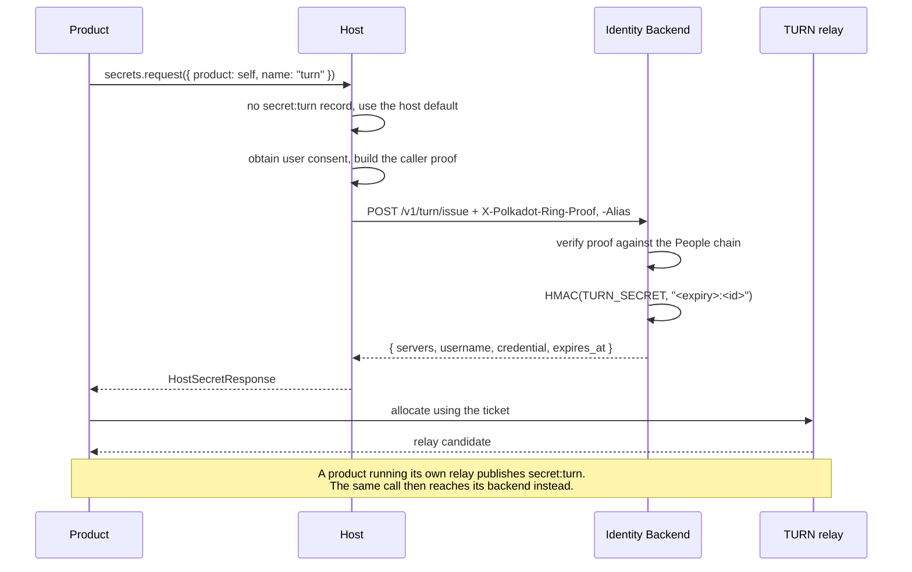
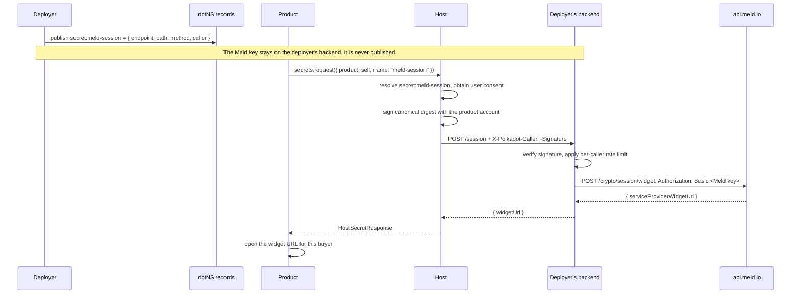

# RFC: Secrets Management in TrUAPI

|                 |                                                                                                    |
| --------------- | -------------------------------------------------------------------------------------------------- |
| **RFC Number**  | (assigned on merge)                                                                                |
| **Start Date**  | 2026-08-03                                                                                         |
| **Description** | A single TrUAPI method letting products use secrets they never hold, held by backends they don't run |
| **Authors**     | Tiago Tavares                                                                                      |

## Summary

Add one method to a new `Secrets` trait, `request`, which sends a product's request to a **backend** that holds a credential and returns only the result. A backend is an HTTPS endpoint named in the product's dotNS text records, with a small set of host-provided defaults for the ones Parity operates. The record also states what caller identity the backend requires, which the host produces from the user's own credentials.

Nothing returns a credential to the product, and nothing transports one to the host, because a host on the user's machine cannot keep a secret from that user. Whether the credential belongs to Parity or to a product's deployer changes only who declared the backend, not the API, the record shape, or the trust model.

## Definitions

- **Backend**. An HTTPS endpoint that holds a credential and acts on the product's behalf. Distinct from the identity backend, which is always named in full.
- **Secret name**. What a product asks for. Resolves to a dotNS text record naming the backend, the one operation it will perform, and the caller proof it wants. Several names may sit in front of the same underlying credential, one per operation.
- **Caller proof**. Evidence about who is calling, produced by the host from the user's own credentials. The backend states which level it requires.
- **Product account**. An sr25519 account the host derives per product from the user's root secret (RFC-0022).
- **Ring VRF proof**. The anonymous bandersnatch proof of people-set membership from `create_account_proof` (RFC-0004). Proves membership without revealing which member.
- **Contextual alias**. The identifier `create_account_proof` derives from the member key and a `ProductProofContext`. The same member key under different contexts yields different, unlinkable aliases (RFC-0004).
- **`AutoSigning`**. The RFC-0010 capability handing the host a product's subtree secret key so it can sign locally without a round trip.

## Motivation

A funding product wants a meld.io API key for fiat onramp. A game product wants TURN credentials so two players can connect through a relay when their networks refuse a direct path. Neither can hold what they are asking for. [Meld's documentation](https://docs.meld.io/docs/meld-api/getting-started) states it plainly: "Always call Meld from your backend. Direct calls from a browser or mobile app expose your API key." A TURN relay secret mints unlimited credentials for a relay somebody pays bandwidth for. Both are long-lived credentials that must stay unknown to the person running the product.

The two asks look different and are not. In both cases a credential lives somewhere, something uses it to do a job, and the product needs the result of that job. The only real variable is who runs that thing.

Requirements for a solution:

1. **Products never receive secret material.** What crosses the TrUAPI boundary is the result of an operation, or a credential that expires on its own.
2. **Parity holds no deployer credentials.** Using this must not require trusting Parity with a third party's key.
3. **Backends are declared per product.** Each product's records are its own namespace, so `meld` under one product is unrelated to `meld` under another.
4. **A backend can tell its callers apart.** A publicly reachable endpoint must not mean anonymous unlimited use of the credential behind it.
5. **Nothing depends on the host's platform.** The desktop and web hosts have no equivalent of Apple App Attest or Google Play Integrity and must not be second-class.
6. **One mechanism.** A product using Parity's relay, a product using its own relay, and a product calling Meld should differ in configuration, not in code shape.

## Detailed Design

### Trust boundary

For any host implementing this API:

> A credential that must remain unknown to the user MUST NOT be transmitted to the host or to the product.

Every other decision in this RFC follows from that constraint. The user controls the host, so delivering a secret into it delivers the secret to them regardless of transport.

### Declaration and resolution

A backend is named in the product's dotNS text records:

```text
Key:   secret:<name>
Value: {
  "endpoint": "https://onramp.example.com",
  "path":     "/meld/session",
  "method":   "POST",
  "caller":   "signature"
}
```

The credential never appears in the record. What is published is one operation the deployer is willing to spend it on, and what identity they want with the request.

A request names the product whose records to read and the secret within them, so `secret:<name>` is resolved under that product. The record it resolves to names the backend that holds it. The host falls back to its built-in defaults when the named product declares nothing under that name, and that fallback is the whole of the platform case:

| Secret | Default backend                              | `caller`     | Overridable |
| ------ | -------------------------------------------- | ------------ | ----------- |
| `turn` | The identity backend's `POST /v1/turn/issue` | `personhood` | Yes         |

A product wanting Parity's relay names `turn` and declares nothing. A product running its own relay publishes `secret:turn` and gets theirs. Same method, same response shape, no code change.

```ts
// Parity's relay, no record needed.
await truapi.secrets.request({ product: self, name: "turn" });

// The deployer's own Meld session backend.
await truapi.secrets.request({ product: self, name: "meld-session", body });
```

Naming another product's dotNS name is allowed, following RFC-0004 and RFC-0023, which take a product identifier rather than assuming the caller's. Records are public and endpoints are publicly reachable, so refusing this would buy obscurity rather than isolation. What actually protects a backend is the caller proof and its own rate limiting, not who is permitted to name it.

Typed convenience such as a `getIceServers()` that parses the TURN response into `RTCIceServer[]` belongs in the product SDK, above this RFC.

### Method

Added to a new `Secrets` trait:

```rust
/// Send a request to a backend, which holds a credential the product never
/// sees, and return its response.
///
/// The backend is resolved as `secret:<name>` in `product`'s dotNS records,
/// falling back to a host default. That record fixes the endpoint, path, and
/// method, so the caller supplies only a body, query, and headers.
#[wire(request_id = 152)]
async fn request(
    &self,
    _cx: &CallContext,
    _request: HostSecretRequest,
) -> Result<HostSecretResponse, CallError<HostSecretError>> {
    Err(CallError::unavailable())
}
```

### Request, response, and error

```rust
struct HostSecretRequest {
    /// dotNS name whose records declare the backend. Usually the caller's
    /// own, but naming another product is allowed.
    product: DotNsName,
    /// Secret name, resolved as `secret:<name>` in that product's records,
    /// falling back to a host default. The record it finds names the backend.
    name: String,
    /// Appended to the record's fixed path as a query string.
    query: Vec<(String, String)>,
    headers: Vec<(String, String)>,
    body: Option<Bytes>,
}

/// The dotNS record, published by the deployer rather than sent over the wire.
struct BackendRecord {
    /// Origin the request is sent to. Shown to the user at consent time.
    endpoint: String,
    /// Fixed path. The product cannot vary it.
    path: String,
    /// Fixed method. The product cannot vary it.
    method: String,
    caller: CallerRequirement,
}

struct HostSecretResponse {
    status: u16,
    headers: Vec<(String, String)>,
    body: Bytes,
}

/// Declared per backend in the dotNS record.
enum CallerRequirement {
    None,
    Signature,
    Personhood,
}

enum HostSecretError {
    /// No authenticated session (RFC-0009). The host must not auto-prompt login.
    NotConnected,
    /// No record and no host default under that name.
    UnknownSecret,
    /// The record exists but does not parse, or names an unsupported field.
    MalformedRecord,
    /// The user declined consent or the signing confirmation.
    Rejected,
    /// The backend requires `personhood` and the user is not a people-set
    /// member. Mirrors `NotMember` from RFC-0004.
    NotMember,
    /// The endpoint could not be reached.
    Transport,
    Unknown { reason: String },
}
```

The caller proof travels as request headers, so a backend verifies it without parsing an arbitrary payload:

```text
X-Polkadot-Product     dotNS name of the calling product, which may differ
                       from the product whose record was resolved. Host-asserted.
X-Polkadot-Caller      Product account public key. Signature and personhood.
X-Polkadot-Timestamp   Unix seconds, to bound replay.
X-Polkadot-Nonce       Random per request, to bound replay.
X-Polkadot-Signature   Signature over the canonical digest.
X-Polkadot-Ring-Proof  Ring VRF proof of people-set membership. Personhood only.
X-Polkadot-Alias       Contextual alias for this backend. Personhood only.
```

The canonical digest covers the method, the full request URL including query, the timestamp, the nonce, and a hash of the body. Backends reject a request whose timestamp falls outside their accepted window, and should reject a repeated nonce within it.

### Call semantics

The host resolves `secret:<name>` from `product`'s dotNS records, falling back to a built-in default, and returns `UnknownSecret` if neither exists. It builds the request from the record's `endpoint`, `path`, and `method`, appending the caller's `query`. It obtains user consent, produces the caller proof the record requires, and attaches it, failing rather than downgrading to a weaker level.

The host MUST strip any caller-supplied header in the `X-Polkadot-` namespace before attaching its own, so a product cannot forge or displace the proof. The product never selects its own caller level: that comes from the record, which the deployer controls.

The response is returned unmodified except for hop-by-hop headers. Products must not assume the request originated from the user's address, because the host makes it directly and the backend makes any upstream call from its own infrastructure.

### Identifying the caller

A declared endpoint is publicly reachable, so without something more, anyone can spend the credential behind it by posting to it.

Three properties get conflated here. **Non-impersonation** means one caller cannot claim another's identifier. **Scarcity** means being someone new costs something. **Volume** means how much any one caller may do. Rate limiting only delivers volume, and volume limits are worthless without scarcity, because a limit per identity is no limit when identities are free.

| `caller`     | Host attaches                                 | Backend gets                                            |
| ------------ | --------------------------------------------- | ------------------------------------------------------- |
| `none`       | Product name only                             | Nothing verifiable. Rate limit by IP.                    |
| `signature`  | Product account key and a request signature   | Non-impersonation and continuity. No scarcity.           |
| `personhood` | The above plus a ring VRF proof and its alias | One verified human, one stable identifier, per backend.  |

`signature` is the default and costs nothing. The host signs the canonical digest with the product account (RFC-0022). The backend gets a key that is the same for that user on every visit and that no other backend can correlate, because per-product derivation already separates them. That is what Meld's `externalCustomerId` wants, and it is a hash of a wallet address today for the same reason.

`personhood` adds scarcity through `create_account_proof` (RFC-0004), which proves people-set membership without revealing which member. The unlinkable identifier comes free with it: the call takes a `ProductProofContext { product_id, suffix }`, and the same member key under different contexts yields different, unlinkable contextual aliases. Setting `suffix` from the backend gives one stable alias per person per backend and an unrelated one everywhere else, so no separate nullifier construction is needed.

This is deliberately the ring path and not `sign_vrf` (RFC-0023). That method produces an sr25519 VRF bound to the product account, for participants who are **not yet** people-set members. It is identity-bound rather than anonymous, and a non-member account is free to create, so it delivers neither the anonymity nor the scarcity this tier exists for. The two are complementary and only the ring path fits here.

Two consequences matter. Verification happens against the People chain, so Parity is not in the path and no token format, key distribution, or availability dependency is involved. And nothing depends on the platform, so a ring proof works identically on a downloadable desktop host. That is why device attestation is not part of this design, and why the identity backend's own attestation is not reused: it covers mobile only, and its HS256 tokens are verifiable by nobody but itself.

Which level to require is a judgement about payoff. Minting TURN tickets hands an attacker free relay bandwidth, which is directly monetisable, so it warrants `personhood`. Creating a Meld session hands an attacker a link to spend their own money into their own wallet, so `signature` is proportionate and `personhood` would exclude users for little gain.

### Authorization

Producing a caller proof follows the rules already governing the primitive it uses: local when `AutoSigning` (RFC-0010) covers the account, otherwise a per-call confirmation presented by the Account Holder. A `personhood` proof additionally follows `create_account_proof`'s rules and returns `NotMember` when the user is not in the ring.

What consent sits on top of that, for the outbound call itself, is unresolved. See Unresolved Questions.

### Consuming-backend contract

A backend that verifies these proofs MUST:

> Derive the caller identity it rate limits from the verified proof itself, never from a caller-supplied field. For `signature`, that is the key the signature verifies under. For `personhood`, that is the contextual alias carried by a ring proof checked against the current ring on the People chain.

`X-Polkadot-Product` is host-asserted and unverifiable, so a backend must never make a trust decision on it. It is a routing and diagnostics hint. In particular a backend cannot restrict itself to the product that declared it, because any product may name that record and the caller field asserting otherwise is unverifiable. A backend that ignores this contract gains nothing an attacker cannot forge, and the failure is silent, which is why it is stated normatively rather than left to implementers.

### Flows

Parity's relay, reached through the host default. No record is published, and the identity backend verifies a ring proof instead of the JWT it uses today.



A deployer's own credential, reached through a declared record. The Meld key never leaves their infrastructure.



### Accounts Protocol companion

None. Both caller proofs reuse primitives that already have their companions, `sign_raw` and `create_account_proof`, so the Host and Account Holder boundary is unchanged.

## Implementation notes

- **Query values are the only caller-controlled part of the URL.** Endpoint, path, and method all come from the record, so encoding the query is the whole of the injection surface.
- **Conformance tests** worth writing against a mock backend: a caller cannot influence the resolved URL path or method, caller-supplied `X-Polkadot-` headers are stripped, a `personhood` backend returns `NotMember` rather than falling back to `signature`, a product record shadows a host default of the same name, and the same user yields the same contextual alias across sessions and different aliases across backends.
- **The TURN default is verifiable end to end** against a real relay: a ticket derived from the wrong secret produces `401` and no relay candidate.

## Non-goals

For credentials that belong to a **deployer or to Parity** and must stay unknown to the user, where the product needs the result of an operation rather than the credential itself.

**Not** for secrets that belong to the user. Those can be encrypted to the user's own key, and the objection driving this design does not apply to them.

**Not** a general outbound HTTP proxy. The endpoint is fixed by the record, and a product wanting arbitrary network access already has `RemotePermission::Remote`.

**Not** a way to hide anything from the user. Results cross into the host and are therefore readable by whoever runs it. Only the credential stays out of reach.

## Drawbacks

- **Deployers must run something.** There is no path here to shipping a product with a third-party credential and no infrastructure. For small products that may be the difference between shipping and not.
- **A declared endpoint is publicly reachable.** Caller proofs raise the bar without making it private. Backends still need rate limiting, and the abuse cost lands on whoever runs them.
- **`signature` provides no scarcity.** Keypairs are free, so at that tier the operator is relying on the attacker's payoff being low. That is a judgement about a specific backend, not a guarantee.
- **`personhood` excludes non-members.** It rests on people-set membership, so it shuts out anyone still verifying. RFC-0023 exists precisely because that population needs a different path, and this tier has no equivalent for them.
- **Product identity is unverifiable, so a backend cannot restrict who invokes it.** Any product may name another's record, and the caller field carrying product identity is host-asserted. Backends gate on the caller proof and their own rate limits. What impersonation buys is calls against the backend's own endpoint, not possession of a credential.
- **One record per operation.** A deployer needing several calls against the same credential publishes several names. That is the cost of the product not choosing paths.

## Alternatives

### A generic `get_host_secret(name)`

Rejected. It breaches the trust boundary by definition, and it cannot serve the TURN case anyway, because the identity backend holds no credential to return, only a minting endpoint. A flat namespace with no owner also lets two products each claim `meld`.

### Bake secrets into host distributions

Rejected. A downloadable host makes any embedded secret public. This is not hypothetical, it is what ships today.

### Fetch the secret from the deployer's URL into the host

Rejected, and worth distinguishing from the accepted design because it looks similar. An endpoint that hands the plaintext credential to whoever asks is strictly worse than publishing the credential, because it adds a false sense of control. The host calls a backend to have work done, never to collect a key.

### Escrow the secret with a Parity-run resolver

Considered at length and set aside. The deployer would encrypt the secret to a resolver's published key, publish the ciphertext in the record, and the resolver would decrypt and attach it. It spares deployers from running anything, but it makes Parity the custodian of third-party payment credentials with the liability that follows, and concentrates every deployer's secret behind one breach. Confidential computing with remote attestation reduces that trust rather than removing it, at the cost of reproducible builds, enclave-hosted TLS egress, and re-attestation on every deploy. If requiring deployer-run infrastructure proves to block adoption, this is what to revisit.

### Encrypt secrets to every user's key

Rejected. Authorising a user to decrypt gives that user the plaintext, which is the outcome the Meld case must avoid. The same objection defeats encrypting to a host key, since the host is the user's to control. It also requires enumerating users before they arrive, grows the record linearly, and cannot revoke what has already been decrypted. The scheme is correct for secrets that belong to the user, which is a non-goal here.

### Identity-backend attestation tokens as the caller proof

Rejected. It attests app instances using Apple App Attest, Google Play Integrity, and Android key attestation, none of which exist on the desktop or web hosts. Its tokens are HS256, so the identity backend is the only party able to verify them, and a deployer could not check one without new asymmetric signing, a published JWKS, and an audience claim. Personhood delivers stronger scarcity, works everywhere, and is verifiable against the People chain.

### Deliver results over the statement store

Rejected as the general transport. It offers durability across reloads and multi-device delivery, but it is a public broadcast medium, so it publishes durable metadata about which product called what and when, and RFC-0010 names that observer as the threat it defends against. It also adds propagation latency at the moment a user taps buy, needs a slot allowance, and bounds payload size. It remains plausible as an optional delivery mode for small latency-tolerant payloads.

### Have the provider issue a client-safe credential

Not rejected, and preferable where available. Meld Checkout accepts a `publicKey` in the URL and requires no backend, which would leave the funding product needing nothing from this RFC, at the cost of Meld's hosted UI in place of a custom provider and quote flow. Worth checking before declaring a backend.

## Prior Art and References

- **RFC-0004**, `create_account_proof`. The ring-VRF proof and the `ProductProofContext` whose suffix yields unlinkable contextual aliases, which the `personhood` tier is built from. Its `NotMember` error is mirrored here.
- **RFC-0010**, allowance and `AutoSigning`, which decides whether a caller proof needs a per-call confirmation.
- **RFC-0022**, account key derivations. Source of the product account the `signature` tier signs with.
- **RFC-0023**, `sign_vrf`. The complementary sr25519 path for participants who are not yet people-set members, and why it is not the primitive used here.
- **RFC-0024**, personhood as a product (in review). It adds an explicit `key_handle` to `create_account_proof` and deletes RFC-0004's host-side key selection, so the `personhood` tier here depends on whichever of the two lands. It also requires every proof context to be built with TrUAPI's product-scoped context function, which constrains how this RFC may derive its suffix.
- `POST /v1/turn/issue` in the identity backend. Already implemented, and the default `turn` backend.
- [Meld API getting started](https://docs.meld.io/docs/meld-api/getting-started), for the backend-only constraint and the note that "Meld does not require IP or CORS allowlisting", which rules out origin restriction as a mitigation.

## Unresolved Questions

- **What user consent does this call require?** Reusing `RemotePermission::Remote { domains }` for the endpoint origin is the obvious fit, but it was written for a product reaching out directly, and here the host calls on the product's behalf. Open within that: whether consent is per backend or per call, whether the record's declared endpoint is shown at grant time, and whether `personhood` needs its own prompt given it discloses more than `signature`.
- **How the `ProductProofContext` suffix is derived from the backend.** It must bind in a way the backend operator can reproduce and a product cannot vary to farm fresh aliases. The endpoint origin is the obvious binding, which means changing endpoint resets every identifier. RFC-0004 leaves the suffix to the caller, and RFC-0024 requires contexts to use the product-scoped construction, so this needs settling against whichever lands.
- **Where the `key_handle` comes from if RFC-0024 lands.** That RFC deletes host-side key selection, so a `personhood` request would need a handle the product does not have and must not learn. The host supplying it from the registry is the obvious answer and is not specified here.
- **How host defaults are discovered.** A product needs to know whether `turn` exists before calling it, and hosts differ. This may want a companion to the existing `featureSupported` probe.
- **Whether the record needs a schema version.** One field now avoids a migration later, when `caller` grows variants.
- **Should the platform `turn` default really require `personhood`?** Minting relay tickets is directly monetisable, which argues yes, but it would lock every non-member out of WebRTC entirely. `signature` plus a tight per-caller quota may be the better trade, and this is a product decision rather than a protocol one.
